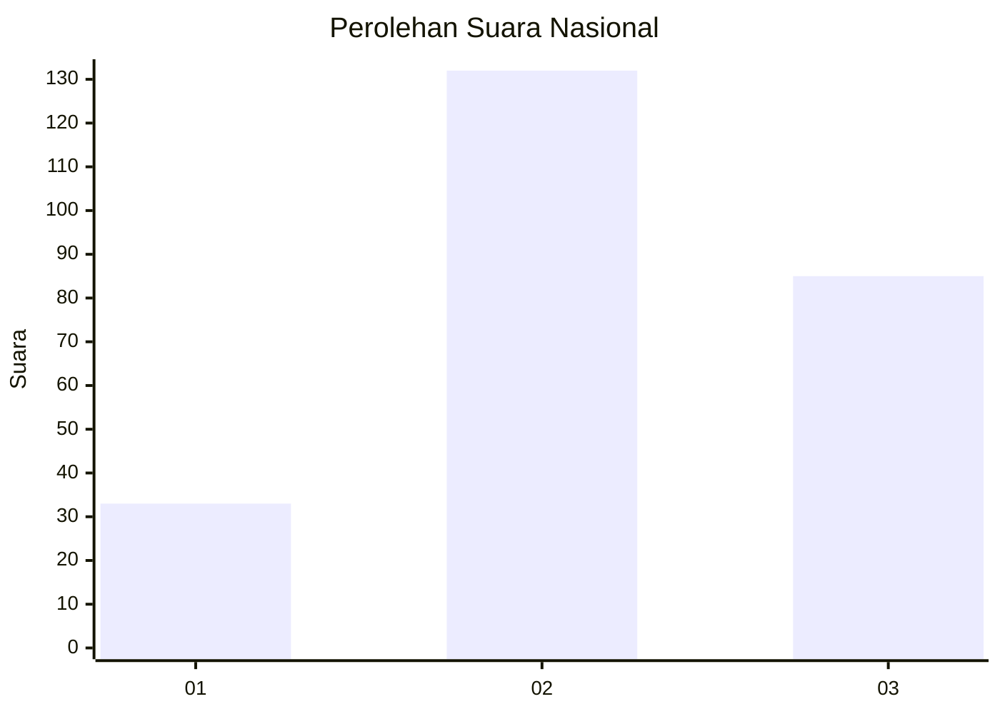
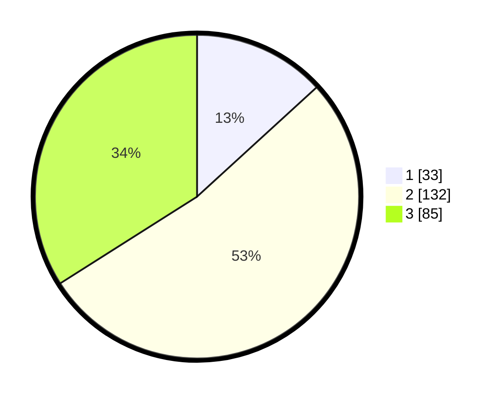

# Hasil

## Grafik

## Tabel

| No. | Nama Paslon    | Suara | Suara (raw) | Persentase |
|:--- |:-------------- | -----:| -----------:| ----------:|
| 1   | ANIES MUHAIMIN | 33    | [33][p-1]   | 13,20      |
| 2   | PRABOWO GIBRAN | 132   | [132][p-2]  | 52,80      |
| 3   | GANJAR MAHFUD  | 85    | [85][p-3]   | 34,00      |

[p-1]: https://github.com/gigit-pemilu/pemilu-2024/blob/main/pilpres/hitung-suara/sub/34-di-yogyakarta/sub/04-sleman/sub/05-seyegan/sub/2002-margodadi/sub/019-tps/sub/paslon-1.txt
[p-2]: https://github.com/gigit-pemilu/pemilu-2024/blob/main/pilpres/hitung-suara/sub/34-di-yogyakarta/sub/04-sleman/sub/05-seyegan/sub/2002-margodadi/sub/019-tps/sub/paslon-2.txt
[p-3]: https://github.com/gigit-pemilu/pemilu-2024/blob/main/pilpres/hitung-suara/sub/34-di-yogyakarta/sub/04-sleman/sub/05-seyegan/sub/2002-margodadi/sub/019-tps/sub/paslon-3.txt

## Foto C Plano

https://sirekap-obj-formc.kpu.go.id/42ec/pemilu/ppwp/34/04/05/20/02/3404052002019-20240214-220703--ed59835a-2e44-462c-9463-026064595e23.jpg

https://sirekap-obj-formc.kpu.go.id/42ec/pemilu/ppwp/34/04/05/20/02/3404052002019-20240214-160112--c30f0cc9-9484-42c0-9860-4b5a242a4815.jpg

https://sirekap-obj-formc.kpu.go.id/42ec/pemilu/ppwp/34/04/05/20/02/3404052002019-20240214-160122--4bb6710e-6d0e-4f5d-8863-5f07471270a9.jpg

## Metadata

| Key        | Value               |
| ---------- | ------------------- |
| Time Stamp | 2024-02-15 03:06:03 |

