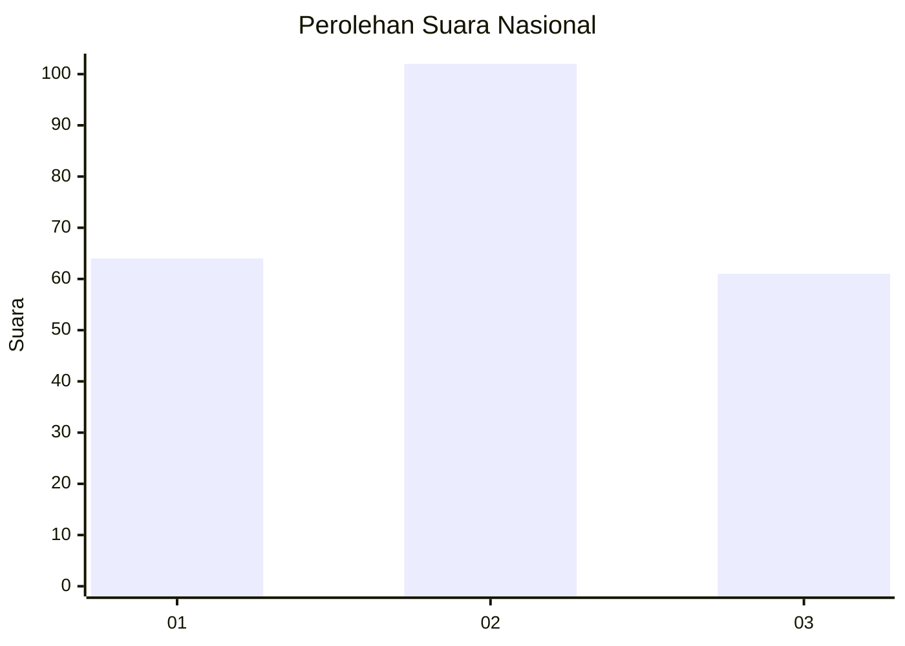
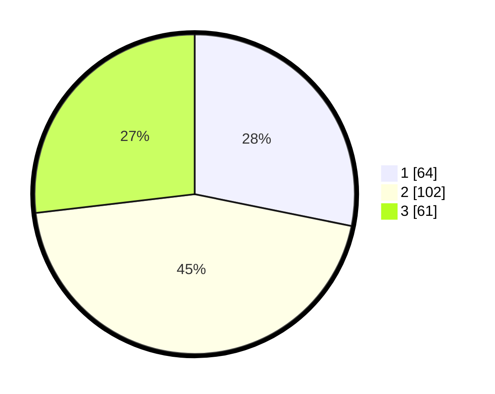

# Hasil

## Grafik

## Tabel

| No. | Nama Paslon    | Suara | Suara (raw) | Persentase |
|:--- |:-------------- | -----:| -----------:| ----------:|
| 1   | ANIES MUHAIMIN | 64    | [64][p-1]   | 28,19      |
| 2   | PRABOWO GIBRAN | 102   | [102][p-2]  | 44,93      |
| 3   | GANJAR MAHFUD  | 61    | [61][p-3]   | 26,87      |

[p-1]: https://github.com/gigit-pemilu/pemilu-2024/blob/main/pilpres/hitung-suara/sub/34-di-yogyakarta/sub/04-sleman/sub/05-seyegan/sub/2002-margodadi/sub/020-tps/sub/paslon-1.txt
[p-2]: https://github.com/gigit-pemilu/pemilu-2024/blob/main/pilpres/hitung-suara/sub/34-di-yogyakarta/sub/04-sleman/sub/05-seyegan/sub/2002-margodadi/sub/020-tps/sub/paslon-2.txt
[p-3]: https://github.com/gigit-pemilu/pemilu-2024/blob/main/pilpres/hitung-suara/sub/34-di-yogyakarta/sub/04-sleman/sub/05-seyegan/sub/2002-margodadi/sub/020-tps/sub/paslon-3.txt

## Foto C Plano

https://sirekap-obj-formc.kpu.go.id/0657/pemilu/ppwp/34/04/05/20/02/3404052002020-20240215-063223--4c5d8b71-7b01-4bfd-9a1b-228ea70896f7.jpg

https://sirekap-obj-formc.kpu.go.id/0657/pemilu/ppwp/34/04/05/20/02/3404052002020-20240215-063301--431bd6a2-db6c-4a22-bdf0-358d3b856215.jpg

https://sirekap-obj-formc.kpu.go.id/0657/pemilu/ppwp/34/04/05/20/02/3404052002020-20240215-063308--7d58b232-7fa5-44c9-8f56-a45c0050fc13.jpg

## Metadata

| Key        | Value               |
| ---------- | ------------------- |
| Time Stamp | 2024-02-15 15:30:25 |

