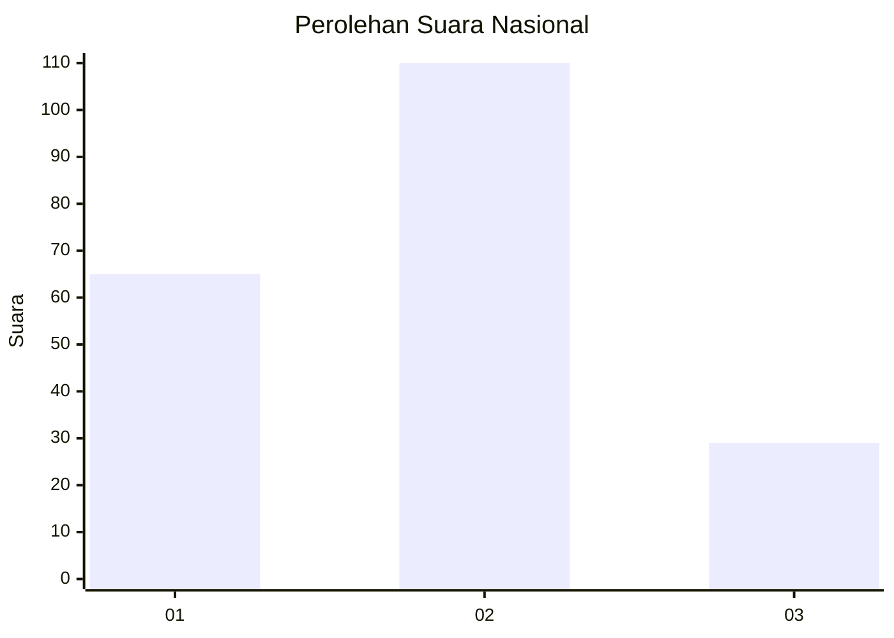
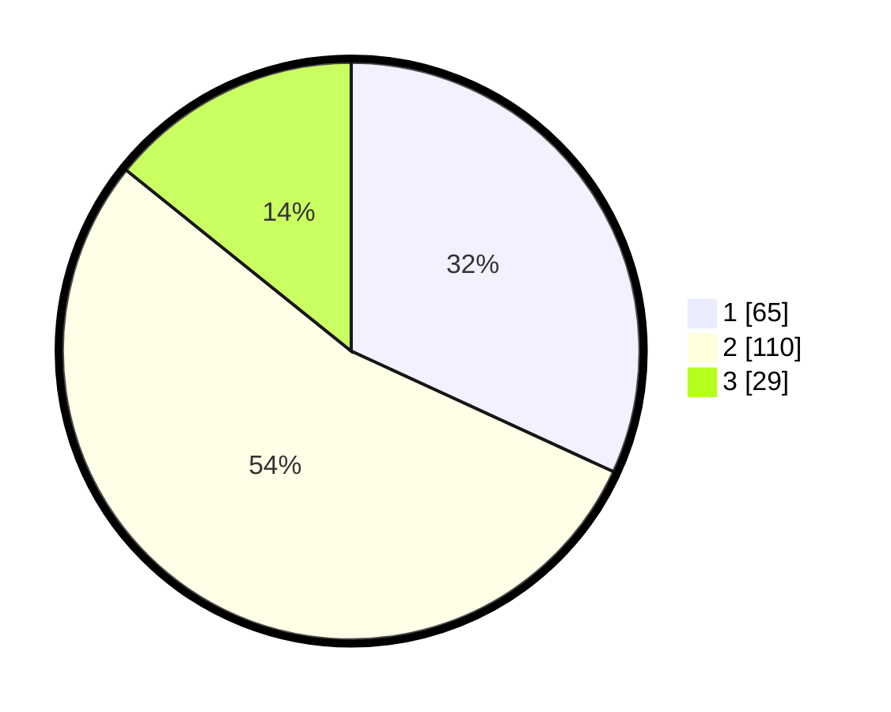

# Hasil

## Grafik

## Tabel

| No. | Nama Paslon    | Suara | Suara (raw) | Persentase |
|:--- |:-------------- | -----:| -----------:| ----------:|
| 1   | ANIES MUHAIMIN | 65    | [65][p-1]   | 31,86      |
| 2   | PRABOWO GIBRAN | 110   | [110][p-2]  | 53,92      |
| 3   | GANJAR MAHFUD  | 29    | [29][p-3]   | 14,22      |

[p-1]: https://github.com/gigit-pemilu/pemilu-2024/blob/main/pilpres/hitung-suara/sub/34-di-yogyakarta/sub/04-sleman/sub/05-seyegan/sub/2002-margodadi/sub/027-tps/sub/paslon-1.txt
[p-2]: https://github.com/gigit-pemilu/pemilu-2024/blob/main/pilpres/hitung-suara/sub/34-di-yogyakarta/sub/04-sleman/sub/05-seyegan/sub/2002-margodadi/sub/027-tps/sub/paslon-2.txt
[p-3]: https://github.com/gigit-pemilu/pemilu-2024/blob/main/pilpres/hitung-suara/sub/34-di-yogyakarta/sub/04-sleman/sub/05-seyegan/sub/2002-margodadi/sub/027-tps/sub/paslon-3.txt

## Foto C Plano

https://sirekap-obj-formc.kpu.go.id/3aab/pemilu/ppwp/34/04/05/20/02/3404052002027-20240214-214627--d128e50a-6af3-47b5-9fe1-4ef017945f19.jpg

https://sirekap-obj-formc.kpu.go.id/3aab/pemilu/ppwp/34/04/05/20/02/3404052002027-20240214-214633--9aa4df84-05a2-4cc5-be57-d2366a2df0be.jpg

https://sirekap-obj-formc.kpu.go.id/3aab/pemilu/ppwp/34/04/05/20/02/3404052002027-20240214-214638--a711ee69-cad3-4e64-b6fd-9b10d0e06647.jpg

## Metadata

| Key        | Value               |
| ---------- | ------------------- |
| Time Stamp | 2024-02-15 21:01:18 |

