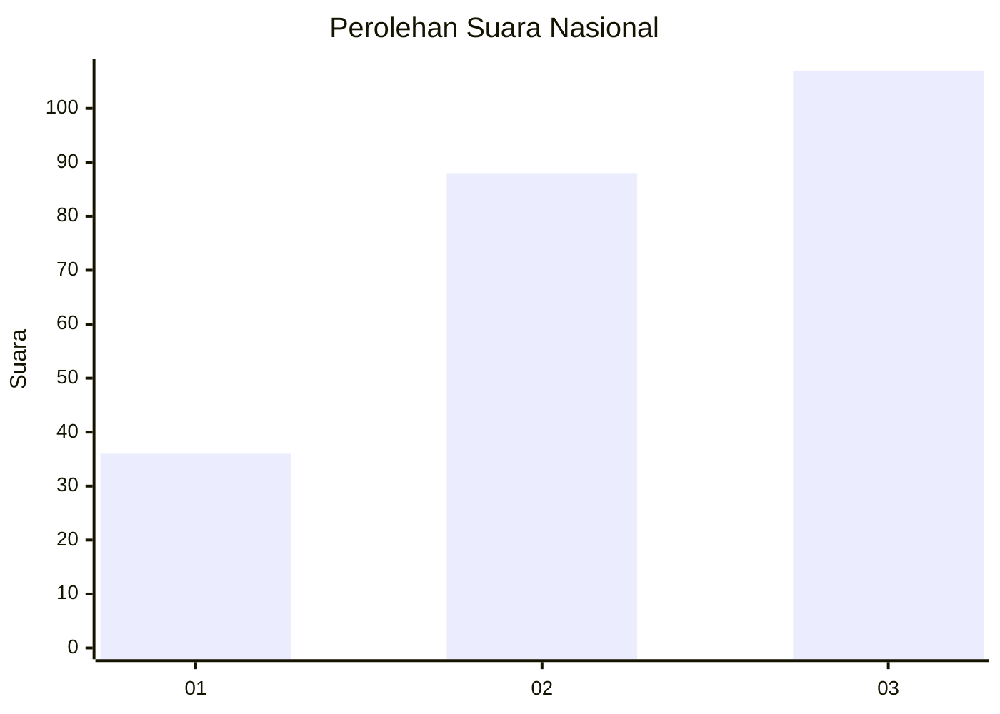
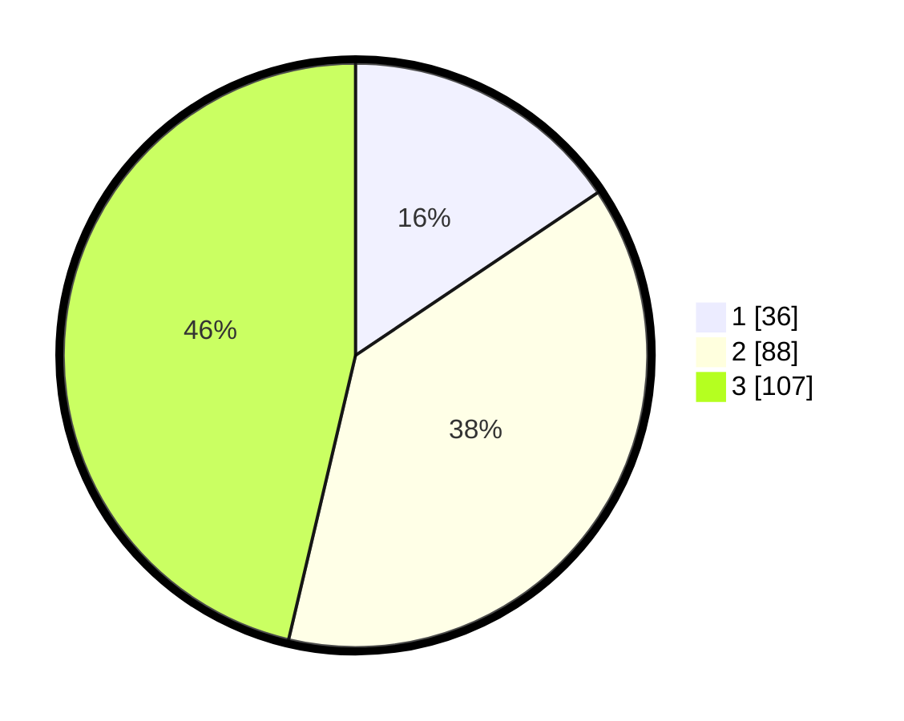

# Hasil

## Grafik

## Tabel

| No. | Nama Paslon    | Suara | Suara (raw) | Persentase |
|:--- |:-------------- | -----:| -----------:| ----------:|
| 1   | ANIES MUHAIMIN | 36    | [36][p-1]   | 15,58      |
| 2   | PRABOWO GIBRAN | 88    | [88][p-2]   | 38,10      |
| 3   | GANJAR MAHFUD  | 107   | [107][p-3]  | 46,32      |

[p-1]: https://github.com/gigit-pemilu/pemilu-2024/blob/main/pilpres/hitung-suara/sub/34-di-yogyakarta/sub/04-sleman/sub/05-seyegan/sub/2003-margokaton/sub/003-tps/sub/paslon-1.txt
[p-2]: https://github.com/gigit-pemilu/pemilu-2024/blob/main/pilpres/hitung-suara/sub/34-di-yogyakarta/sub/04-sleman/sub/05-seyegan/sub/2003-margokaton/sub/003-tps/sub/paslon-2.txt
[p-3]: https://github.com/gigit-pemilu/pemilu-2024/blob/main/pilpres/hitung-suara/sub/34-di-yogyakarta/sub/04-sleman/sub/05-seyegan/sub/2003-margokaton/sub/003-tps/sub/paslon-3.txt

## Foto C Plano

https://sirekap-obj-formc.kpu.go.id/585f/pemilu/ppwp/34/04/05/20/03/3404052003003-20240214-191058--ec5bfee1-8dbc-4843-a44d-140d6946a727.jpg

https://sirekap-obj-formc.kpu.go.id/585f/pemilu/ppwp/34/04/05/20/03/3404052003003-20240214-204441--40e09db7-e1b8-4b3e-b671-f8c5d65b14a4.jpg

https://sirekap-obj-formc.kpu.go.id/585f/pemilu/ppwp/34/04/05/20/03/3404052003003-20240214-204546--cea1fc71-207a-436c-854e-d7c316a443d6.jpg

## Metadata

| Key        | Value               |
| ---------- | ------------------- |
| Time Stamp | 2024-02-15 21:01:18 |

