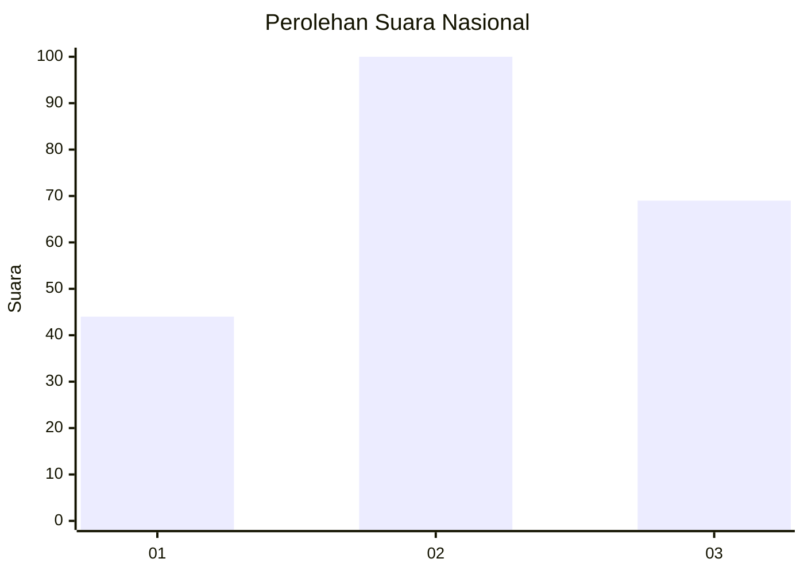
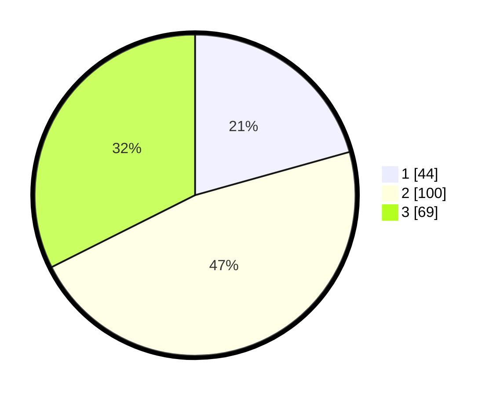

# Hasil

## Grafik

## Tabel

| No. | Nama Paslon    | Suara | Suara (raw) | Persentase |
|:--- |:-------------- | -----:| -----------:| ----------:|
| 1   | ANIES MUHAIMIN | 44    | [44][p-1]   | 20,66      |
| 2   | PRABOWO GIBRAN | 100   | [100][p-2]  | 46,95      |
| 3   | GANJAR MAHFUD  | 69    | [69][p-3]   | 32,39      |

[p-1]: https://github.com/gigit-pemilu/pemilu-2024/blob/main/pilpres/hitung-suara/sub/34-di-yogyakarta/sub/04-sleman/sub/05-seyegan/sub/2003-margokaton/sub/004-tps/sub/paslon-1.txt
[p-2]: https://github.com/gigit-pemilu/pemilu-2024/blob/main/pilpres/hitung-suara/sub/34-di-yogyakarta/sub/04-sleman/sub/05-seyegan/sub/2003-margokaton/sub/004-tps/sub/paslon-2.txt
[p-3]: https://github.com/gigit-pemilu/pemilu-2024/blob/main/pilpres/hitung-suara/sub/34-di-yogyakarta/sub/04-sleman/sub/05-seyegan/sub/2003-margokaton/sub/004-tps/sub/paslon-3.txt

## Foto C Plano

https://sirekap-obj-formc.kpu.go.id/7e9d/pemilu/ppwp/34/04/05/20/03/3404052003004-20240215-063221--c8be1f1b-5957-493a-afaa-973003710978.jpg

https://sirekap-obj-formc.kpu.go.id/7e9d/pemilu/ppwp/34/04/05/20/03/3404052003004-20240215-063227--8299309b-450f-443c-ad4c-6da9db93dc4c.jpg

https://sirekap-obj-formc.kpu.go.id/7e9d/pemilu/ppwp/34/04/05/20/03/3404052003004-20240214-215951--273a1349-8558-49d5-8a9b-ab4dc084551a.jpg

## Metadata

| Key        | Value               |
| ---------- | ------------------- |
| Time Stamp | 2024-02-15 21:01:18 |

