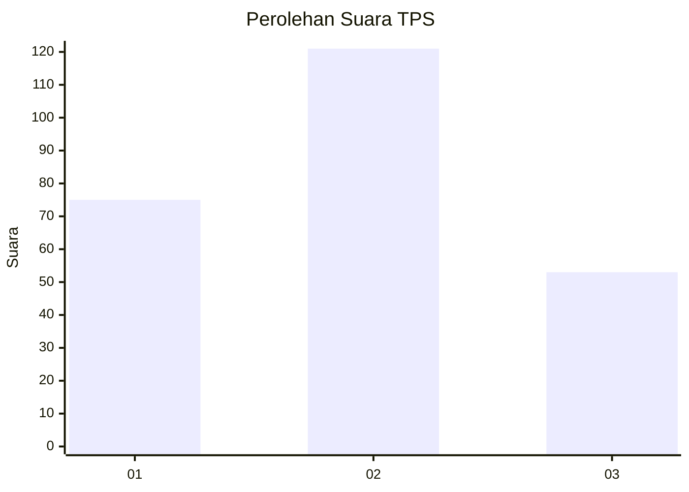
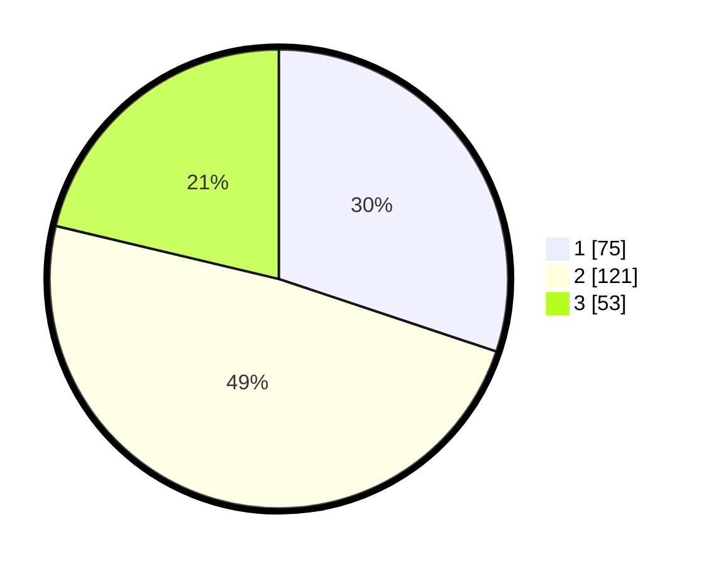

# Hasil

## Grafik

## Tabel

| No. | Nama Paslon    | Suara | Suara (raw) | Persentase |
|:--- |:-------------- | -----:| -----------:| ----------:|
| 1   | ANIES MUHAIMIN | 75    | [75][p-1]   | 30,12      |
| 2   | PRABOWO GIBRAN | 121   | [121][p-2]  | 48,59      |
| 3   | GANJAR MAHFUD  | 53    | [53][p-3]   | 21,29      |

[p-1]: https://github.com/gigit-pemilu/pemilu-2024-34-di-yogyakarta/blob/main/pilpres/hitung-suara/sub/34-di-yogyakarta/sub/04-sleman/sub/05-seyegan/sub/2003-margokaton/sub/005-tps/sub/paslon-1.txt
[p-2]: https://github.com/gigit-pemilu/pemilu-2024-34-di-yogyakarta/blob/main/pilpres/hitung-suara/sub/34-di-yogyakarta/sub/04-sleman/sub/05-seyegan/sub/2003-margokaton/sub/005-tps/sub/paslon-2.txt
[p-3]: https://github.com/gigit-pemilu/pemilu-2024-34-di-yogyakarta/blob/main/pilpres/hitung-suara/sub/34-di-yogyakarta/sub/04-sleman/sub/05-seyegan/sub/2003-margokaton/sub/005-tps/sub/paslon-3.txt

## Foto C Plano

https://sirekap-obj-formc.kpu.go.id/9981/pemilu/ppwp/34/04/05/20/03/3404052003005-20240214-211424--e497c7c9-67da-4a1f-9f53-f2078b9d1efa.jpg

https://sirekap-obj-formc.kpu.go.id/9981/pemilu/ppwp/34/04/05/20/03/3404052003005-20240214-211438--7a991423-cf98-4c5f-83ae-68985e6194eb.jpg

https://sirekap-obj-formc.kpu.go.id/9981/pemilu/ppwp/34/04/05/20/03/3404052003005-20240214-211443--ce0367f5-7b0f-4245-8a55-9e71b506bb76.jpg

## Metadata

| Key        | Value               |
| ---------- | ------------------- |
| Time Stamp | 2024-02-15 15:30:25 |

