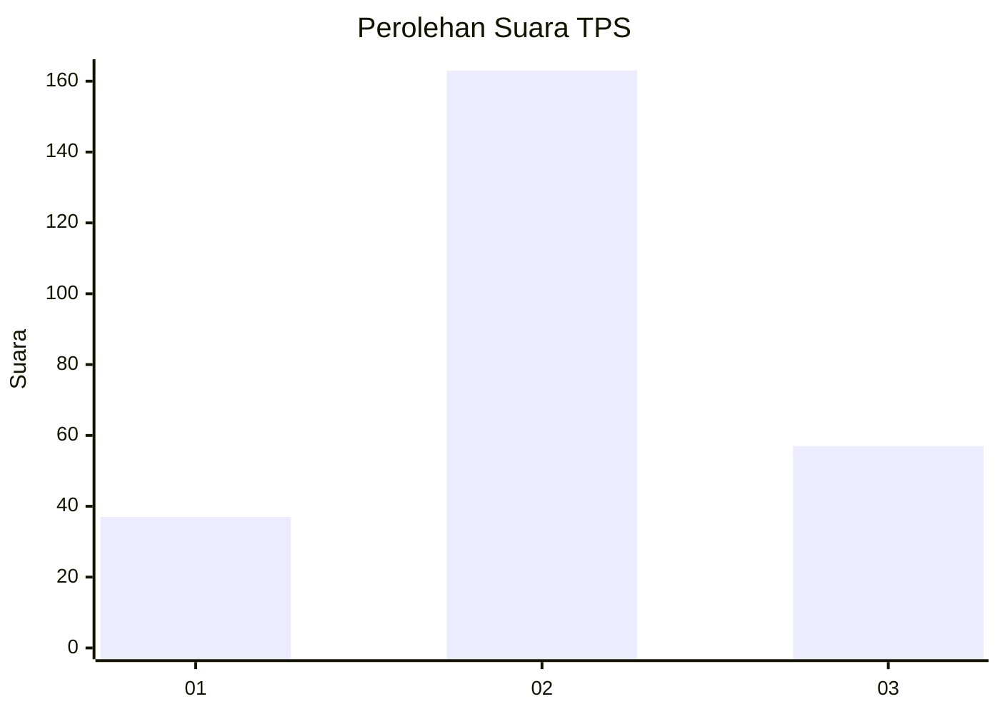
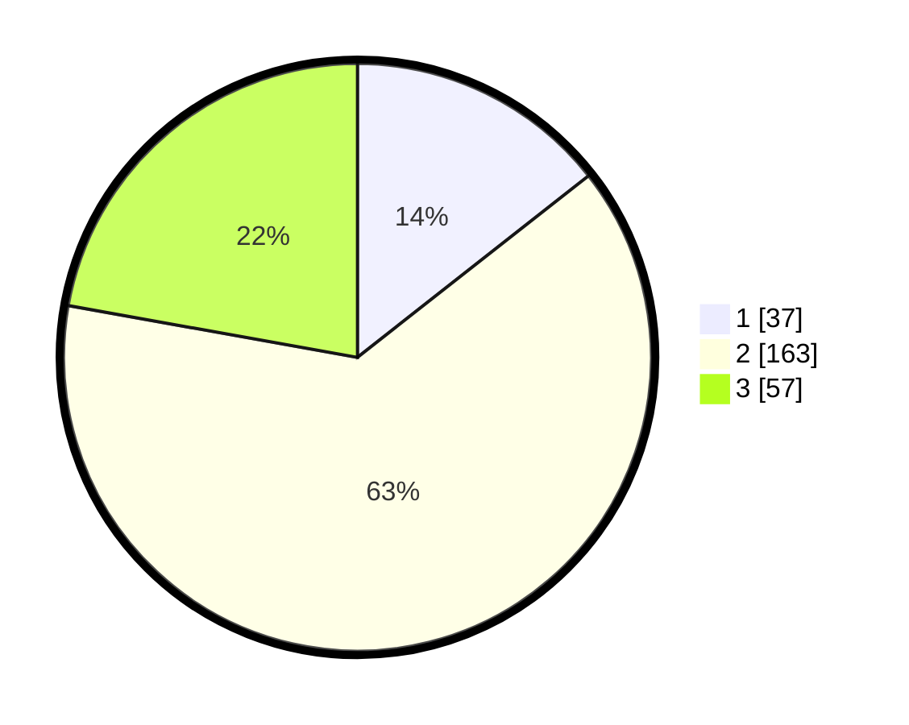

# Hasil

## Grafik

## Tabel

| No. | Nama Paslon    | Suara | Suara (raw) | Persentase |
|:--- |:-------------- | -----:| -----------:| ----------:|
| 1   | ANIES MUHAIMIN | 37    | [37][p-1]   | 14,40      |
| 2   | PRABOWO GIBRAN | 163   | [163][p-2]  | 63,42      |
| 3   | GANJAR MAHFUD  | 57    | [57][p-3]   | 22,18      |

[p-1]: https://github.com/gigit-pemilu/pemilu-2024-34-di-yogyakarta/blob/main/pilpres/hitung-suara/sub/34-di-yogyakarta/sub/04-sleman/sub/05-seyegan/sub/2003-margokaton/sub/006-tps/sub/paslon-1.txt
[p-2]: https://github.com/gigit-pemilu/pemilu-2024-34-di-yogyakarta/blob/main/pilpres/hitung-suara/sub/34-di-yogyakarta/sub/04-sleman/sub/05-seyegan/sub/2003-margokaton/sub/006-tps/sub/paslon-2.txt
[p-3]: https://github.com/gigit-pemilu/pemilu-2024-34-di-yogyakarta/blob/main/pilpres/hitung-suara/sub/34-di-yogyakarta/sub/04-sleman/sub/05-seyegan/sub/2003-margokaton/sub/006-tps/sub/paslon-3.txt

## Foto C Plano

https://sirekap-obj-formc.kpu.go.id/7bb4/pemilu/ppwp/34/04/05/20/03/3404052003006-20240214-205245--08dfd15e-060c-4251-a7ad-f933bdc34f3f.jpg

https://sirekap-obj-formc.kpu.go.id/7bb4/pemilu/ppwp/34/04/05/20/03/3404052003006-20240214-205323--d533b510-661a-444f-8532-bbfcceeee983.jpg

https://sirekap-obj-formc.kpu.go.id/7bb4/pemilu/ppwp/34/04/05/20/03/3404052003006-20240214-205412--22e216e2-b606-4502-b136-130309a57357.jpg

## Metadata

| Key        | Value               |
| ---------- | ------------------- |
| Time Stamp | 2024-02-15 15:30:25 |

