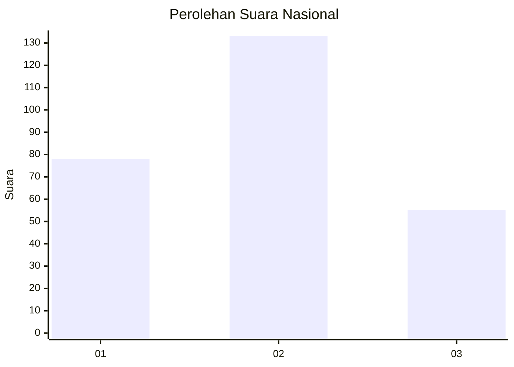
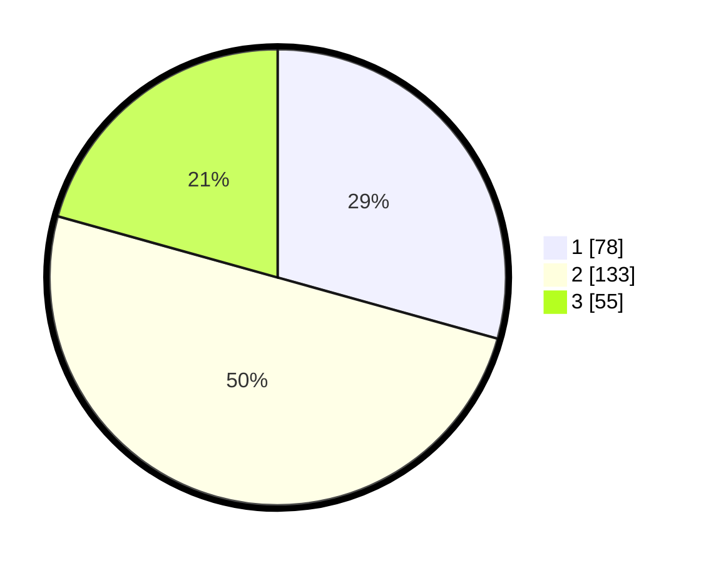

# Hasil

## Grafik

## Tabel

| No. | Nama Paslon    | Suara | Suara (raw) | Persentase |
|:--- |:-------------- | -----:| -----------:| ----------:|
| 1   | ANIES MUHAIMIN | 78    | [78][p-1]   | 29,32      |
| 2   | PRABOWO GIBRAN | 133   | [133][p-2]  | 50,00      |
| 3   | GANJAR MAHFUD  | 55    | [55][p-3]   | 20,68      |

[p-1]: https://github.com/gigit-pemilu/pemilu-2024/blob/main/pilpres/hitung-suara/sub/34-di-yogyakarta/sub/04-sleman/sub/05-seyegan/sub/2003-margokaton/sub/010-tps/sub/paslon-1.txt
[p-2]: https://github.com/gigit-pemilu/pemilu-2024/blob/main/pilpres/hitung-suara/sub/34-di-yogyakarta/sub/04-sleman/sub/05-seyegan/sub/2003-margokaton/sub/010-tps/sub/paslon-2.txt
[p-3]: https://github.com/gigit-pemilu/pemilu-2024/blob/main/pilpres/hitung-suara/sub/34-di-yogyakarta/sub/04-sleman/sub/05-seyegan/sub/2003-margokaton/sub/010-tps/sub/paslon-3.txt

## Foto C Plano

https://sirekap-obj-formc.kpu.go.id/1711/pemilu/ppwp/34/04/05/20/03/3404052003010-20240215-021304--aa6bbf99-725e-430a-8d91-ba04e7b0d802.jpg

https://sirekap-obj-formc.kpu.go.id/1711/pemilu/ppwp/34/04/05/20/03/3404052003010-20240215-021454--e08115af-d509-4d7b-8d75-29cc145af2ce.jpg

https://sirekap-obj-formc.kpu.go.id/1711/pemilu/ppwp/34/04/05/20/03/3404052003010-20240215-021606--18fb1a20-08bb-4c9d-ae96-e28cdeaaae88.jpg

## Metadata

| Key        | Value               |
| ---------- | ------------------- |
| Time Stamp | 2024-02-15 21:01:18 |

