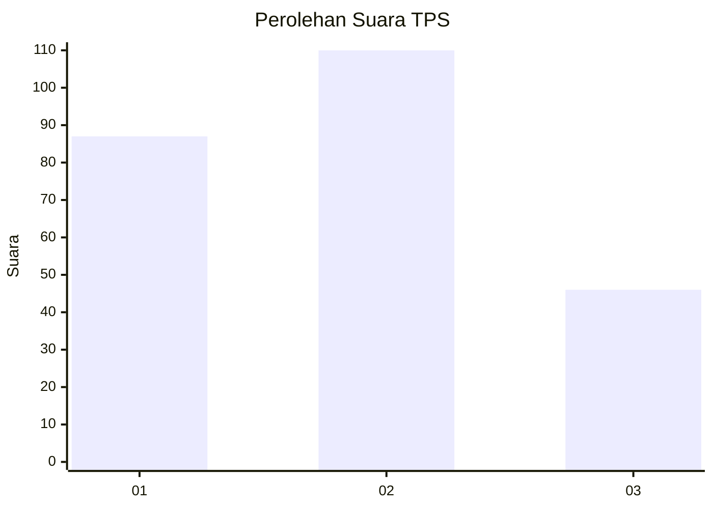
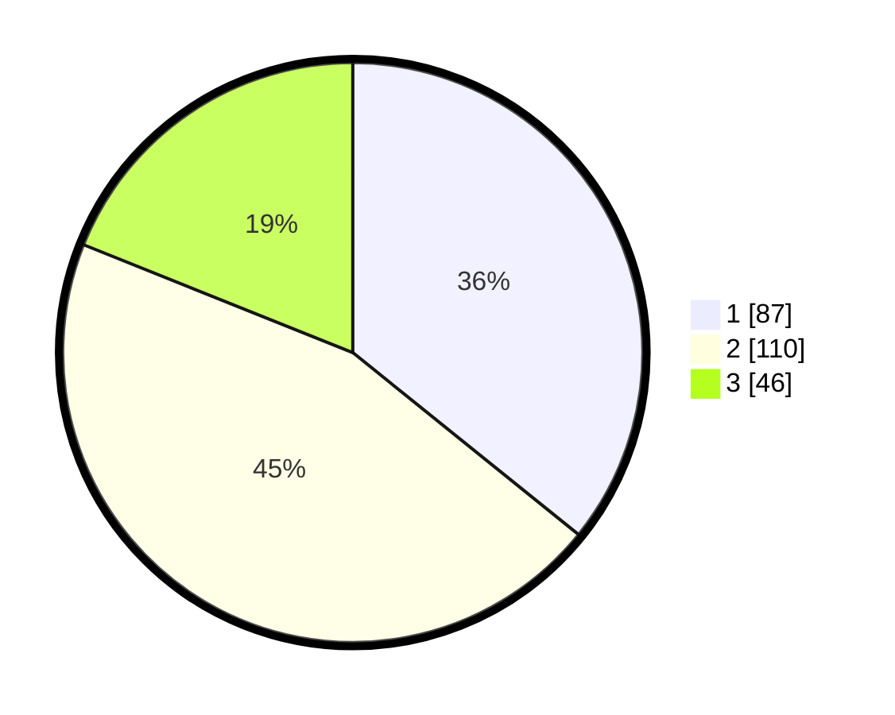

# Hasil

## Grafik

## Tabel

| No. | Nama Paslon    | Suara | Suara (raw) | Persentase |
|:--- |:-------------- | -----:| -----------:| ----------:|
| 1   | ANIES MUHAIMIN | 87    | [87][p-1]   | 35,80      |
| 2   | PRABOWO GIBRAN | 110   | [110][p-2]  | 45,27      |
| 3   | GANJAR MAHFUD  | 46    | [46][p-3]   | 18,93      |

[p-1]: https://github.com/gigit-pemilu/pemilu-2024-34-di-yogyakarta/blob/main/pilpres/hitung-suara/sub/34-di-yogyakarta/sub/04-sleman/sub/05-seyegan/sub/2003-margokaton/sub/013-tps/sub/paslon-1.txt
[p-2]: https://github.com/gigit-pemilu/pemilu-2024-34-di-yogyakarta/blob/main/pilpres/hitung-suara/sub/34-di-yogyakarta/sub/04-sleman/sub/05-seyegan/sub/2003-margokaton/sub/013-tps/sub/paslon-2.txt
[p-3]: https://github.com/gigit-pemilu/pemilu-2024-34-di-yogyakarta/blob/main/pilpres/hitung-suara/sub/34-di-yogyakarta/sub/04-sleman/sub/05-seyegan/sub/2003-margokaton/sub/013-tps/sub/paslon-3.txt

## Foto C Plano

https://sirekap-obj-formc.kpu.go.id/f048/pemilu/ppwp/34/04/05/20/03/3404052003013-20240214-220655--72dc1570-684d-449b-b14b-f7b9deeff2ea.jpg

https://sirekap-obj-formc.kpu.go.id/f048/pemilu/ppwp/34/04/05/20/03/3404052003013-20240214-190825--b2ebf09c-f399-4516-98d6-eb7ccc055fff.jpg

https://sirekap-obj-formc.kpu.go.id/f048/pemilu/ppwp/34/04/05/20/03/3404052003013-20240214-191248--77796945-5cdf-46d0-bc8c-ec1d50bc6b05.jpg

## Metadata

| Key        | Value               |
| ---------- | ------------------- |
| Time Stamp | 2024-02-15 12:00:28 |

