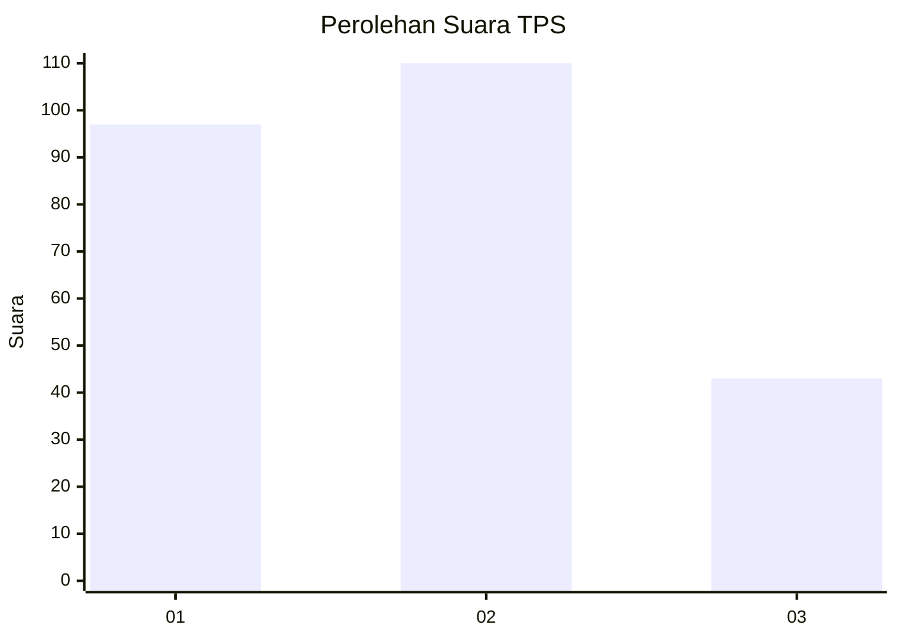
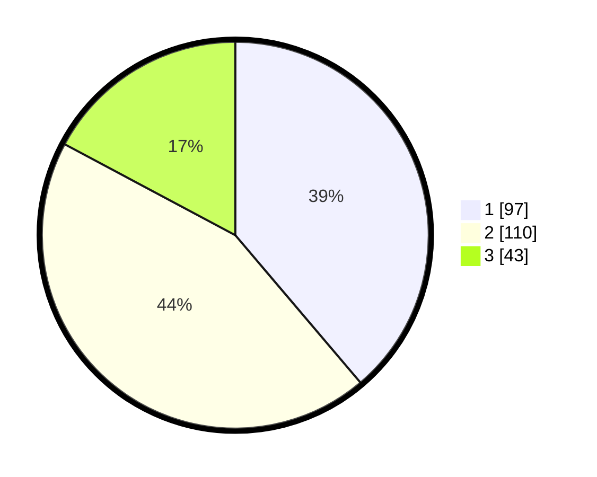

# Hasil

## Grafik

## Tabel

| No. | Nama Paslon    | Suara | Suara (raw) | Persentase |
|:--- |:-------------- | -----:| -----------:| ----------:|
| 1   | ANIES MUHAIMIN | 97    | [97][p-1]   | 38,80      |
| 2   | PRABOWO GIBRAN | 110   | [110][p-2]  | 44,00      |
| 3   | GANJAR MAHFUD  | 43    | [43][p-3]   | 17,20      |

[p-1]: https://github.com/gigit-pemilu/pemilu-2024-34-di-yogyakarta/blob/main/pilpres/hitung-suara/sub/34-di-yogyakarta/sub/04-sleman/sub/05-seyegan/sub/2003-margokaton/sub/015-tps/sub/paslon-1.txt
[p-2]: https://github.com/gigit-pemilu/pemilu-2024-34-di-yogyakarta/blob/main/pilpres/hitung-suara/sub/34-di-yogyakarta/sub/04-sleman/sub/05-seyegan/sub/2003-margokaton/sub/015-tps/sub/paslon-2.txt
[p-3]: https://github.com/gigit-pemilu/pemilu-2024-34-di-yogyakarta/blob/main/pilpres/hitung-suara/sub/34-di-yogyakarta/sub/04-sleman/sub/05-seyegan/sub/2003-margokaton/sub/015-tps/sub/paslon-3.txt

## Foto C Plano

https://sirekap-obj-formc.kpu.go.id/00e5/pemilu/ppwp/34/04/05/20/03/3404052003015-20240214-230719--036604b6-4e71-4674-8577-65c6978b18b5.jpg

https://sirekap-obj-formc.kpu.go.id/00e5/pemilu/ppwp/34/04/05/20/03/3404052003015-20240214-230847--a4cc7794-9128-412f-95d6-2edc8164193e.jpg

https://sirekap-obj-formc.kpu.go.id/00e5/pemilu/ppwp/34/04/05/20/03/3404052003015-20240214-231025--49e97929-5474-4ca6-886c-56866da4f3ee.jpg

## Metadata

| Key        | Value               |
| ---------- | ------------------- |
| Time Stamp | 2024-02-15 21:30:27 |

