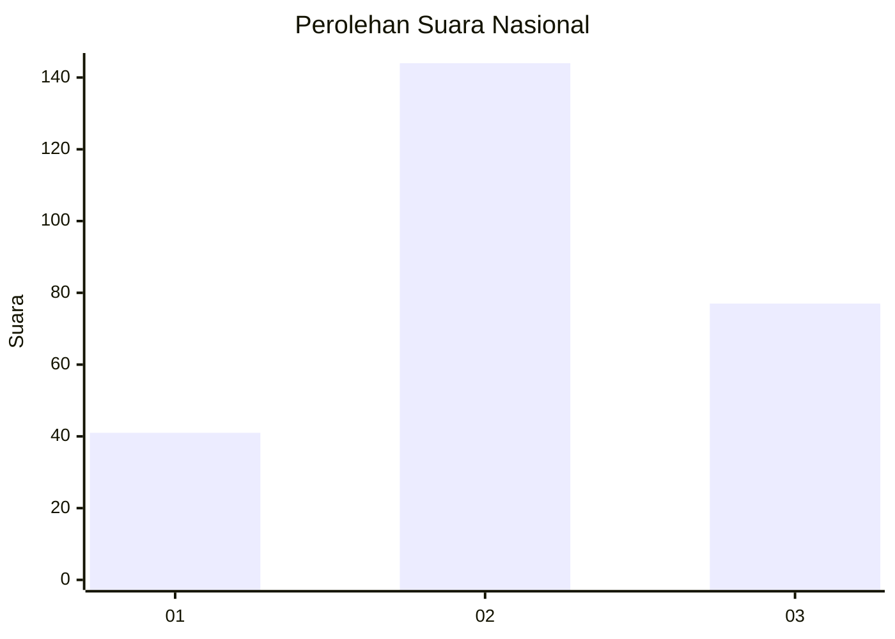
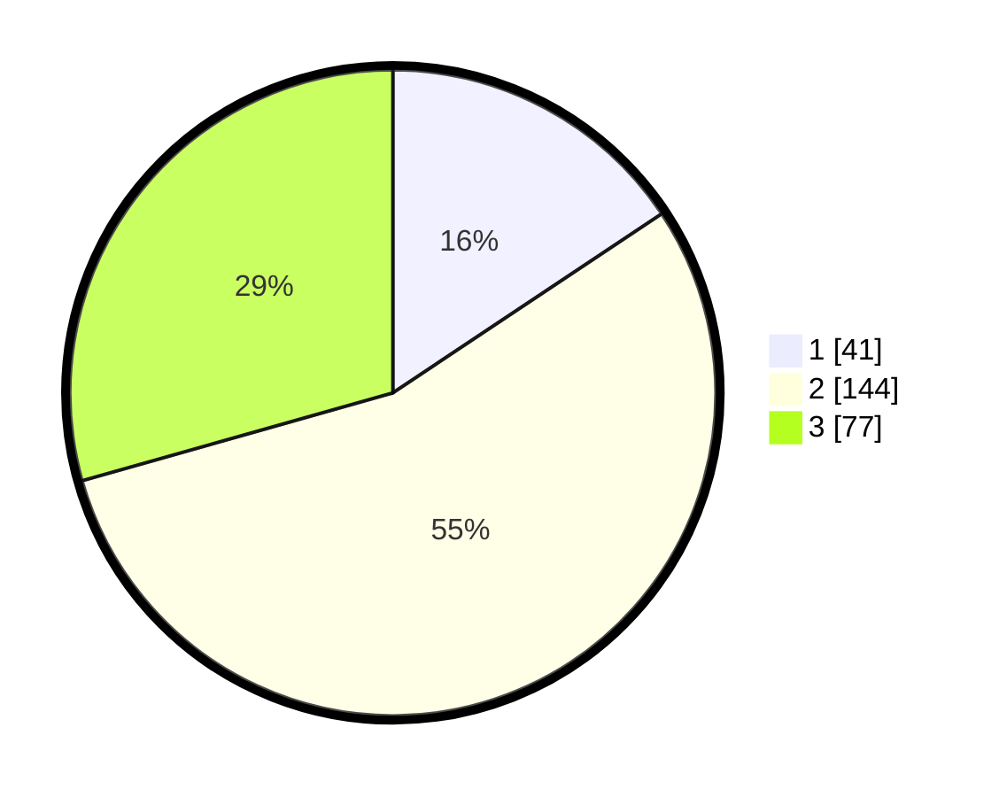

# Hasil

## Grafik

## Tabel

| No. | Nama Paslon    | Suara | Suara (raw) | Persentase |
|:--- |:-------------- | -----:| -----------:| ----------:|
| 1   | ANIES MUHAIMIN | 41    | [41][p-1]   | 15,65      |
| 2   | PRABOWO GIBRAN | 144   | [144][p-2]  | 54,96      |
| 3   | GANJAR MAHFUD  | 77    | [77][p-3]   | 29,39      |

[p-1]: https://github.com/gigit-pemilu/pemilu-2024/blob/main/pilpres/hitung-suara/sub/34-di-yogyakarta/sub/04-sleman/sub/05-seyegan/sub/2003-margokaton/sub/020-tps/sub/paslon-1.txt
[p-2]: https://github.com/gigit-pemilu/pemilu-2024/blob/main/pilpres/hitung-suara/sub/34-di-yogyakarta/sub/04-sleman/sub/05-seyegan/sub/2003-margokaton/sub/020-tps/sub/paslon-2.txt
[p-3]: https://github.com/gigit-pemilu/pemilu-2024/blob/main/pilpres/hitung-suara/sub/34-di-yogyakarta/sub/04-sleman/sub/05-seyegan/sub/2003-margokaton/sub/020-tps/sub/paslon-3.txt

## Foto C Plano

https://sirekap-obj-formc.kpu.go.id/2aa2/pemilu/ppwp/34/04/05/20/03/3404052003020-20240215-025349--694623b0-7bca-48f5-aecf-43f278d37b79.jpg

https://sirekap-obj-formc.kpu.go.id/2aa2/pemilu/ppwp/34/04/05/20/03/3404052003020-20240215-025454--b53a9004-f913-4873-b87a-60d0d3af71e0.jpg

https://sirekap-obj-formc.kpu.go.id/2aa2/pemilu/ppwp/34/04/05/20/03/3404052003020-20240215-025546--2ba21255-a3bc-4829-adc6-ce87578df6eb.jpg

## Metadata

| Key        | Value               |
| ---------- | ------------------- |
| Time Stamp | 2024-02-15 21:01:18 |

