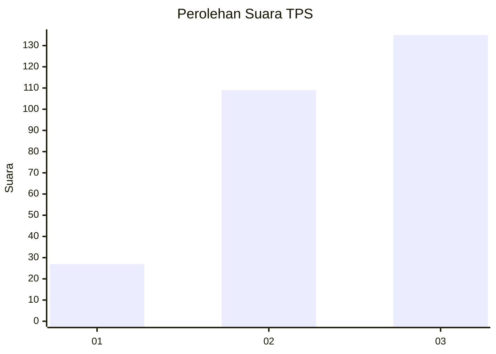
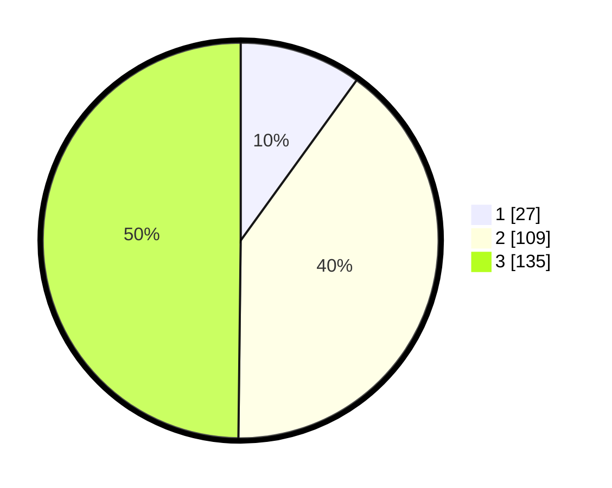

# Hasil

## Grafik

## Tabel

| No. | Nama Paslon    | Suara | Suara (raw) | Persentase |
|:--- |:-------------- | -----:| -----------:| ----------:|
| 1   | ANIES MUHAIMIN | 27    | [27][p-1]   | 9,96       |
| 2   | PRABOWO GIBRAN | 109   | [109][p-2]  | 40,22      |
| 3   | GANJAR MAHFUD  | 135   | [135][p-3]  | 49,82      |

[p-1]: https://github.com/gigit-pemilu/pemilu-2024-34-di-yogyakarta/blob/main/pilpres/hitung-suara/sub/34-di-yogyakarta/sub/04-sleman/sub/05-seyegan/sub/2003-margokaton/sub/023-tps/sub/paslon-1.txt
[p-2]: https://github.com/gigit-pemilu/pemilu-2024-34-di-yogyakarta/blob/main/pilpres/hitung-suara/sub/34-di-yogyakarta/sub/04-sleman/sub/05-seyegan/sub/2003-margokaton/sub/023-tps/sub/paslon-2.txt
[p-3]: https://github.com/gigit-pemilu/pemilu-2024-34-di-yogyakarta/blob/main/pilpres/hitung-suara/sub/34-di-yogyakarta/sub/04-sleman/sub/05-seyegan/sub/2003-margokaton/sub/023-tps/sub/paslon-3.txt

## Foto C Plano

https://sirekap-obj-formc.kpu.go.id/8701/pemilu/ppwp/34/04/05/20/03/3404052003023-20240214-200535--f4f1c856-65fe-407e-ac84-bc4748832773.jpg

https://sirekap-obj-formc.kpu.go.id/8701/pemilu/ppwp/34/04/05/20/03/3404052003023-20240214-155421--6e770c71-dfa1-4651-8dc2-2ef163077003.jpg

https://sirekap-obj-formc.kpu.go.id/8701/pemilu/ppwp/34/04/05/20/03/3404052003023-20240214-200216--11bed151-92dd-44b0-9d5f-0228cbfa5d5f.jpg

## Metadata

| Key        | Value               |
| ---------- | ------------------- |
| Time Stamp | 2024-02-15 16:00:26 |

