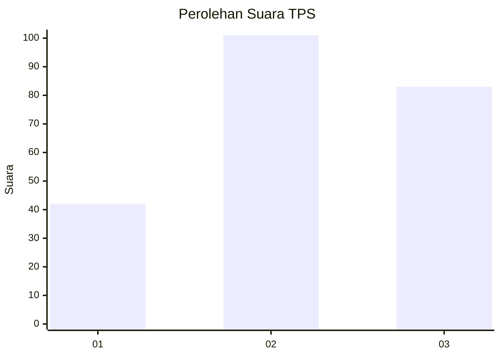
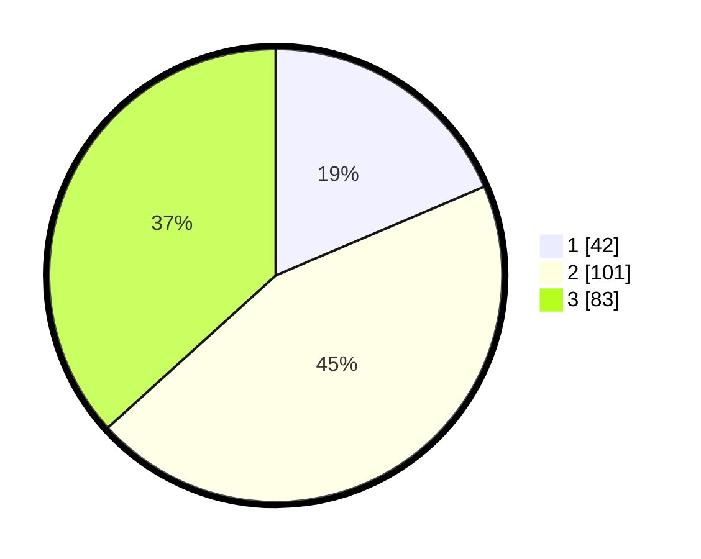

# Hasil

## Grafik

## Tabel

| No. | Nama Paslon    | Suara | Suara (raw) | Persentase |
|:--- |:-------------- | -----:| -----------:| ----------:|
| 1   | ANIES MUHAIMIN | 42    | [42][p-1]   | 18,58      |
| 2   | PRABOWO GIBRAN | 101   | [101][p-2]  | 44,69      |
| 3   | GANJAR MAHFUD  | 83    | [83][p-3]   | 36,73      |

[p-1]: https://github.com/gigit-pemilu/pemilu-2024-34-di-yogyakarta/blob/main/pilpres/hitung-suara/sub/34-di-yogyakarta/sub/04-sleman/sub/05-seyegan/sub/2004-margomulyo/sub/001-tps/sub/paslon-1.txt
[p-2]: https://github.com/gigit-pemilu/pemilu-2024-34-di-yogyakarta/blob/main/pilpres/hitung-suara/sub/34-di-yogyakarta/sub/04-sleman/sub/05-seyegan/sub/2004-margomulyo/sub/001-tps/sub/paslon-2.txt
[p-3]: https://github.com/gigit-pemilu/pemilu-2024-34-di-yogyakarta/blob/main/pilpres/hitung-suara/sub/34-di-yogyakarta/sub/04-sleman/sub/05-seyegan/sub/2004-margomulyo/sub/001-tps/sub/paslon-3.txt

## Foto C Plano

https://sirekap-obj-formc.kpu.go.id/eec8/pemilu/ppwp/34/04/05/20/04/3404052004001-20240215-200243--2e47543c-d112-4dd1-aec9-e48a7a11cf80.jpg

https://sirekap-obj-formc.kpu.go.id/eec8/pemilu/ppwp/34/04/05/20/04/3404052004001-20240215-200808--5a826383-cd24-44b7-9677-0d167980cb8f.jpg

https://sirekap-obj-formc.kpu.go.id/eec8/pemilu/ppwp/34/04/05/20/04/3404052004001-20240215-200836--0af82d9c-269c-4b10-82a3-47c311fd0185.jpg

## Metadata

| Key        | Value               |
| ---------- | ------------------- |
| Time Stamp | 2024-02-15 22:30:27 |

