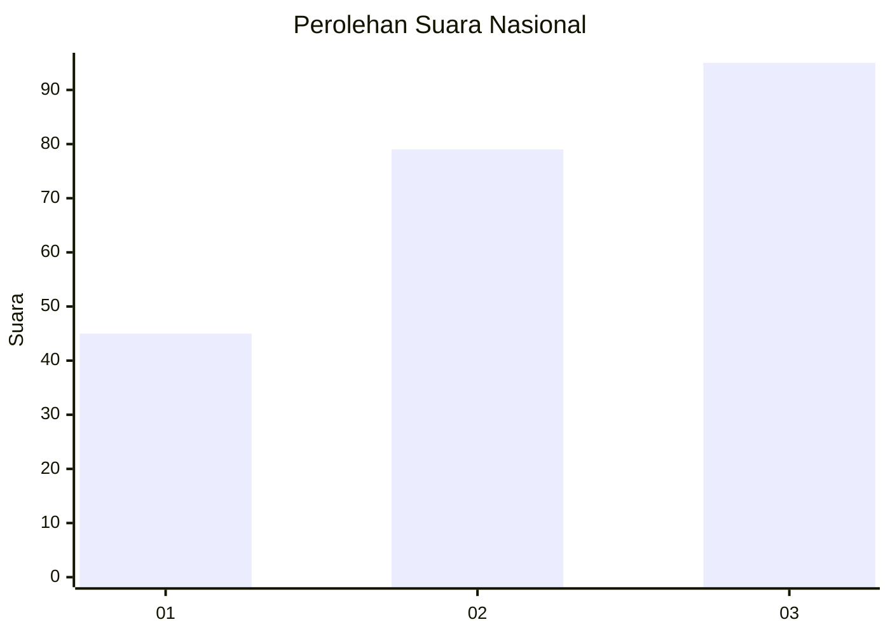
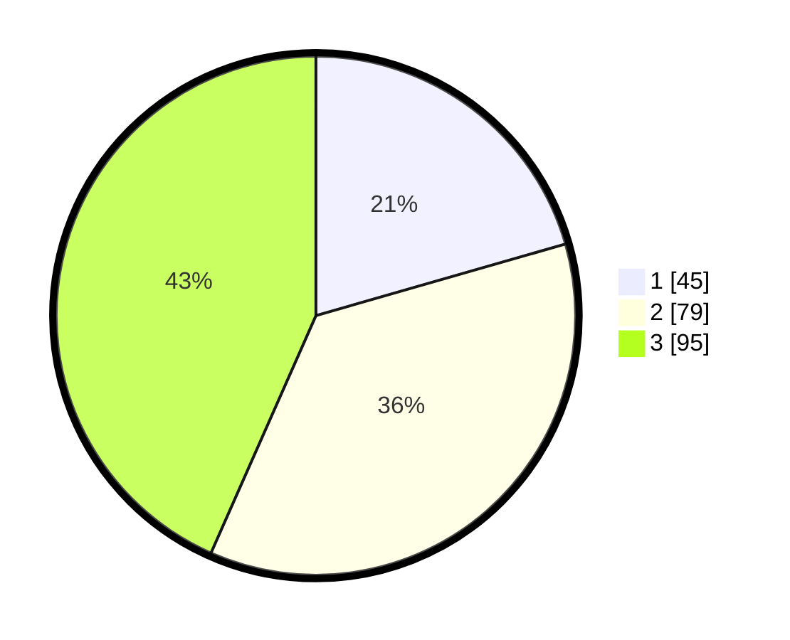

# Hasil

## Grafik

## Tabel

| No. | Nama Paslon    | Suara | Suara (raw) | Persentase |
|:--- |:-------------- | -----:| -----------:| ----------:|
| 1   | ANIES MUHAIMIN | 45    | [45][p-1]   | 20,55      |
| 2   | PRABOWO GIBRAN | 79    | [79][p-2]   | 36,07      |
| 3   | GANJAR MAHFUD  | 95    | [95][p-3]   | 43,38      |

[p-1]: https://github.com/gigit-pemilu/pemilu-2024/blob/main/pilpres/hitung-suara/sub/34-di-yogyakarta/sub/04-sleman/sub/05-seyegan/sub/2004-margomulyo/sub/002-tps/sub/paslon-1.txt
[p-2]: https://github.com/gigit-pemilu/pemilu-2024/blob/main/pilpres/hitung-suara/sub/34-di-yogyakarta/sub/04-sleman/sub/05-seyegan/sub/2004-margomulyo/sub/002-tps/sub/paslon-2.txt
[p-3]: https://github.com/gigit-pemilu/pemilu-2024/blob/main/pilpres/hitung-suara/sub/34-di-yogyakarta/sub/04-sleman/sub/05-seyegan/sub/2004-margomulyo/sub/002-tps/sub/paslon-3.txt

## Foto C Plano

https://sirekap-obj-formc.kpu.go.id/c003/pemilu/ppwp/34/04/05/20/04/3404052004002-20240214-203539--790a4dfe-975a-4397-8ec8-af3773ded6a2.jpg

https://sirekap-obj-formc.kpu.go.id/c003/pemilu/ppwp/34/04/05/20/04/3404052004002-20240214-204033--95c95194-008a-4197-bc77-8d71d836264c.jpg

https://sirekap-obj-formc.kpu.go.id/c003/pemilu/ppwp/34/04/05/20/04/3404052004002-20240214-223159--956897d5-2207-4d02-8c59-88397b5f1afa.jpg

## Metadata

| Key        | Value               |
| ---------- | ------------------- |
| Time Stamp | 2024-02-16 12:51:22 |

