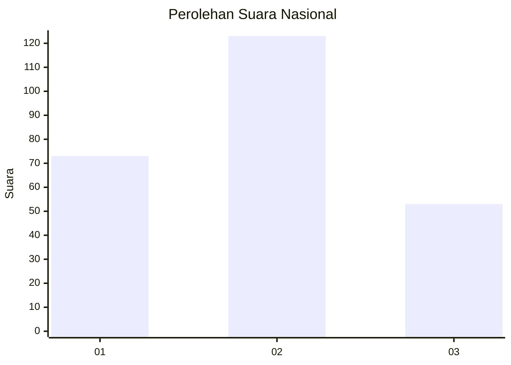
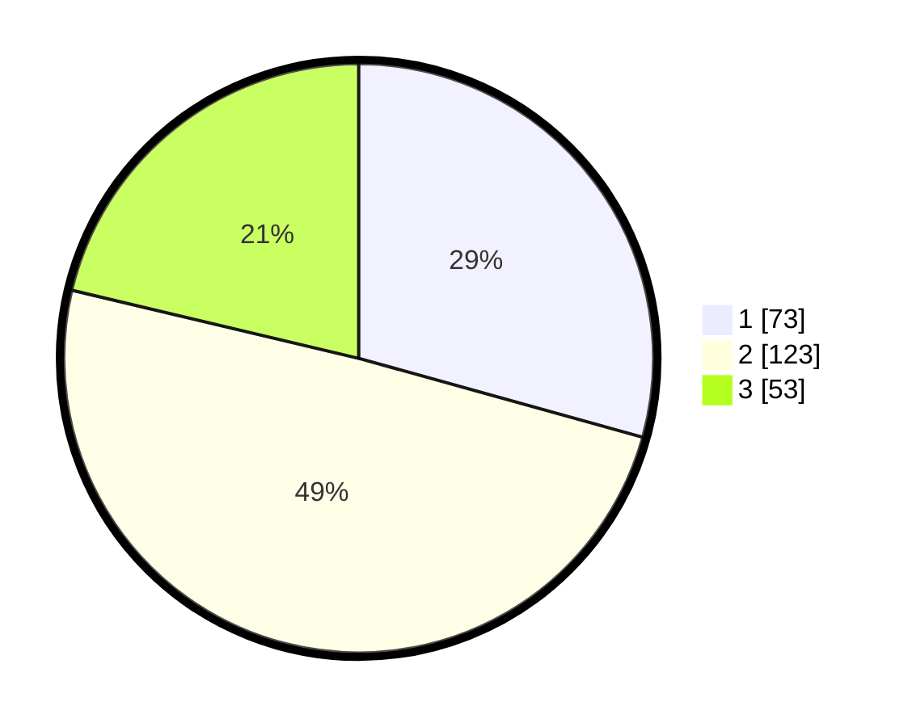

# Hasil

## Grafik

## Tabel

| No. | Nama Paslon    | Suara | Suara (raw) | Persentase |
|:--- |:-------------- | -----:| -----------:| ----------:|
| 1   | ANIES MUHAIMIN | 73    | [73][p-1]   | 29,32      |
| 2   | PRABOWO GIBRAN | 123   | [123][p-2]  | 49,40      |
| 3   | GANJAR MAHFUD  | 53    | [53][p-3]   | 21,29      |

[p-1]: https://github.com/gigit-pemilu/pemilu-2024/blob/main/pilpres/hitung-suara/sub/34-di-yogyakarta/sub/04-sleman/sub/05-seyegan/sub/2004-margomulyo/sub/003-tps/sub/paslon-1.txt
[p-2]: https://github.com/gigit-pemilu/pemilu-2024/blob/main/pilpres/hitung-suara/sub/34-di-yogyakarta/sub/04-sleman/sub/05-seyegan/sub/2004-margomulyo/sub/003-tps/sub/paslon-2.txt
[p-3]: https://github.com/gigit-pemilu/pemilu-2024/blob/main/pilpres/hitung-suara/sub/34-di-yogyakarta/sub/04-sleman/sub/05-seyegan/sub/2004-margomulyo/sub/003-tps/sub/paslon-3.txt

## Foto C Plano

https://sirekap-obj-formc.kpu.go.id/7474/pemilu/ppwp/34/04/05/20/04/3404052004003-20240215-011511--67be9bba-031e-43b4-b7db-a0049c4edcf6.jpg

https://sirekap-obj-formc.kpu.go.id/7474/pemilu/ppwp/34/04/05/20/04/3404052004003-20240214-224154--9f9c5cf5-b9e6-4993-ab44-d3223b3f3752.jpg

https://sirekap-obj-formc.kpu.go.id/7474/pemilu/ppwp/34/04/05/20/04/3404052004003-20240214-224323--c26169e5-5326-4604-bd3b-220aec185499.jpg

## Metadata

| Key        | Value               |
| ---------- | ------------------- |
| Time Stamp | 2024-02-15 15:30:25 |

