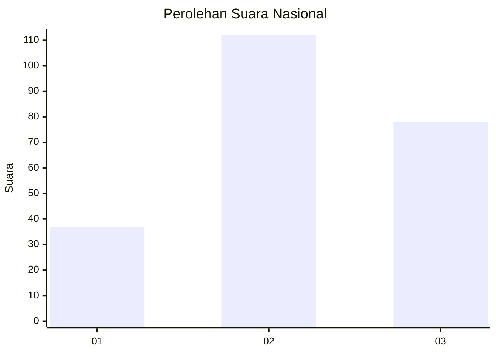
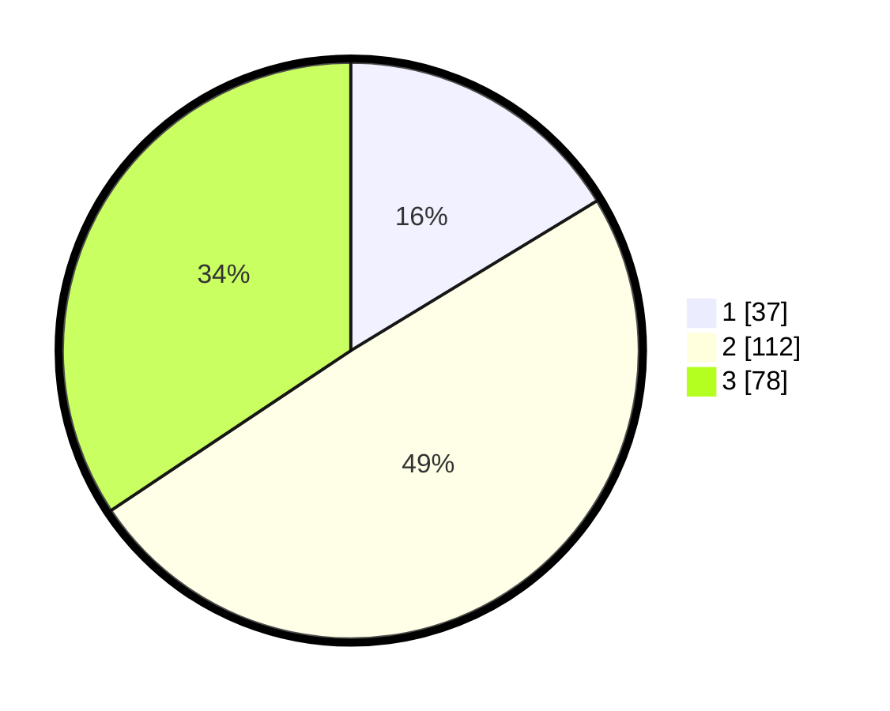

# Hasil

## Grafik

## Tabel

| No. | Nama Paslon    | Suara | Suara (raw) | Persentase |
|:--- |:-------------- | -----:| -----------:| ----------:|
| 1   | ANIES MUHAIMIN | 37    | [37][p-1]   | 16,30      |
| 2   | PRABOWO GIBRAN | 112   | [112][p-2]  | 49,34      |
| 3   | GANJAR MAHFUD  | 78    | [78][p-3]   | 34,36      |

[p-1]: https://github.com/gigit-pemilu/pemilu-2024/blob/main/pilpres/hitung-suara/sub/34-di-yogyakarta/sub/04-sleman/sub/05-seyegan/sub/2004-margomulyo/sub/007-tps/sub/paslon-1.txt
[p-2]: https://github.com/gigit-pemilu/pemilu-2024/blob/main/pilpres/hitung-suara/sub/34-di-yogyakarta/sub/04-sleman/sub/05-seyegan/sub/2004-margomulyo/sub/007-tps/sub/paslon-2.txt
[p-3]: https://github.com/gigit-pemilu/pemilu-2024/blob/main/pilpres/hitung-suara/sub/34-di-yogyakarta/sub/04-sleman/sub/05-seyegan/sub/2004-margomulyo/sub/007-tps/sub/paslon-3.txt

## Foto C Plano

https://sirekap-obj-formc.kpu.go.id/2d46/pemilu/ppwp/34/04/05/20/04/3404052004007-20240215-005451--4fb00c30-bbf5-435d-9857-265e51486870.jpg

https://sirekap-obj-formc.kpu.go.id/2d46/pemilu/ppwp/34/04/05/20/04/3404052004007-20240215-030942--38daa5a0-ea1d-4018-9283-4d55540730f1.jpg

https://sirekap-obj-formc.kpu.go.id/2d46/pemilu/ppwp/34/04/05/20/04/3404052004007-20240215-031138--d2d5ba48-2176-4b33-918c-a984a98403e6.jpg

## Metadata

| Key        | Value               |
| ---------- | ------------------- |
| Time Stamp | 2024-02-15 16:00:26 |

