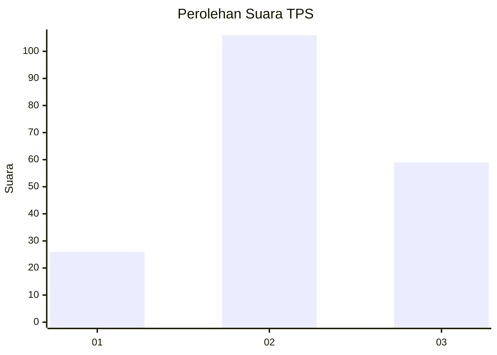
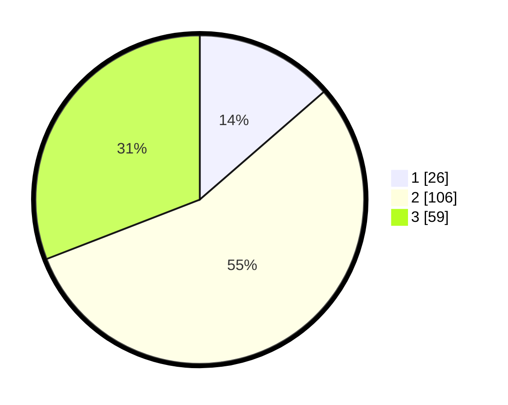

# Hasil

## Grafik

## Tabel

| No. | Nama Paslon    | Suara | Suara (raw) | Persentase |
|:--- |:-------------- | -----:| -----------:| ----------:|
| 1   | ANIES MUHAIMIN | 26    | [26][p-1]   | 13,61      |
| 2   | PRABOWO GIBRAN | 106   | [106][p-2]  | 55,50      |
| 3   | GANJAR MAHFUD  | 59    | [59][p-3]   | 30,89      |

[p-1]: https://github.com/gigit-pemilu/pemilu-2024-34-di-yogyakarta/blob/main/pilpres/hitung-suara/sub/34-di-yogyakarta/sub/04-sleman/sub/05-seyegan/sub/2004-margomulyo/sub/013-tps/sub/paslon-1.txt
[p-2]: https://github.com/gigit-pemilu/pemilu-2024-34-di-yogyakarta/blob/main/pilpres/hitung-suara/sub/34-di-yogyakarta/sub/04-sleman/sub/05-seyegan/sub/2004-margomulyo/sub/013-tps/sub/paslon-2.txt
[p-3]: https://github.com/gigit-pemilu/pemilu-2024-34-di-yogyakarta/blob/main/pilpres/hitung-suara/sub/34-di-yogyakarta/sub/04-sleman/sub/05-seyegan/sub/2004-margomulyo/sub/013-tps/sub/paslon-3.txt

## Foto C Plano

https://sirekap-obj-formc.kpu.go.id/3324/pemilu/ppwp/34/04/05/20/04/3404052004013-20240214-231417--369658f7-8179-497c-8325-a28f34038d75.jpg

https://sirekap-obj-formc.kpu.go.id/3324/pemilu/ppwp/34/04/05/20/04/3404052004013-20240214-231531--a8c11e61-26df-4f6f-8e2a-f0cb7bf30ce6.jpg

https://sirekap-obj-formc.kpu.go.id/3324/pemilu/ppwp/34/04/05/20/04/3404052004013-20240214-231733--3f03fb7f-2f39-43dd-af9d-07bb4e9b2d57.jpg

## Metadata

| Key        | Value               |
| ---------- | ------------------- |
| Time Stamp | 2024-02-15 16:00:26 |

