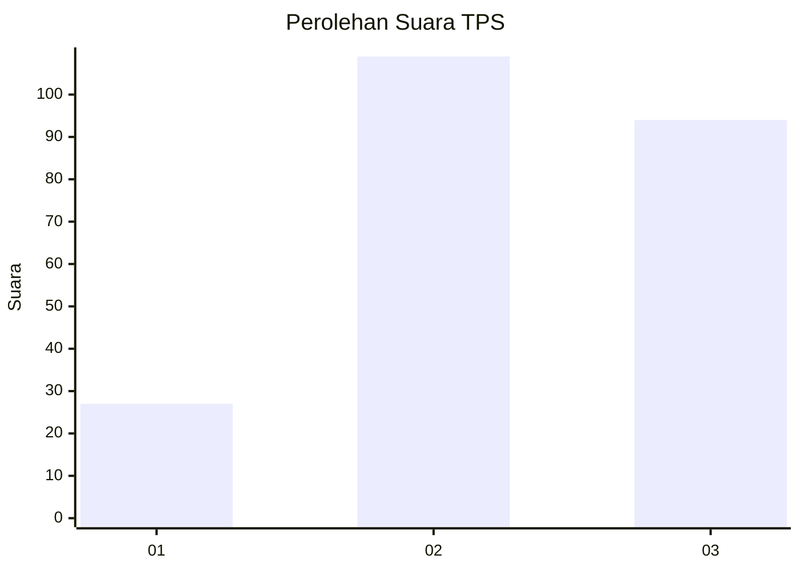
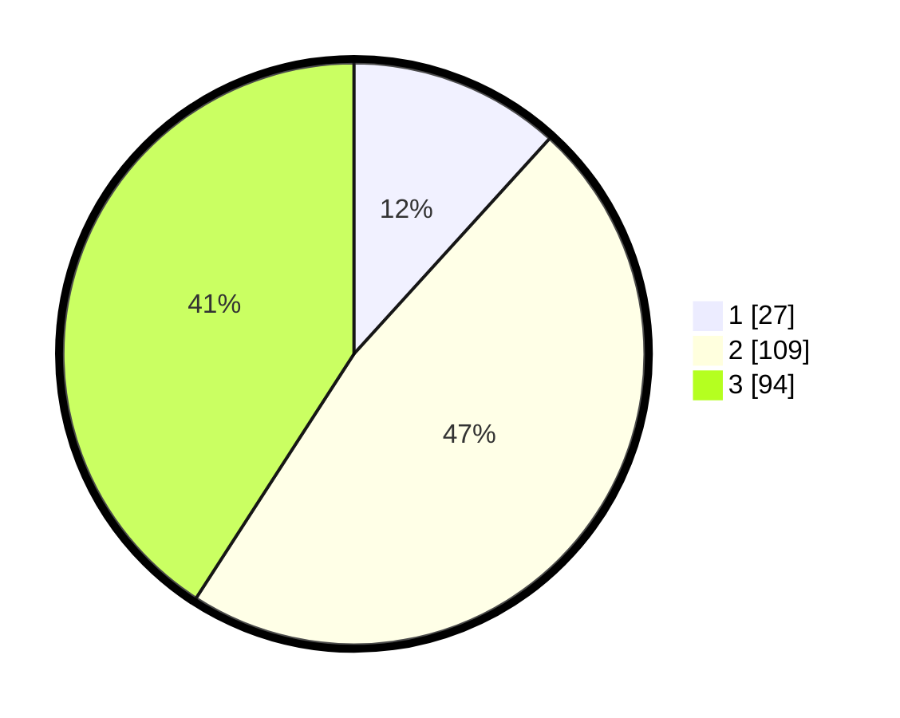

# Hasil

## Grafik

## Tabel

| No. | Nama Paslon    | Suara | Suara (raw) | Persentase |
|:--- |:-------------- | -----:| -----------:| ----------:|
| 1   | ANIES MUHAIMIN | 27    | [27][p-1]   | 11,74      |
| 2   | PRABOWO GIBRAN | 109   | [109][p-2]  | 47,39      |
| 3   | GANJAR MAHFUD  | 94    | [94][p-3]   | 40,87      |

[p-1]: https://github.com/gigit-pemilu/pemilu-2024-34-di-yogyakarta/blob/main/pilpres/hitung-suara/sub/34-di-yogyakarta/sub/04-sleman/sub/05-seyegan/sub/2004-margomulyo/sub/014-tps/sub/paslon-1.txt
[p-2]: https://github.com/gigit-pemilu/pemilu-2024-34-di-yogyakarta/blob/main/pilpres/hitung-suara/sub/34-di-yogyakarta/sub/04-sleman/sub/05-seyegan/sub/2004-margomulyo/sub/014-tps/sub/paslon-2.txt
[p-3]: https://github.com/gigit-pemilu/pemilu-2024-34-di-yogyakarta/blob/main/pilpres/hitung-suara/sub/34-di-yogyakarta/sub/04-sleman/sub/05-seyegan/sub/2004-margomulyo/sub/014-tps/sub/paslon-3.txt

## Foto C Plano

https://sirekap-obj-formc.kpu.go.id/a3c0/pemilu/ppwp/34/04/05/20/04/3404052004014-20240214-225842--855e10fb-a757-46ff-8f41-fdcede247b04.jpg

https://sirekap-obj-formc.kpu.go.id/a3c0/pemilu/ppwp/34/04/05/20/04/3404052004014-20240214-230148--adae9aa6-3301-41cb-a5db-8609226e44ff.jpg

https://sirekap-obj-formc.kpu.go.id/a3c0/pemilu/ppwp/34/04/05/20/04/3404052004014-20240214-230357--57c6c7ad-3ac5-46e7-ad34-27091539e8a0.jpg

## Metadata

| Key        | Value               |
| ---------- | ------------------- |
| Time Stamp | 2024-02-15 16:00:26 |

