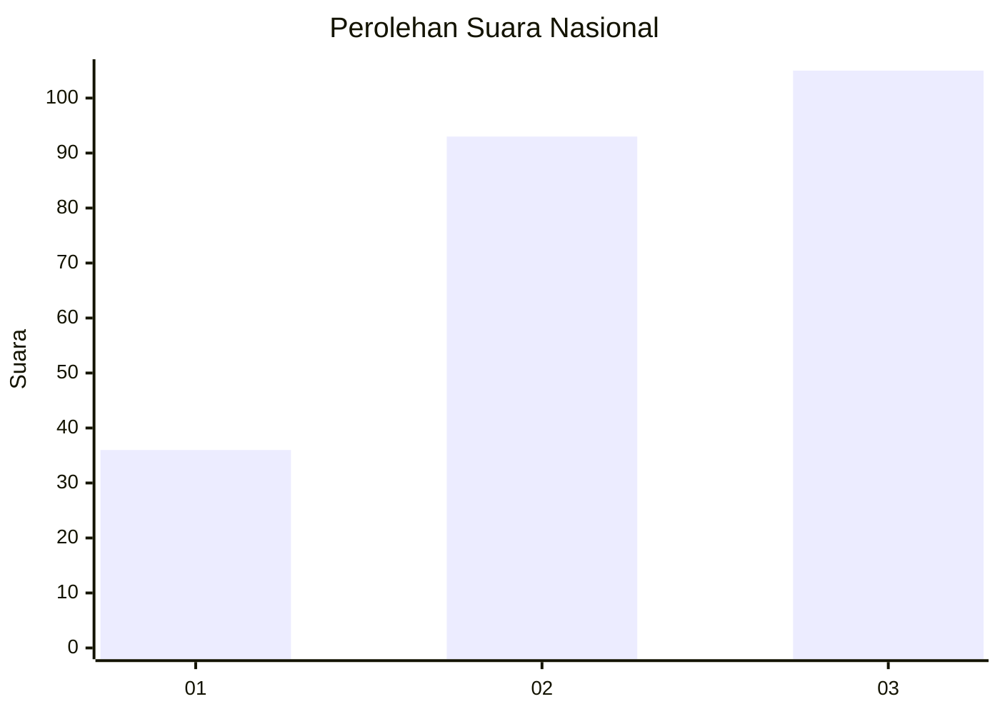
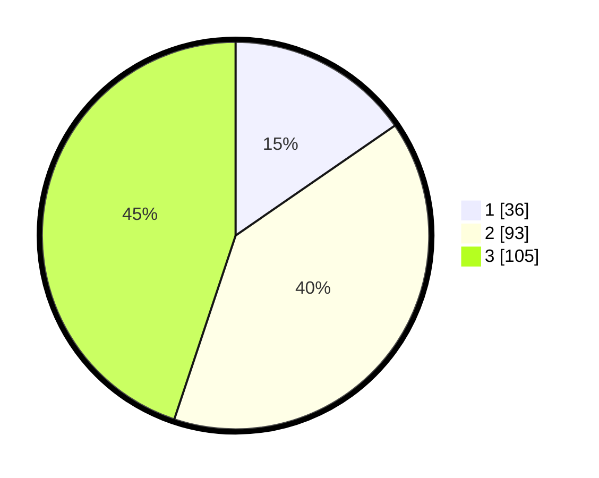

# Hasil

## Grafik

## Tabel

| No. | Nama Paslon    | Suara | Suara (raw) | Persentase |
|:--- |:-------------- | -----:| -----------:| ----------:|
| 1   | ANIES MUHAIMIN | 36    | [36][p-1]   | 15,38      |
| 2   | PRABOWO GIBRAN | 93    | [93][p-2]   | 39,74      |
| 3   | GANJAR MAHFUD  | 105   | [105][p-3]  | 44,87      |

[p-1]: https://github.com/gigit-pemilu/pemilu-2024/blob/main/pilpres/hitung-suara/sub/34-di-yogyakarta/sub/04-sleman/sub/05-seyegan/sub/2004-margomulyo/sub/015-tps/sub/paslon-1.txt
[p-2]: https://github.com/gigit-pemilu/pemilu-2024/blob/main/pilpres/hitung-suara/sub/34-di-yogyakarta/sub/04-sleman/sub/05-seyegan/sub/2004-margomulyo/sub/015-tps/sub/paslon-2.txt
[p-3]: https://github.com/gigit-pemilu/pemilu-2024/blob/main/pilpres/hitung-suara/sub/34-di-yogyakarta/sub/04-sleman/sub/05-seyegan/sub/2004-margomulyo/sub/015-tps/sub/paslon-3.txt

## Foto C Plano

https://sirekap-obj-formc.kpu.go.id/c8fa/pemilu/ppwp/34/04/05/20/04/3404052004015-20240214-214743--716f7a5e-2677-46f2-aade-476504d21a28.jpg

https://sirekap-obj-formc.kpu.go.id/c8fa/pemilu/ppwp/34/04/05/20/04/3404052004015-20240214-215021--e6515d11-61f4-426f-88ee-b5fb6ddaaa18.jpg

https://sirekap-obj-formc.kpu.go.id/c8fa/pemilu/ppwp/34/04/05/20/04/3404052004015-20240214-215119--982443f9-edfb-4199-9170-9cca4468d0e3.jpg

## Metadata

| Key        | Value               |
| ---------- | ------------------- |
| Time Stamp | 2024-02-15 16:00:26 |

