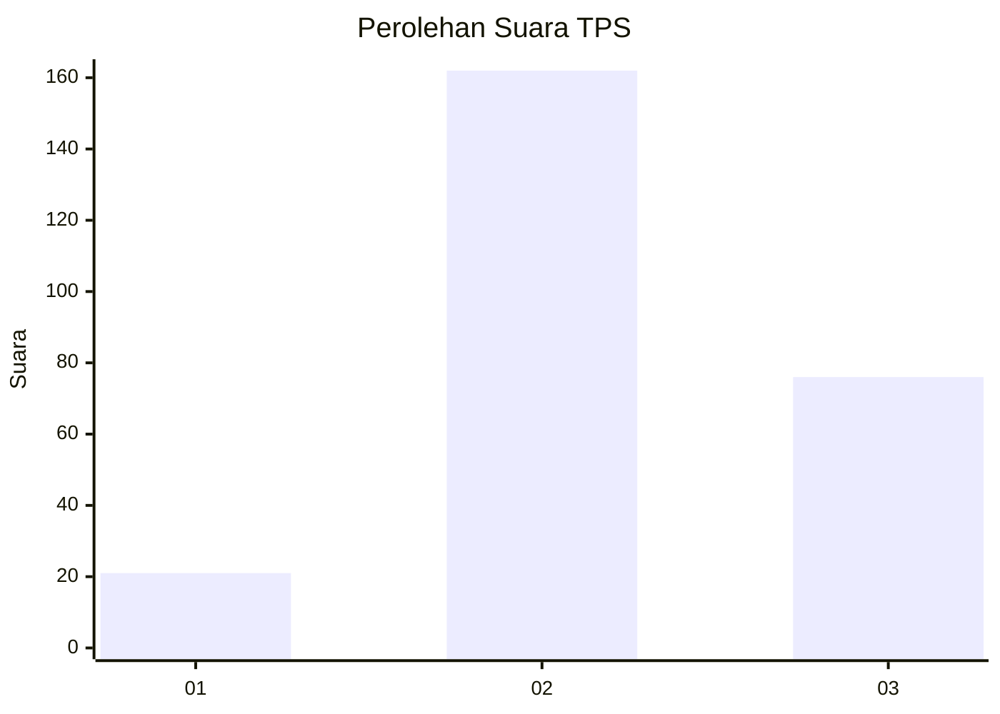
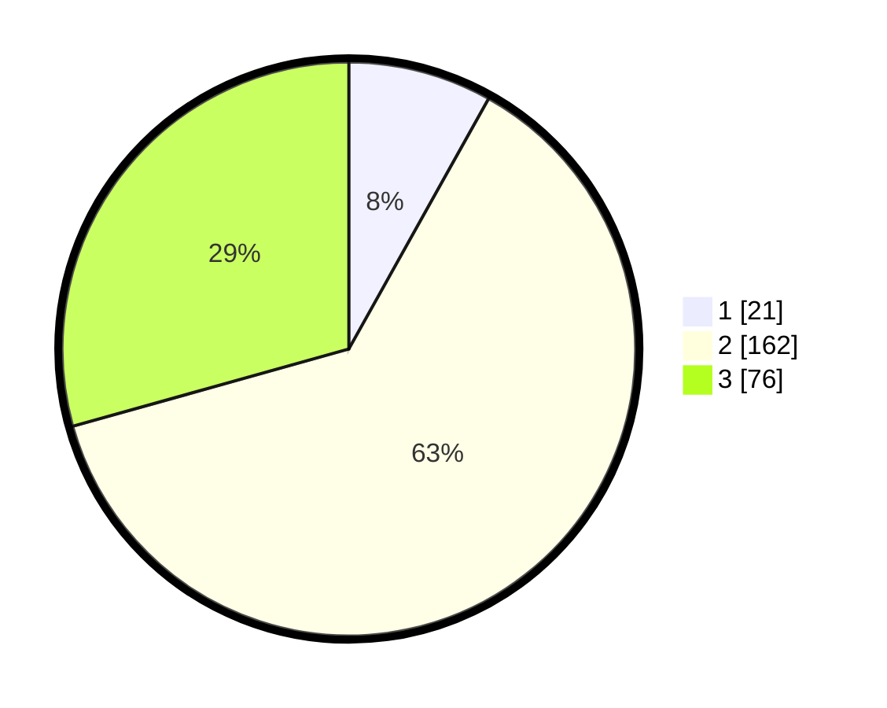

# Hasil

## Grafik

## Tabel

| No. | Nama Paslon    | Suara | Suara (raw) | Persentase |
|:--- |:-------------- | -----:| -----------:| ----------:|
| 1   | ANIES MUHAIMIN | 21    | [21][p-1]   | 8,11       |
| 2   | PRABOWO GIBRAN | 162   | [162][p-2]  | 62,55      |
| 3   | GANJAR MAHFUD  | 76    | [76][p-3]   | 29,34      |

[p-1]: https://github.com/gigit-pemilu/pemilu-2024-34-di-yogyakarta/blob/main/pilpres/hitung-suara/sub/34-di-yogyakarta/sub/04-sleman/sub/05-seyegan/sub/2004-margomulyo/sub/021-tps/sub/paslon-1.txt
[p-2]: https://github.com/gigit-pemilu/pemilu-2024-34-di-yogyakarta/blob/main/pilpres/hitung-suara/sub/34-di-yogyakarta/sub/04-sleman/sub/05-seyegan/sub/2004-margomulyo/sub/021-tps/sub/paslon-2.txt
[p-3]: https://github.com/gigit-pemilu/pemilu-2024-34-di-yogyakarta/blob/main/pilpres/hitung-suara/sub/34-di-yogyakarta/sub/04-sleman/sub/05-seyegan/sub/2004-margomulyo/sub/021-tps/sub/paslon-3.txt

## Foto C Plano

https://sirekap-obj-formc.kpu.go.id/0e0e/pemilu/ppwp/34/04/05/20/04/3404052004021-20240216-003424--9d1687fe-92ca-42c2-a63d-561f45bdf318.jpg

https://sirekap-obj-formc.kpu.go.id/0e0e/pemilu/ppwp/34/04/05/20/04/3404052004021-20240216-005113--0f2f8499-91c6-47df-ae12-d5bb4c4deb0e.jpg

https://sirekap-obj-formc.kpu.go.id/0e0e/pemilu/ppwp/34/04/05/20/04/3404052004021-20240215-234928--0f4e240a-2290-4735-a076-beb94085a220.jpg

## Metadata

| Key        | Value               |
| ---------- | ------------------- |
| Time Stamp | 2024-02-16 12:51:22 |

