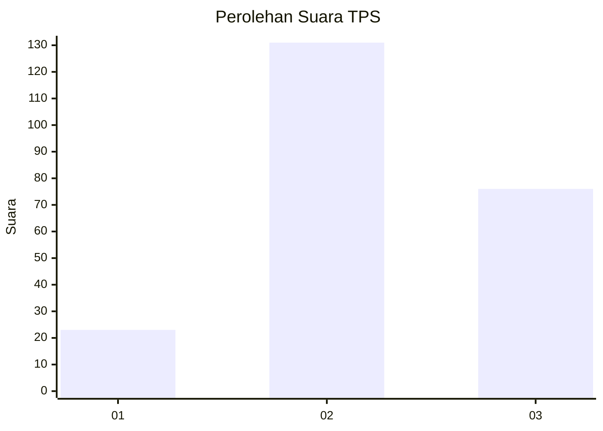
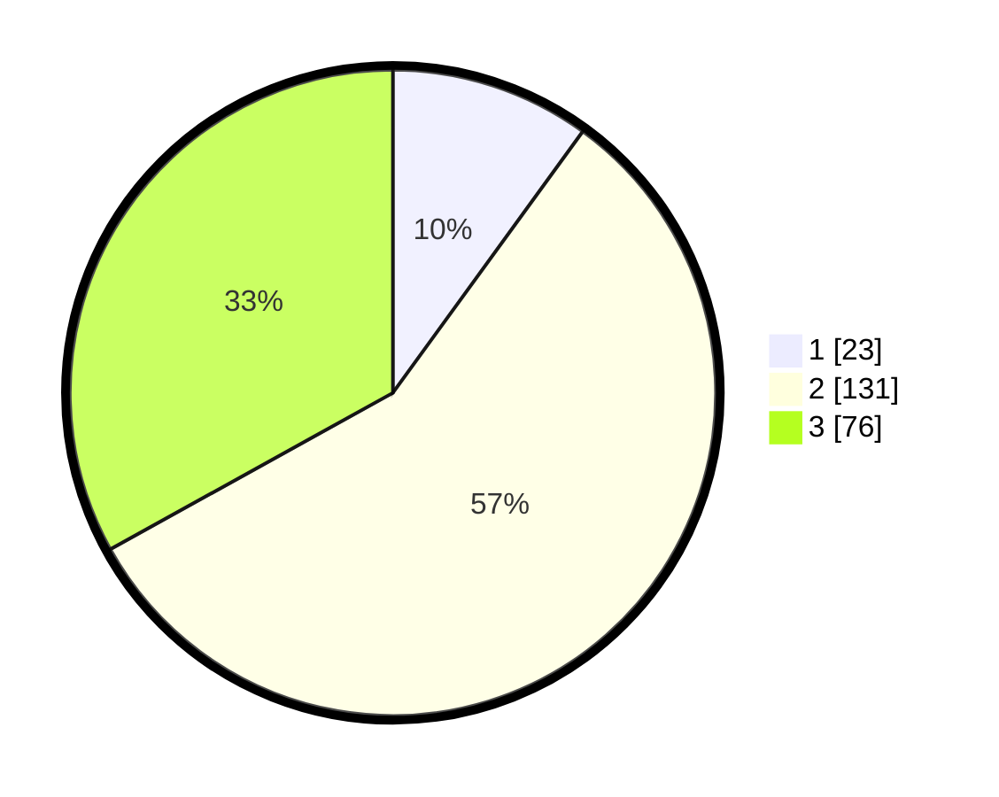

# Hasil

## Grafik

## Tabel

| No. | Nama Paslon    | Suara | Suara (raw) | Persentase |
|:--- |:-------------- | -----:| -----------:| ----------:|
| 1   | ANIES MUHAIMIN | 23    | [23][p-1]   | 10,00      |
| 2   | PRABOWO GIBRAN | 131   | [131][p-2]  | 56,96      |
| 3   | GANJAR MAHFUD  | 76    | [76][p-3]   | 33,04      |

[p-1]: https://github.com/gigit-pemilu/pemilu-2024-34-di-yogyakarta/blob/main/pilpres/hitung-suara/sub/34-di-yogyakarta/sub/04-sleman/sub/05-seyegan/sub/2004-margomulyo/sub/024-tps/sub/paslon-1.txt
[p-2]: https://github.com/gigit-pemilu/pemilu-2024-34-di-yogyakarta/blob/main/pilpres/hitung-suara/sub/34-di-yogyakarta/sub/04-sleman/sub/05-seyegan/sub/2004-margomulyo/sub/024-tps/sub/paslon-2.txt
[p-3]: https://github.com/gigit-pemilu/pemilu-2024-34-di-yogyakarta/blob/main/pilpres/hitung-suara/sub/34-di-yogyakarta/sub/04-sleman/sub/05-seyegan/sub/2004-margomulyo/sub/024-tps/sub/paslon-3.txt

## Foto C Plano

https://sirekap-obj-formc.kpu.go.id/ebb7/pemilu/ppwp/34/04/05/20/04/3404052004024-20240214-233256--b024c2ff-f657-4d84-8ed4-3865ecd45336.jpg

https://sirekap-obj-formc.kpu.go.id/ebb7/pemilu/ppwp/34/04/05/20/04/3404052004024-20240214-233355--f3f800c8-7a99-458a-a3dc-d38b78478d19.jpg

https://sirekap-obj-formc.kpu.go.id/ebb7/pemilu/ppwp/34/04/05/20/04/3404052004024-20240214-233556--9a820fc7-fc44-4395-aa96-7905a97f4940.jpg

## Metadata

| Key        | Value               |
| ---------- | ------------------- |
| Time Stamp | 2024-02-15 16:00:26 |

