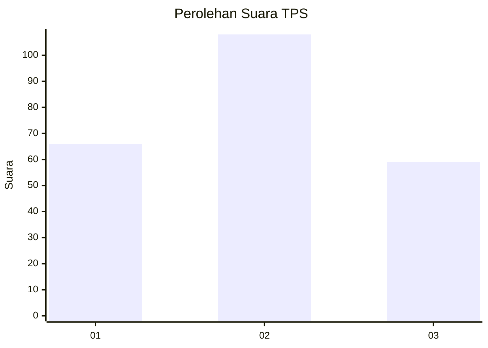
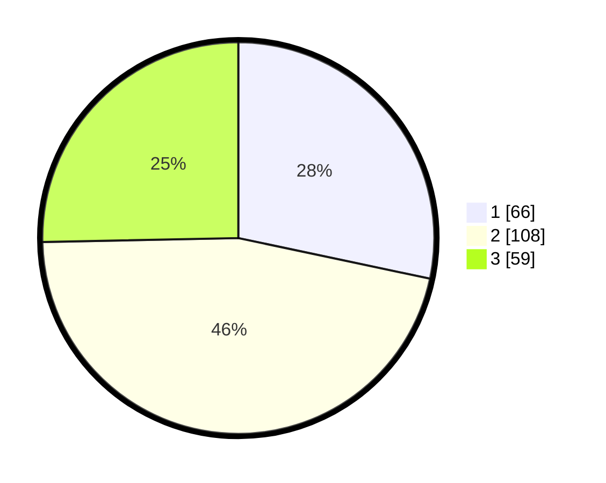

# Hasil

## Grafik

## Tabel

| No. | Nama Paslon    | Suara | Suara (raw) | Persentase |
|:--- |:-------------- | -----:| -----------:| ----------:|
| 1   | ANIES MUHAIMIN | 66    | [66][p-1]   | 28,33      |
| 2   | PRABOWO GIBRAN | 108   | [108][p-2]  | 46,35      |
| 3   | GANJAR MAHFUD  | 59    | [59][p-3]   | 25,32      |

[p-1]: https://github.com/gigit-pemilu/pemilu-2024-34-di-yogyakarta/blob/main/pilpres/hitung-suara/sub/34-di-yogyakarta/sub/04-sleman/sub/05-seyegan/sub/2004-margomulyo/sub/026-tps/sub/paslon-1.txt
[p-2]: https://github.com/gigit-pemilu/pemilu-2024-34-di-yogyakarta/blob/main/pilpres/hitung-suara/sub/34-di-yogyakarta/sub/04-sleman/sub/05-seyegan/sub/2004-margomulyo/sub/026-tps/sub/paslon-2.txt
[p-3]: https://github.com/gigit-pemilu/pemilu-2024-34-di-yogyakarta/blob/main/pilpres/hitung-suara/sub/34-di-yogyakarta/sub/04-sleman/sub/05-seyegan/sub/2004-margomulyo/sub/026-tps/sub/paslon-3.txt

## Foto C Plano

https://sirekap-obj-formc.kpu.go.id/88ba/pemilu/ppwp/34/04/05/20/04/3404052004026-20240215-005132--cdc02176-6e70-47e2-b70a-406e1aee20d2.jpg

https://sirekap-obj-formc.kpu.go.id/88ba/pemilu/ppwp/34/04/05/20/04/3404052004026-20240215-010712--3097fff5-d6ac-48b4-97a2-d691a8cd6c48.jpg

https://sirekap-obj-formc.kpu.go.id/88ba/pemilu/ppwp/34/04/05/20/04/3404052004026-20240215-010819--77aa5bf2-4099-4314-8585-717679a63e0b.jpg

## Metadata

| Key        | Value               |
| ---------- | ------------------- |
| Time Stamp | 2024-02-15 16:00:26 |

