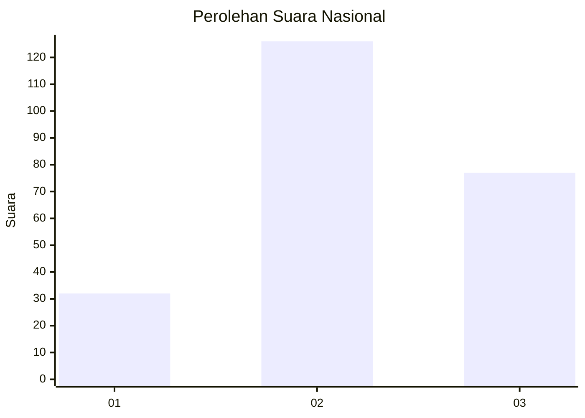
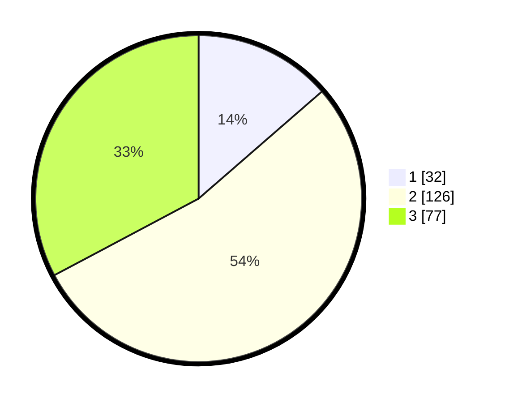

# Hasil

## Grafik

## Tabel

| No. | Nama Paslon    | Suara | Suara (raw) | Persentase |
|:--- |:-------------- | -----:| -----------:| ----------:|
| 1   | ANIES MUHAIMIN | 32    | [32][p-1]   | 13,62      |
| 2   | PRABOWO GIBRAN | 126   | [126][p-2]  | 53,62      |
| 3   | GANJAR MAHFUD  | 77    | [77][p-3]   | 32,77      |

[p-1]: https://github.com/gigit-pemilu/pemilu-2024/blob/main/pilpres/hitung-suara/sub/34-di-yogyakarta/sub/04-sleman/sub/05-seyegan/sub/2004-margomulyo/sub/028-tps/sub/paslon-1.txt
[p-2]: https://github.com/gigit-pemilu/pemilu-2024/blob/main/pilpres/hitung-suara/sub/34-di-yogyakarta/sub/04-sleman/sub/05-seyegan/sub/2004-margomulyo/sub/028-tps/sub/paslon-2.txt
[p-3]: https://github.com/gigit-pemilu/pemilu-2024/blob/main/pilpres/hitung-suara/sub/34-di-yogyakarta/sub/04-sleman/sub/05-seyegan/sub/2004-margomulyo/sub/028-tps/sub/paslon-3.txt

## Foto C Plano

https://sirekap-obj-formc.kpu.go.id/9483/pemilu/ppwp/34/04/05/20/04/3404052004028-20240214-224138--ffe98346-bc64-4f81-bb91-0eba460d8d9d.jpg

https://sirekap-obj-formc.kpu.go.id/9483/pemilu/ppwp/34/04/05/20/04/3404052004028-20240214-224232--2fcef220-5a37-4411-83ad-6331fa3974cf.jpg

https://sirekap-obj-formc.kpu.go.id/9483/pemilu/ppwp/34/04/05/20/04/3404052004028-20240214-224306--545b7dd4-3107-459d-a1ec-a23f7abef9b4.jpg

## Metadata

| Key        | Value               |
| ---------- | ------------------- |
| Time Stamp | 2024-02-15 16:00:26 |

