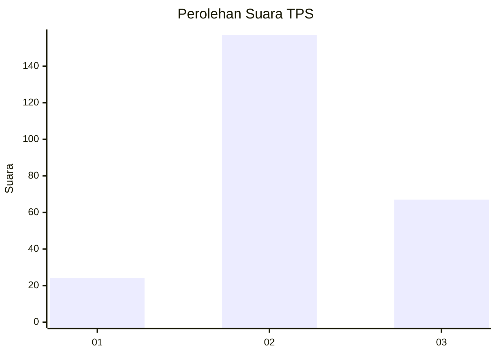
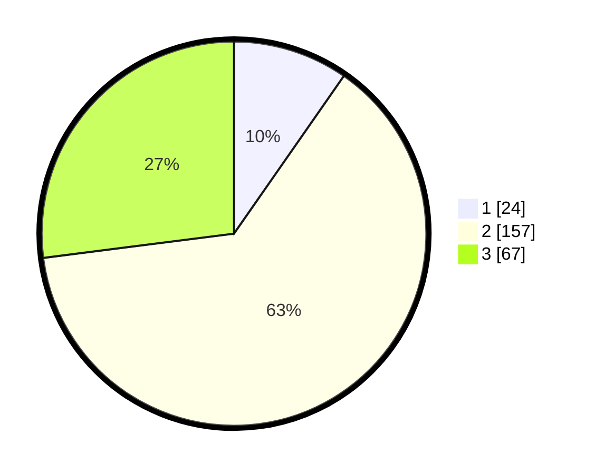

# Hasil

## Grafik

## Tabel

| No. | Nama Paslon    | Suara | Suara (raw) | Persentase |
|:--- |:-------------- | -----:| -----------:| ----------:|
| 1   | ANIES MUHAIMIN | 24    | [24][p-1]   | 9,68       |
| 2   | PRABOWO GIBRAN | 157   | [157][p-2]  | 63,31      |
| 3   | GANJAR MAHFUD  | 67    | [67][p-3]   | 27,02      |

[p-1]: https://github.com/gigit-pemilu/pemilu-2024-34-di-yogyakarta/blob/main/pilpres/hitung-suara/sub/34-di-yogyakarta/sub/04-sleman/sub/05-seyegan/sub/2004-margomulyo/sub/030-tps/sub/paslon-1.txt
[p-2]: https://github.com/gigit-pemilu/pemilu-2024-34-di-yogyakarta/blob/main/pilpres/hitung-suara/sub/34-di-yogyakarta/sub/04-sleman/sub/05-seyegan/sub/2004-margomulyo/sub/030-tps/sub/paslon-2.txt
[p-3]: https://github.com/gigit-pemilu/pemilu-2024-34-di-yogyakarta/blob/main/pilpres/hitung-suara/sub/34-di-yogyakarta/sub/04-sleman/sub/05-seyegan/sub/2004-margomulyo/sub/030-tps/sub/paslon-3.txt

## Foto C Plano

https://sirekap-obj-formc.kpu.go.id/51ae/pemilu/ppwp/34/04/05/20/04/3404052004030-20240214-160143--496d2e0b-8c18-4552-b0df-e330e90e9a2c.jpg

https://sirekap-obj-formc.kpu.go.id/51ae/pemilu/ppwp/34/04/05/20/04/3404052004030-20240214-160131--15c4bbc2-1b1e-41b0-acd2-16edcaa9bf66.jpg

https://sirekap-obj-formc.kpu.go.id/51ae/pemilu/ppwp/34/04/05/20/04/3404052004030-20240214-155720--8dcd0ae6-033c-4544-8859-1134797f606f.jpg

## Metadata

| Key        | Value               |
| ---------- | ------------------- |
| Time Stamp | 2024-02-15 21:01:18 |

