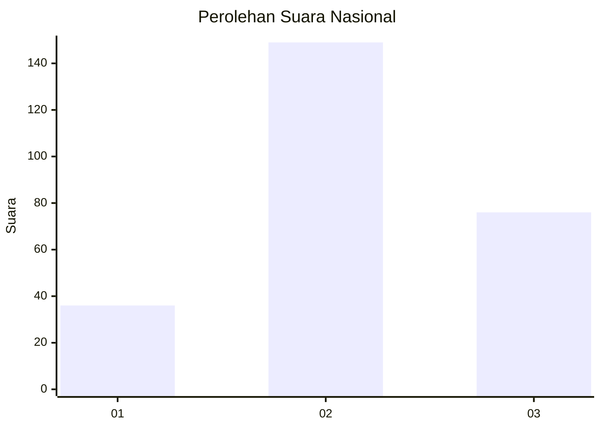
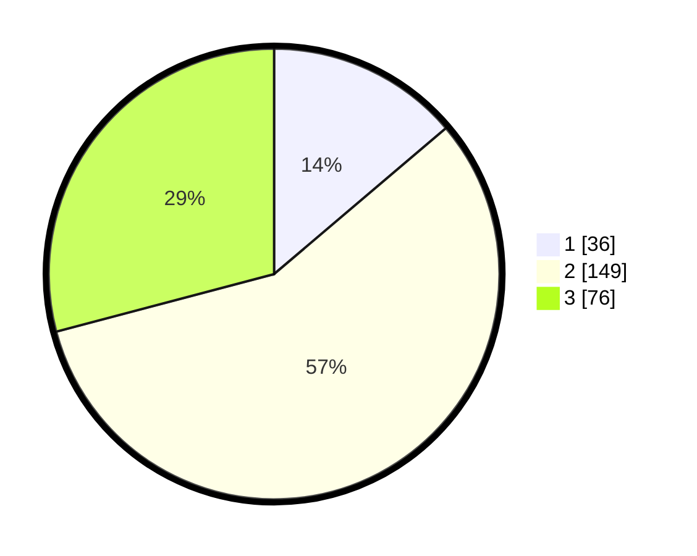

# Hasil

## Grafik

## Tabel

| No. | Nama Paslon    | Suara | Suara (raw) | Persentase |
|:--- |:-------------- | -----:| -----------:| ----------:|
| 1   | ANIES MUHAIMIN | 36    | [36][p-1]   | 13,79      |
| 2   | PRABOWO GIBRAN | 149   | [149][p-2]  | 57,09      |
| 3   | GANJAR MAHFUD  | 76    | [76][p-3]   | 29,12      |

[p-1]: https://github.com/gigit-pemilu/pemilu-2024/blob/main/pilpres/hitung-suara/sub/34-di-yogyakarta/sub/04-sleman/sub/05-seyegan/sub/2004-margomulyo/sub/037-tps/sub/paslon-1.txt
[p-2]: https://github.com/gigit-pemilu/pemilu-2024/blob/main/pilpres/hitung-suara/sub/34-di-yogyakarta/sub/04-sleman/sub/05-seyegan/sub/2004-margomulyo/sub/037-tps/sub/paslon-2.txt
[p-3]: https://github.com/gigit-pemilu/pemilu-2024/blob/main/pilpres/hitung-suara/sub/34-di-yogyakarta/sub/04-sleman/sub/05-seyegan/sub/2004-margomulyo/sub/037-tps/sub/paslon-3.txt

## Foto C Plano

https://sirekap-obj-formc.kpu.go.id/3c49/pemilu/ppwp/34/04/05/20/04/3404052004037-20240214-230925--ec15b286-3210-4107-816f-cfc587df7f4e.jpg

https://sirekap-obj-formc.kpu.go.id/3c49/pemilu/ppwp/34/04/05/20/04/3404052004037-20240214-231003--4bc8d1ca-2707-481b-a0ac-855ae24669d4.jpg

https://sirekap-obj-formc.kpu.go.id/3c49/pemilu/ppwp/34/04/05/20/04/3404052004037-20240214-231155--306c613d-7eb1-410d-ae6f-8cdd3c2f9bee.jpg

## Metadata

| Key        | Value               |
| ---------- | ------------------- |
| Time Stamp | 2024-02-15 21:01:18 |

