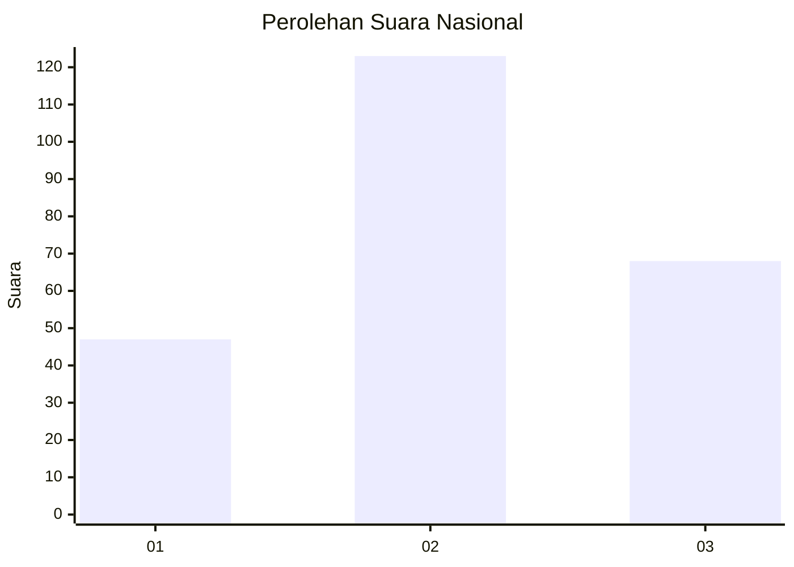
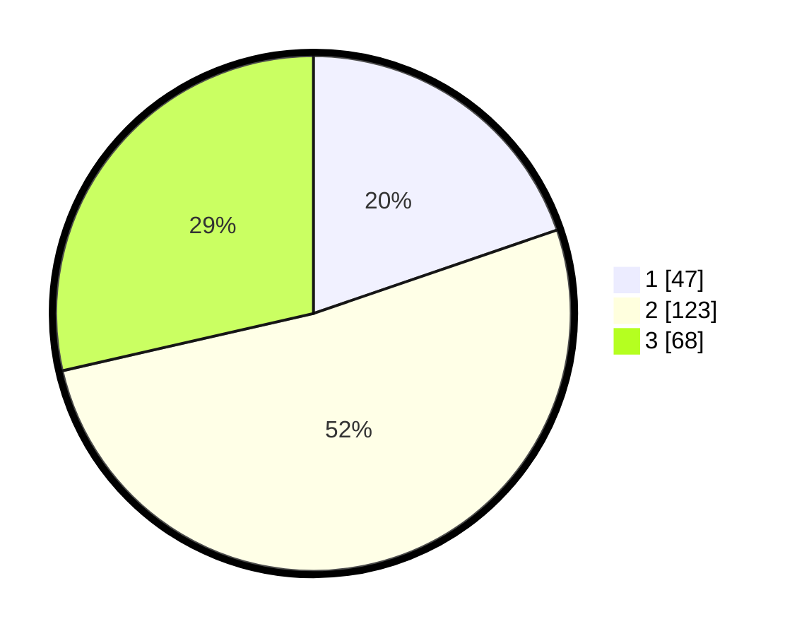

# Hasil

## Grafik

## Tabel

| No. | Nama Paslon    | Suara | Suara (raw) | Persentase |
|:--- |:-------------- | -----:| -----------:| ----------:|
| 1   | ANIES MUHAIMIN | 47    | [47][p-1]   | 19,75      |
| 2   | PRABOWO GIBRAN | 123   | [123][p-2]  | 51,68      |
| 3   | GANJAR MAHFUD  | 68    | [68][p-3]   | 28,57      |

[p-1]: https://github.com/gigit-pemilu/pemilu-2024/blob/main/pilpres/hitung-suara/sub/34-di-yogyakarta/sub/04-sleman/sub/05-seyegan/sub/2005-margoagung/sub/010-tps/sub/paslon-1.txt
[p-2]: https://github.com/gigit-pemilu/pemilu-2024/blob/main/pilpres/hitung-suara/sub/34-di-yogyakarta/sub/04-sleman/sub/05-seyegan/sub/2005-margoagung/sub/010-tps/sub/paslon-2.txt
[p-3]: https://github.com/gigit-pemilu/pemilu-2024/blob/main/pilpres/hitung-suara/sub/34-di-yogyakarta/sub/04-sleman/sub/05-seyegan/sub/2005-margoagung/sub/010-tps/sub/paslon-3.txt

## Foto C Plano

https://sirekap-obj-formc.kpu.go.id/9e31/pemilu/ppwp/34/04/05/20/05/3404052005010-20240215-033458--c5bbc6da-c322-4acd-89a6-80068137a3ff.jpg

https://sirekap-obj-formc.kpu.go.id/9e31/pemilu/ppwp/34/04/05/20/05/3404052005010-20240215-033518--530109d9-a908-4530-a162-ced815a17f31.jpg

https://sirekap-obj-formc.kpu.go.id/9e31/pemilu/ppwp/34/04/05/20/05/3404052005010-20240215-033538--7c16d8c7-5d24-4022-a1b6-89d5a6782775.jpg

## Metadata

| Key        | Value               |
| ---------- | ------------------- |
| Time Stamp | 2024-02-15 18:00:26 |

