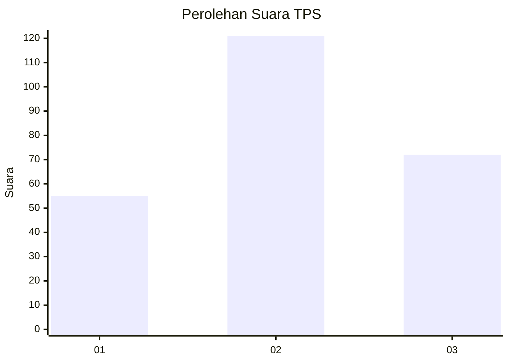
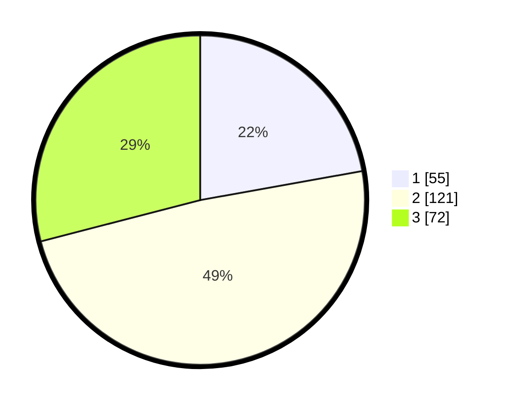

# Hasil

## Grafik

## Tabel

| No. | Nama Paslon    | Suara | Suara (raw) | Persentase |
|:--- |:-------------- | -----:| -----------:| ----------:|
| 1   | ANIES MUHAIMIN | 55    | [55][p-1]   | 22,18      |
| 2   | PRABOWO GIBRAN | 121   | [121][p-2]  | 48,79      |
| 3   | GANJAR MAHFUD  | 72    | [72][p-3]   | 29,03      |

[p-1]: https://github.com/gigit-pemilu/pemilu-2024-34-di-yogyakarta/blob/main/pilpres/hitung-suara/sub/34-di-yogyakarta/sub/04-sleman/sub/05-seyegan/sub/2005-margoagung/sub/022-tps/sub/paslon-1.txt
[p-2]: https://github.com/gigit-pemilu/pemilu-2024-34-di-yogyakarta/blob/main/pilpres/hitung-suara/sub/34-di-yogyakarta/sub/04-sleman/sub/05-seyegan/sub/2005-margoagung/sub/022-tps/sub/paslon-2.txt
[p-3]: https://github.com/gigit-pemilu/pemilu-2024-34-di-yogyakarta/blob/main/pilpres/hitung-suara/sub/34-di-yogyakarta/sub/04-sleman/sub/05-seyegan/sub/2005-margoagung/sub/022-tps/sub/paslon-3.txt

## Foto C Plano

https://sirekap-obj-formc.kpu.go.id/2d4a/pemilu/ppwp/34/04/05/20/05/3404052005022-20240215-010804--db6c5050-e4c3-4b07-9f82-507cb61dff28.jpg

https://sirekap-obj-formc.kpu.go.id/2d4a/pemilu/ppwp/34/04/05/20/05/3404052005022-20240215-013622--fea269bb-d1a1-4391-8810-068c3da34cf6.jpg

https://sirekap-obj-formc.kpu.go.id/2d4a/pemilu/ppwp/34/04/05/20/05/3404052005022-20240215-013926--94f7a83e-e03e-43cc-880f-857e858e87a2.jpg

## Metadata

| Key        | Value               |
| ---------- | ------------------- |
| Time Stamp | 2024-02-15 21:01:18 |

