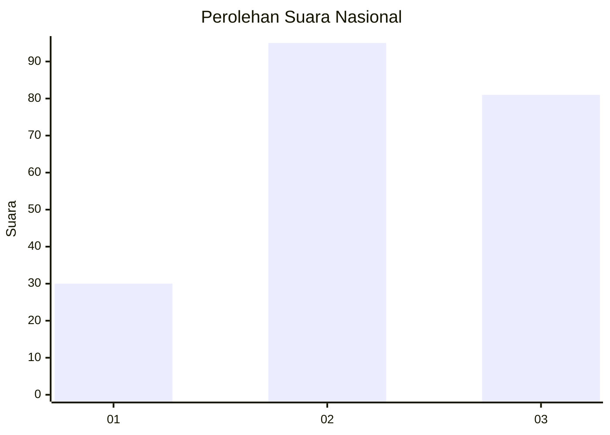
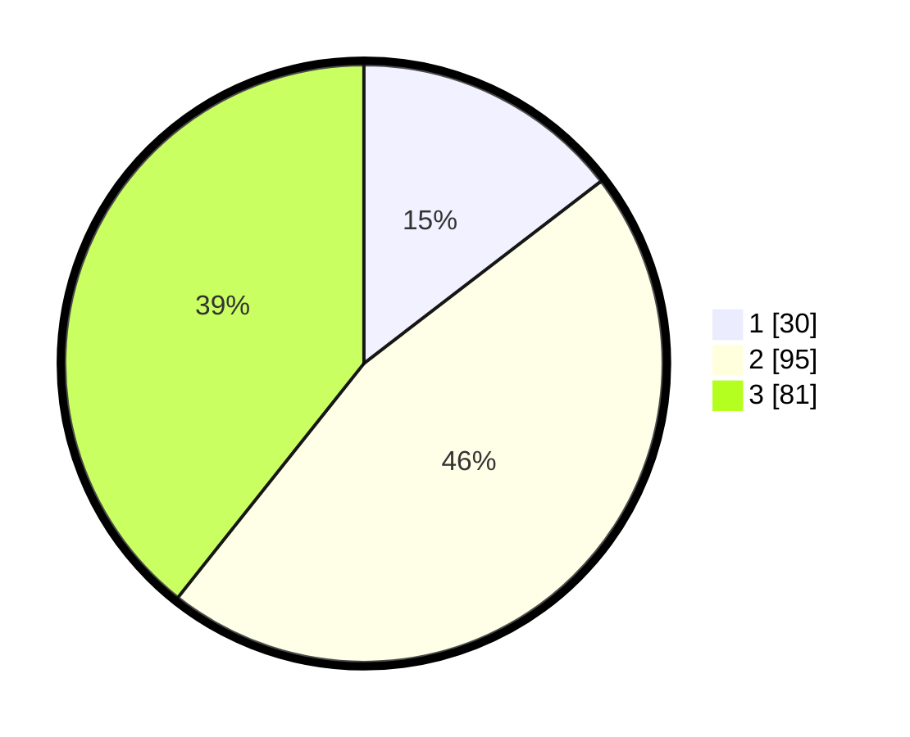

# Hasil

## Grafik

## Tabel

| No. | Nama Paslon    | Suara | Suara (raw) | Persentase |
|:--- |:-------------- | -----:| -----------:| ----------:|
| 1   | ANIES MUHAIMIN | 30    | [30][p-1]   | 14,56      |
| 2   | PRABOWO GIBRAN | 95    | [95][p-2]   | 46,12      |
| 3   | GANJAR MAHFUD  | 81    | [81][p-3]   | 39,32      |

[p-1]: https://github.com/gigit-pemilu/pemilu-2024/blob/main/pilpres/hitung-suara/sub/34-di-yogyakarta/sub/04-sleman/sub/05-seyegan/sub/2005-margoagung/sub/027-tps/sub/paslon-1.txt
[p-2]: https://github.com/gigit-pemilu/pemilu-2024/blob/main/pilpres/hitung-suara/sub/34-di-yogyakarta/sub/04-sleman/sub/05-seyegan/sub/2005-margoagung/sub/027-tps/sub/paslon-2.txt
[p-3]: https://github.com/gigit-pemilu/pemilu-2024/blob/main/pilpres/hitung-suara/sub/34-di-yogyakarta/sub/04-sleman/sub/05-seyegan/sub/2005-margoagung/sub/027-tps/sub/paslon-3.txt

## Foto C Plano

https://sirekap-obj-formc.kpu.go.id/d49e/pemilu/ppwp/34/04/05/20/05/3404052005027-20240215-045428--46791685-5ee1-42ae-a0b3-d5aea3788bd9.jpg

https://sirekap-obj-formc.kpu.go.id/d49e/pemilu/ppwp/34/04/05/20/05/3404052005027-20240215-045506--848a384f-69af-48d3-9daf-406c280866b3.jpg

https://sirekap-obj-formc.kpu.go.id/d49e/pemilu/ppwp/34/04/05/20/05/3404052005027-20240215-060000--65cfb6dd-3df8-49fd-ab2d-57cc272afd7a.jpg

## Metadata

| Key        | Value               |
| ---------- | ------------------- |
| Time Stamp | 2024-02-15 16:00:26 |

