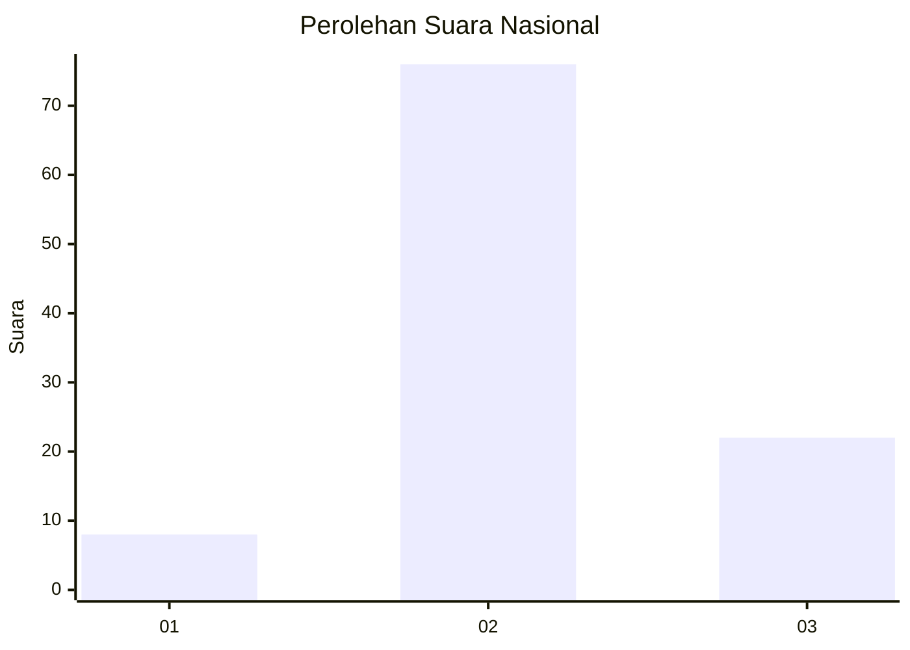
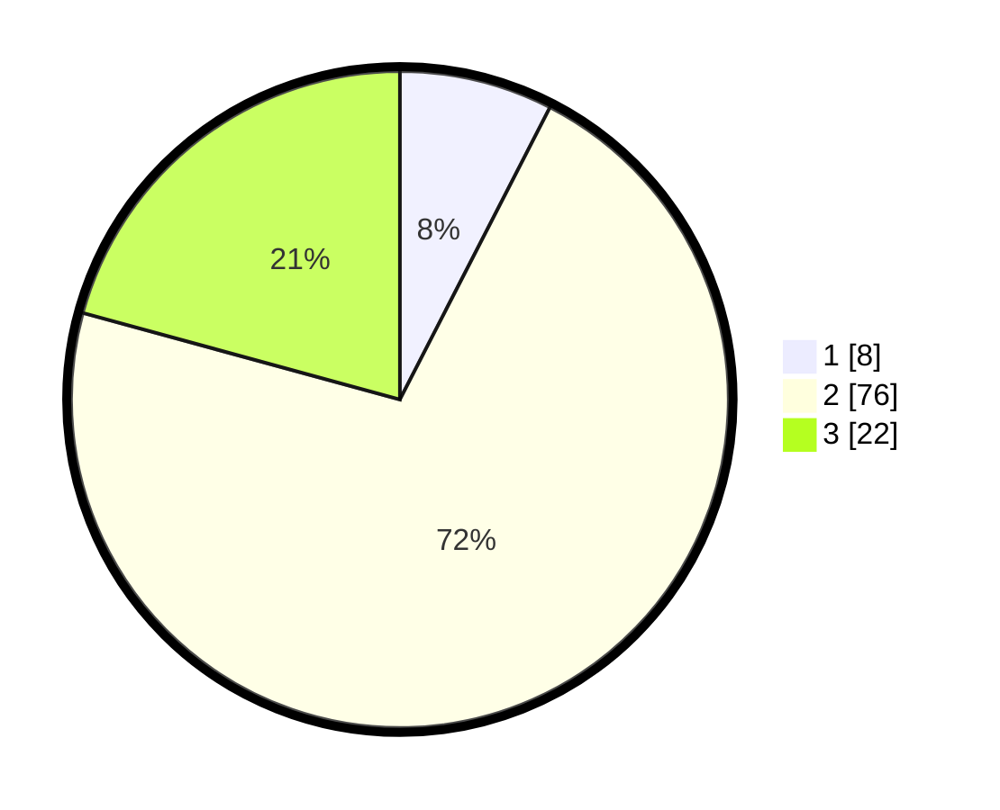

# Hasil

## Grafik

## Tabel

| No. | Nama Paslon    | Suara | Suara (raw) | Persentase |
|:--- |:-------------- | -----:| -----------:| ----------:|
| 1   | ANIES MUHAIMIN | 8     | [8][p-1]    | 7,55       |
| 2   | PRABOWO GIBRAN | 76    | [76][p-2]   | 71,70      |
| 3   | GANJAR MAHFUD  | 22    | [22][p-3]   | 20,75      |

[p-1]: https://github.com/gigit-pemilu/pemilu-2024/blob/main/pilpres/hitung-suara/sub/34-di-yogyakarta/sub/04-sleman/sub/05-seyegan/sub/2005-margoagung/sub/034-tps/sub/paslon-1.txt
[p-2]: https://github.com/gigit-pemilu/pemilu-2024/blob/main/pilpres/hitung-suara/sub/34-di-yogyakarta/sub/04-sleman/sub/05-seyegan/sub/2005-margoagung/sub/034-tps/sub/paslon-2.txt
[p-3]: https://github.com/gigit-pemilu/pemilu-2024/blob/main/pilpres/hitung-suara/sub/34-di-yogyakarta/sub/04-sleman/sub/05-seyegan/sub/2005-margoagung/sub/034-tps/sub/paslon-3.txt

## Foto C Plano

https://sirekap-obj-formc.kpu.go.id/57de/pemilu/ppwp/34/04/05/20/05/3404052005034-20240216-164541--31b7010c-5425-4ef1-8185-89f6a6632f2e.jpg

https://sirekap-obj-formc.kpu.go.id/57de/pemilu/ppwp/34/04/05/20/05/3404052005034-20240216-164543--89623134-5c1a-44f5-86a3-f8a2a172a811.jpg

https://sirekap-obj-formc.kpu.go.id/57de/pemilu/ppwp/34/04/05/20/05/3404052005034-20240216-164542--3c5b6fa2-c378-4ae4-b45e-fb6837487457.jpg

## Metadata

| Key        | Value               |
| ---------- | ------------------- |
| Time Stamp | 2024-02-16 21:01:00 |

## DATA PEMILIH TETAP

Jumlah pemilih dalam DPT: **118**.
 * L: **57**.
 * P: **61**.

## DATA PENGGUNA HAK PILIH

Jumlah pengguna hak pilih dalam DPT: **104**.
 * L: **49**.
 * P: **55**.

Jumlah pengguna hak pilih dalam DPTb: **4**.
 * L: **0**.
 * P: **4**.

Jumlah pengguna hak pilih dalam DPK: **1**.
 * L: **0**.
 * P: **1**.

Jumlah pengguna hak pilih: **109**.
 * L: **49**.
 * P: **60**.

## JUMLAH SUARA SAH DAN TIDAK SAH

JUMLAH SELURUH SUARA SAH: **106**.

JUMLAH SUARA TIDAK SAH: **3**.

JUMLAH SELURUH SUARA SAH DAN SUARA TIDAK SAH: **109**.

