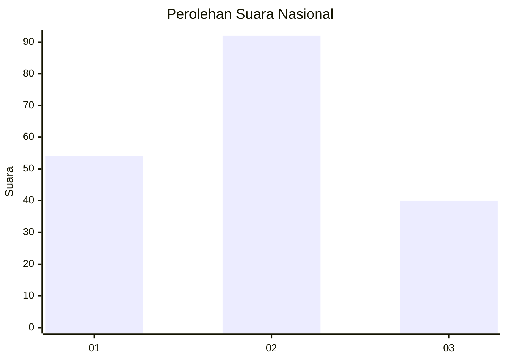
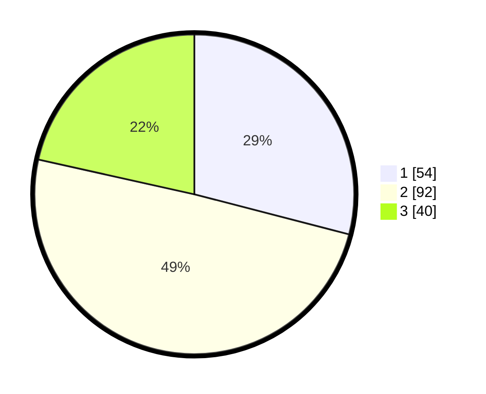

# Hasil

## Grafik

## Tabel

| No. | Nama Paslon    | Suara | Suara (raw) | Persentase |
|:--- |:-------------- | -----:| -----------:| ----------:|
| 1   | ANIES MUHAIMIN | 54    | [54][p-1]   | 29,03      |
| 2   | PRABOWO GIBRAN | 92    | [92][p-2]   | 49,46      |
| 3   | GANJAR MAHFUD  | 40    | [40][p-3]   | 21,51      |

[p-1]: https://github.com/gigit-pemilu/pemilu-2024/blob/main/pilpres/hitung-suara/sub/34-di-yogyakarta/sub/04-sleman/sub/06-mlati/sub/2001-sinduadi/sub/005-tps/sub/paslon-1.txt
[p-2]: https://github.com/gigit-pemilu/pemilu-2024/blob/main/pilpres/hitung-suara/sub/34-di-yogyakarta/sub/04-sleman/sub/06-mlati/sub/2001-sinduadi/sub/005-tps/sub/paslon-2.txt
[p-3]: https://github.com/gigit-pemilu/pemilu-2024/blob/main/pilpres/hitung-suara/sub/34-di-yogyakarta/sub/04-sleman/sub/06-mlati/sub/2001-sinduadi/sub/005-tps/sub/paslon-3.txt

## Foto C Plano

https://sirekap-obj-formc.kpu.go.id/5953/pemilu/ppwp/34/04/06/20/01/3404062001005-20240216-115727--fa8e5346-b86a-4799-810f-856e93db1d32.jpg

https://sirekap-obj-formc.kpu.go.id/5953/pemilu/ppwp/34/04/06/20/01/3404062001005-20240216-115733--aa36ee30-63fc-4a80-b98d-1657ba477549.jpg

https://sirekap-obj-formc.kpu.go.id/5953/pemilu/ppwp/34/04/06/20/01/3404062001005-20240216-115730--2fdbedd1-f2bc-4be3-a4f8-e0020a0a3011.jpg

## Metadata

| Key        | Value               |
| ---------- | ------------------- |
| Time Stamp | 2024-02-16 13:30:32 |

## DATA PEMILIH TETAP

Jumlah pemilih dalam DPT: **203**.
 * L: **96**.
 * P: **113**.

## DATA PENGGUNA HAK PILIH

Jumlah pengguna hak pilih dalam DPT: **182**.
 * L: **84**.
 * P: **98**.

Jumlah pengguna hak pilih dalam DPTb: **8**.
 * L: **4**.
 * P: **4**.

Jumlah pengguna hak pilih dalam DPK: **2**.
 * L: **0**.
 * P: **2**.

Jumlah pengguna hak pilih: **192**.
 * L: **88**.
 * P: **104**.

## JUMLAH SUARA SAH DAN TIDAK SAH

JUMLAH SELURUH SUARA SAH: **186**.

JUMLAH SUARA TIDAK SAH: **6**.

JUMLAH SELURUH SUARA SAH DAN SUARA TIDAK SAH: **192**.

