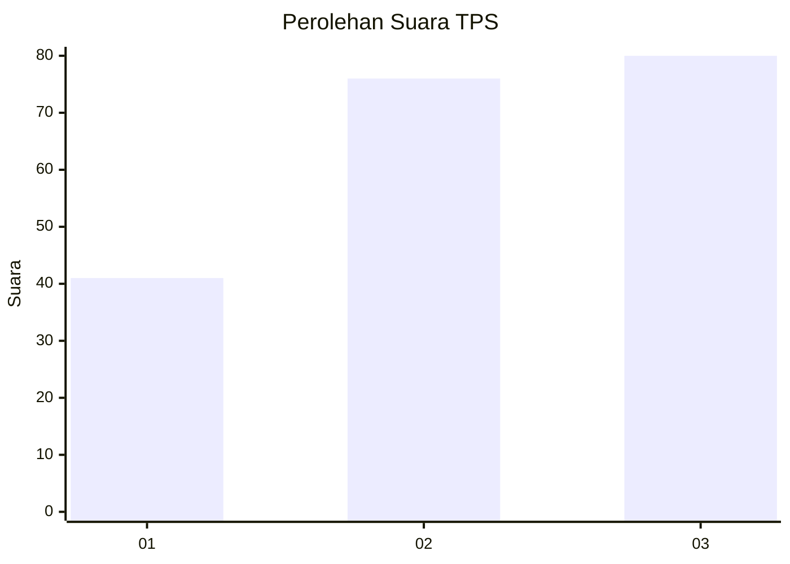
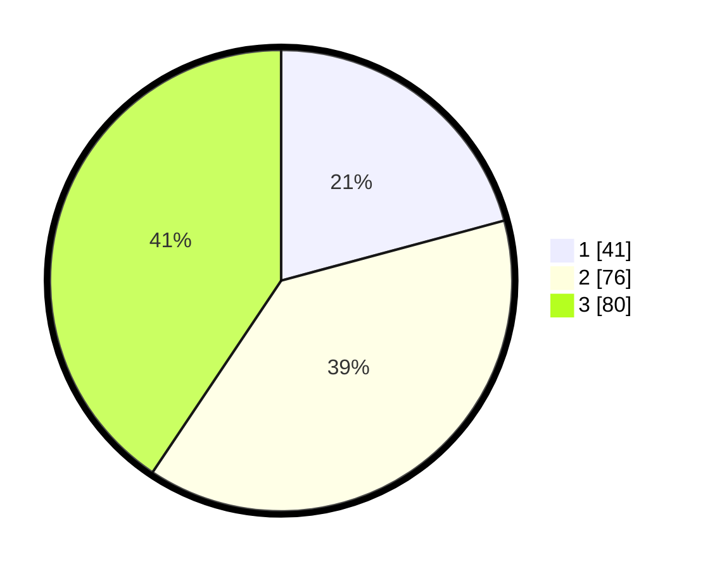

# Hasil

## Grafik

## Tabel

| No. | Nama Paslon    | Suara | Suara (raw) | Persentase |
|:--- |:-------------- | -----:| -----------:| ----------:|
| 1   | ANIES MUHAIMIN | 41    | [41][p-1]   | 20,81      |
| 2   | PRABOWO GIBRAN | 76    | [76][p-2]   | 38,58      |
| 3   | GANJAR MAHFUD  | 80    | [80][p-3]   | 40,61      |

[p-1]: https://github.com/gigit-pemilu/pemilu-2024-34-di-yogyakarta/blob/main/pilpres/hitung-suara/sub/34-di-yogyakarta/sub/04-sleman/sub/06-mlati/sub/2001-sinduadi/sub/006-tps/sub/paslon-1.txt
[p-2]: https://github.com/gigit-pemilu/pemilu-2024-34-di-yogyakarta/blob/main/pilpres/hitung-suara/sub/34-di-yogyakarta/sub/04-sleman/sub/06-mlati/sub/2001-sinduadi/sub/006-tps/sub/paslon-2.txt
[p-3]: https://github.com/gigit-pemilu/pemilu-2024-34-di-yogyakarta/blob/main/pilpres/hitung-suara/sub/34-di-yogyakarta/sub/04-sleman/sub/06-mlati/sub/2001-sinduadi/sub/006-tps/sub/paslon-3.txt

## Foto C Plano

https://sirekap-obj-formc.kpu.go.id/ff23/pemilu/ppwp/34/04/06/20/01/3404062001006-20240215-010035--18e274cb-2c99-4506-810f-91ba9ea72300.jpg

https://sirekap-obj-formc.kpu.go.id/ff23/pemilu/ppwp/34/04/06/20/01/3404062001006-20240215-010225--ea625915-038e-427d-903a-328571b8fce9.jpg

https://sirekap-obj-formc.kpu.go.id/ff23/pemilu/ppwp/34/04/06/20/01/3404062001006-20240215-010506--974b4339-5fbd-4f44-992c-225035b04074.jpg

## Metadata

| Key        | Value               |
| ---------- | ------------------- |
| Time Stamp | 2024-02-15 15:00:29 |

