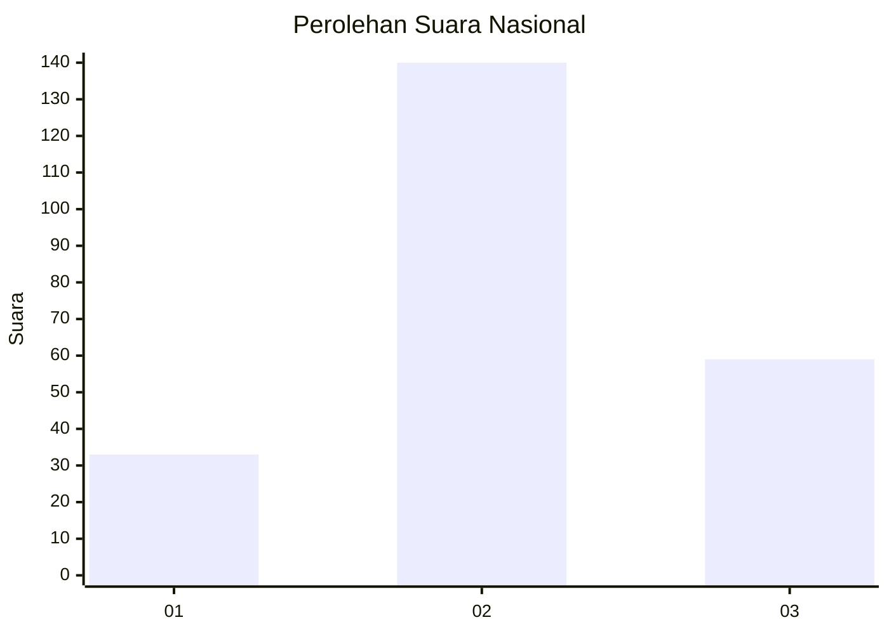
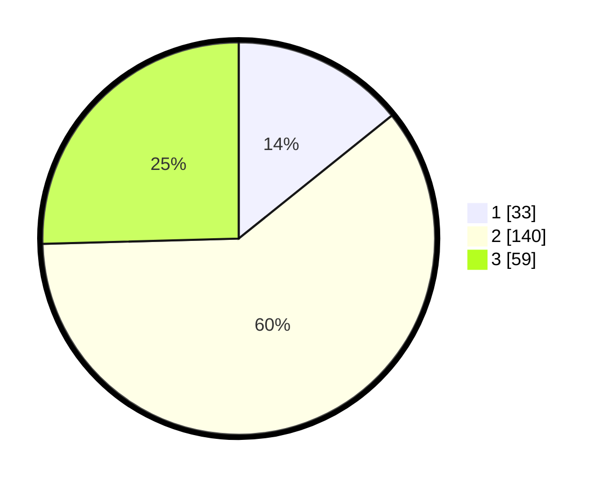

# Hasil

## Grafik

## Tabel

| No. | Nama Paslon    | Suara | Suara (raw) | Persentase |
|:--- |:-------------- | -----:| -----------:| ----------:|
| 1   | ANIES MUHAIMIN | 33    | [33][p-1]   | 14,22      |
| 2   | PRABOWO GIBRAN | 140   | [140][p-2]  | 60,34      |
| 3   | GANJAR MAHFUD  | 59    | [59][p-3]   | 25,43      |

[p-1]: https://github.com/gigit-pemilu/pemilu-2024/blob/main/pilpres/hitung-suara/sub/34-di-yogyakarta/sub/04-sleman/sub/06-mlati/sub/2001-sinduadi/sub/009-tps/sub/paslon-1.txt
[p-2]: https://github.com/gigit-pemilu/pemilu-2024/blob/main/pilpres/hitung-suara/sub/34-di-yogyakarta/sub/04-sleman/sub/06-mlati/sub/2001-sinduadi/sub/009-tps/sub/paslon-2.txt
[p-3]: https://github.com/gigit-pemilu/pemilu-2024/blob/main/pilpres/hitung-suara/sub/34-di-yogyakarta/sub/04-sleman/sub/06-mlati/sub/2001-sinduadi/sub/009-tps/sub/paslon-3.txt

## Foto C Plano

https://sirekap-obj-formc.kpu.go.id/149b/pemilu/ppwp/34/04/06/20/01/3404062001009-20240214-155124--3a59ed74-437e-47a2-a4c4-c7bff5ece873.jpg

https://sirekap-obj-formc.kpu.go.id/149b/pemilu/ppwp/34/04/06/20/01/3404062001009-20240214-155442--3dcc0f61-5abd-4279-b9ae-6e548a34202a.jpg

https://sirekap-obj-formc.kpu.go.id/149b/pemilu/ppwp/34/04/06/20/01/3404062001009-20240214-155543--c9722db9-d397-4e06-9e2b-0de79ccf09bd.jpg

## Metadata

| Key        | Value               |
| ---------- | ------------------- |
| Time Stamp | 2024-02-15 12:00:28 |

