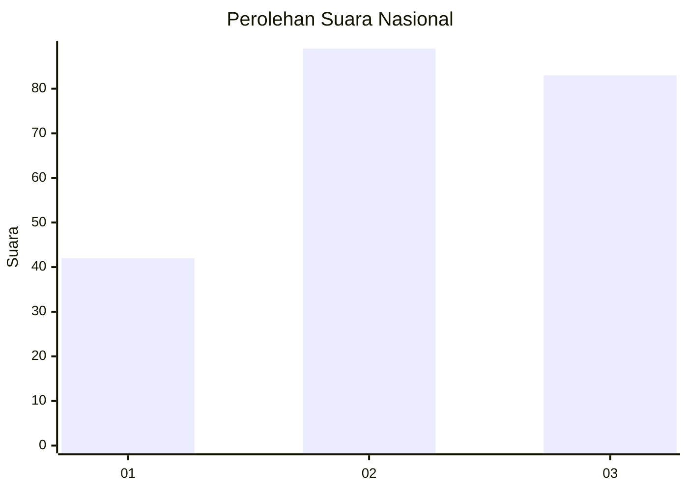
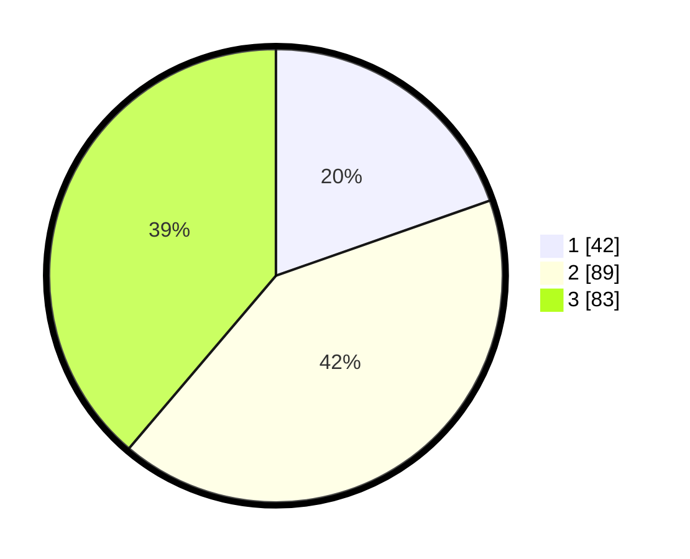

# Hasil

## Grafik

## Tabel

| No. | Nama Paslon    | Suara | Suara (raw) | Persentase |
|:--- |:-------------- | -----:| -----------:| ----------:|
| 1   | ANIES MUHAIMIN | 42    | [42][p-1]   | 19,63      |
| 2   | PRABOWO GIBRAN | 89    | [89][p-2]   | 41,59      |
| 3   | GANJAR MAHFUD  | 83    | [83][p-3]   | 38,79      |

[p-1]: https://github.com/gigit-pemilu/pemilu-2024/blob/main/pilpres/hitung-suara/sub/34-di-yogyakarta/sub/04-sleman/sub/06-mlati/sub/2001-sinduadi/sub/011-tps/sub/paslon-1.txt
[p-2]: https://github.com/gigit-pemilu/pemilu-2024/blob/main/pilpres/hitung-suara/sub/34-di-yogyakarta/sub/04-sleman/sub/06-mlati/sub/2001-sinduadi/sub/011-tps/sub/paslon-2.txt
[p-3]: https://github.com/gigit-pemilu/pemilu-2024/blob/main/pilpres/hitung-suara/sub/34-di-yogyakarta/sub/04-sleman/sub/06-mlati/sub/2001-sinduadi/sub/011-tps/sub/paslon-3.txt

## Foto C Plano

https://sirekap-obj-formc.kpu.go.id/16c4/pemilu/ppwp/34/04/06/20/01/3404062001011-20240215-022731--c936a92c-e05f-4b36-8b9d-d0b514d438a5.jpg

https://sirekap-obj-formc.kpu.go.id/16c4/pemilu/ppwp/34/04/06/20/01/3404062001011-20240215-022751--d6864993-e886-4634-a9f3-eeeb774d3932.jpg

https://sirekap-obj-formc.kpu.go.id/16c4/pemilu/ppwp/34/04/06/20/01/3404062001011-20240215-022808--c2152a40-9c61-47ff-95e3-5aa497009666.jpg

## Metadata

| Key        | Value               |
| ---------- | ------------------- |
| Time Stamp | 2024-02-16 10:30:29 |

