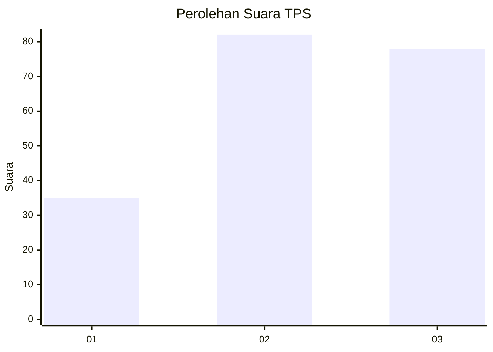
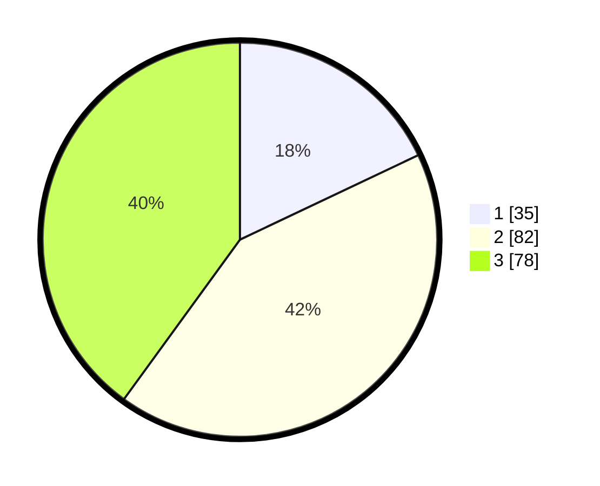

# Hasil

## Grafik

## Tabel

| No. | Nama Paslon    | Suara | Suara (raw) | Persentase |
|:--- |:-------------- | -----:| -----------:| ----------:|
| 1   | ANIES MUHAIMIN | 35    | [35][p-1]   | 17,95      |
| 2   | PRABOWO GIBRAN | 82    | [82][p-2]   | 42,05      |
| 3   | GANJAR MAHFUD  | 78    | [78][p-3]   | 40,00      |

[p-1]: https://github.com/gigit-pemilu/pemilu-2024-34-di-yogyakarta/blob/main/pilpres/hitung-suara/sub/34-di-yogyakarta/sub/04-sleman/sub/06-mlati/sub/2001-sinduadi/sub/015-tps/sub/paslon-1.txt
[p-2]: https://github.com/gigit-pemilu/pemilu-2024-34-di-yogyakarta/blob/main/pilpres/hitung-suara/sub/34-di-yogyakarta/sub/04-sleman/sub/06-mlati/sub/2001-sinduadi/sub/015-tps/sub/paslon-2.txt
[p-3]: https://github.com/gigit-pemilu/pemilu-2024-34-di-yogyakarta/blob/main/pilpres/hitung-suara/sub/34-di-yogyakarta/sub/04-sleman/sub/06-mlati/sub/2001-sinduadi/sub/015-tps/sub/paslon-3.txt

## Foto C Plano

https://sirekap-obj-formc.kpu.go.id/8bac/pemilu/ppwp/34/04/06/20/01/3404062001015-20240214-225358--4a9537b3-c252-4eae-b86b-1eb80d624ffc.jpg

https://sirekap-obj-formc.kpu.go.id/8bac/pemilu/ppwp/34/04/06/20/01/3404062001015-20240214-225622--b838671c-f1a8-4647-9226-c37470e17b3e.jpg

https://sirekap-obj-formc.kpu.go.id/8bac/pemilu/ppwp/34/04/06/20/01/3404062001015-20240214-225808--0809e58d-da7f-4a62-87c4-759190e3a4e5.jpg

## Metadata

| Key        | Value               |
| ---------- | ------------------- |
| Time Stamp | 2024-02-16 21:01:00 |

