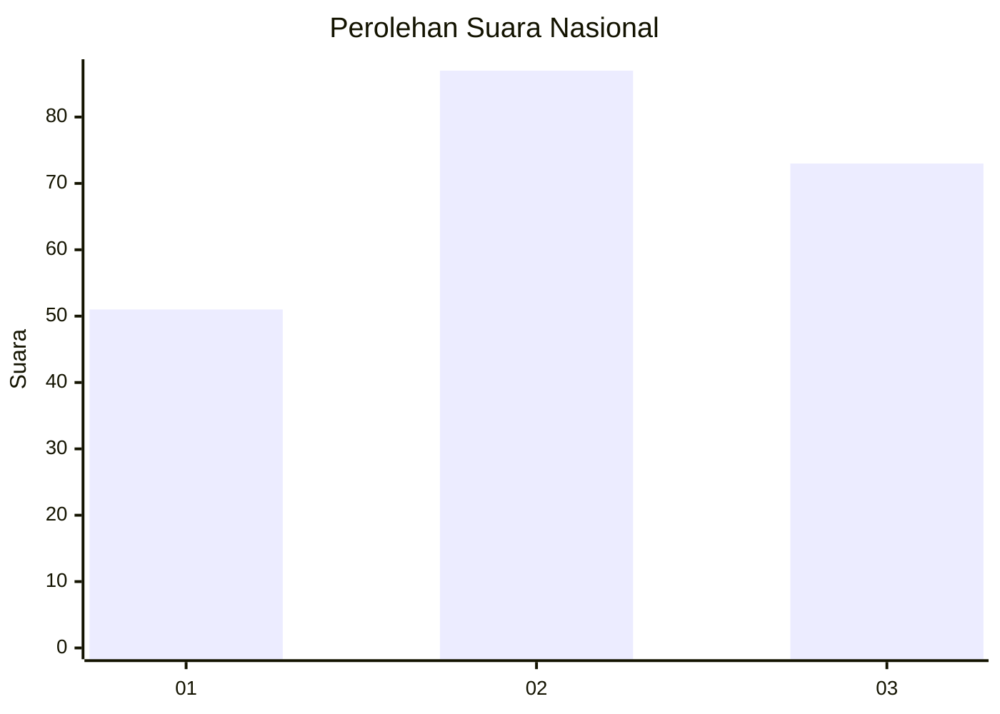
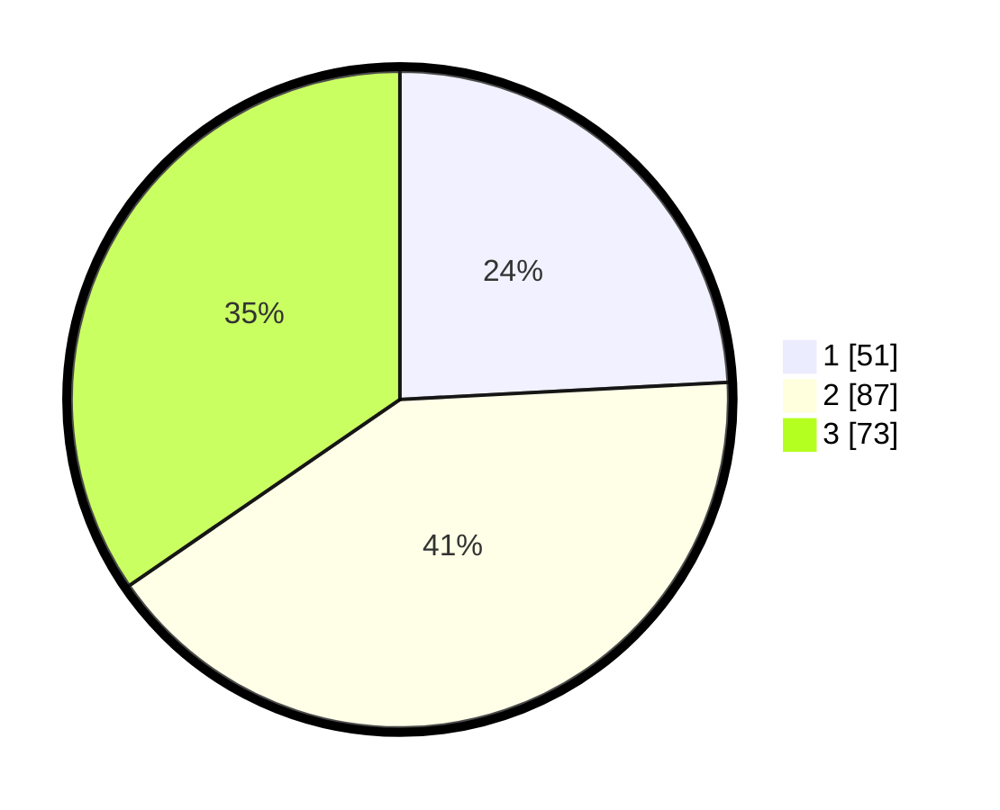

# Hasil

## Grafik

## Tabel

| No. | Nama Paslon    | Suara | Suara (raw) | Persentase |
|:--- |:-------------- | -----:| -----------:| ----------:|
| 1   | ANIES MUHAIMIN | 51    | [51][p-1]   | 24,17      |
| 2   | PRABOWO GIBRAN | 87    | [87][p-2]   | 41,23      |
| 3   | GANJAR MAHFUD  | 73    | [73][p-3]   | 34,60      |

[p-1]: https://github.com/gigit-pemilu/pemilu-2024/blob/main/pilpres/hitung-suara/sub/34-di-yogyakarta/sub/04-sleman/sub/06-mlati/sub/2001-sinduadi/sub/025-tps/sub/paslon-1.txt
[p-2]: https://github.com/gigit-pemilu/pemilu-2024/blob/main/pilpres/hitung-suara/sub/34-di-yogyakarta/sub/04-sleman/sub/06-mlati/sub/2001-sinduadi/sub/025-tps/sub/paslon-2.txt
[p-3]: https://github.com/gigit-pemilu/pemilu-2024/blob/main/pilpres/hitung-suara/sub/34-di-yogyakarta/sub/04-sleman/sub/06-mlati/sub/2001-sinduadi/sub/025-tps/sub/paslon-3.txt

## Foto C Plano

https://sirekap-obj-formc.kpu.go.id/1dc7/pemilu/ppwp/34/04/06/20/01/3404062001025-20240214-225733--d5085a5d-8a23-474d-9c0a-168ac4bed8d3.jpg

https://sirekap-obj-formc.kpu.go.id/1dc7/pemilu/ppwp/34/04/06/20/01/3404062001025-20240214-230039--2f9ddbdc-fac7-490b-9ff3-650365735c2f.jpg

https://sirekap-obj-formc.kpu.go.id/1dc7/pemilu/ppwp/34/04/06/20/01/3404062001025-20240214-230229--1164fa14-9b6c-4ced-a7c0-2ac2ecf0cfcb.jpg

## Metadata

| Key        | Value               |
| ---------- | ------------------- |
| Time Stamp | 2024-02-15 15:00:29 |

