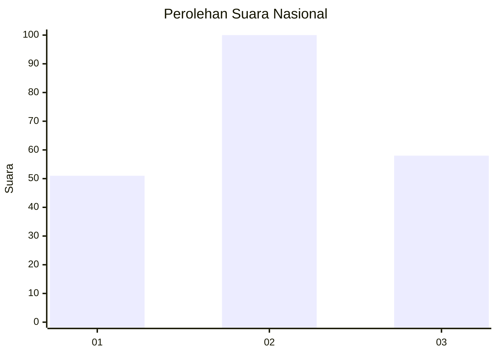
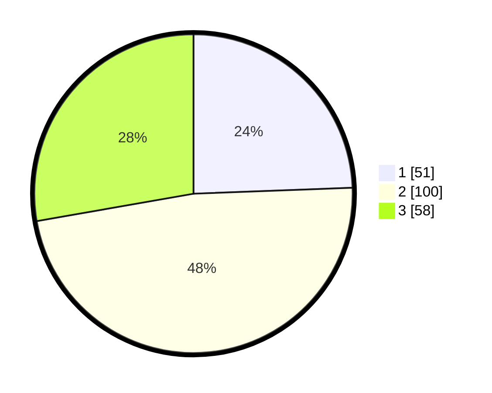

# Hasil

## Grafik

## Tabel

| No. | Nama Paslon    | Suara | Suara (raw) | Persentase |
|:--- |:-------------- | -----:| -----------:| ----------:|
| 1   | ANIES MUHAIMIN | 51    | [51][p-1]   | 24,40      |
| 2   | PRABOWO GIBRAN | 100   | [100][p-2]  | 47,85      |
| 3   | GANJAR MAHFUD  | 58    | [58][p-3]   | 27,75      |

[p-1]: https://github.com/gigit-pemilu/pemilu-2024/blob/main/pilpres/hitung-suara/sub/34-di-yogyakarta/sub/04-sleman/sub/06-mlati/sub/2001-sinduadi/sub/026-tps/sub/paslon-1.txt
[p-2]: https://github.com/gigit-pemilu/pemilu-2024/blob/main/pilpres/hitung-suara/sub/34-di-yogyakarta/sub/04-sleman/sub/06-mlati/sub/2001-sinduadi/sub/026-tps/sub/paslon-2.txt
[p-3]: https://github.com/gigit-pemilu/pemilu-2024/blob/main/pilpres/hitung-suara/sub/34-di-yogyakarta/sub/04-sleman/sub/06-mlati/sub/2001-sinduadi/sub/026-tps/sub/paslon-3.txt

## Foto C Plano

https://sirekap-obj-formc.kpu.go.id/1858/pemilu/ppwp/34/04/06/20/01/3404062001026-20240214-230740--136b3133-77f2-47fb-9daa-625de020d293.jpg

https://sirekap-obj-formc.kpu.go.id/1858/pemilu/ppwp/34/04/06/20/01/3404062001026-20240214-231006--94ddc40d-9c34-4eab-9a4b-b4f6e8ff3385.jpg

https://sirekap-obj-formc.kpu.go.id/1858/pemilu/ppwp/34/04/06/20/01/3404062001026-20240214-231055--c881ce23-cb07-4d4c-ac92-e617ef2c773c.jpg

## Metadata

| Key        | Value               |
| ---------- | ------------------- |
| Time Stamp | 2024-02-15 19:30:26 |

