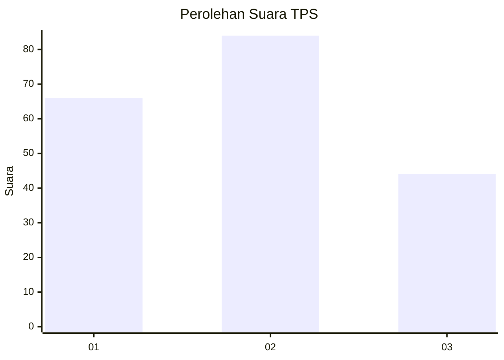
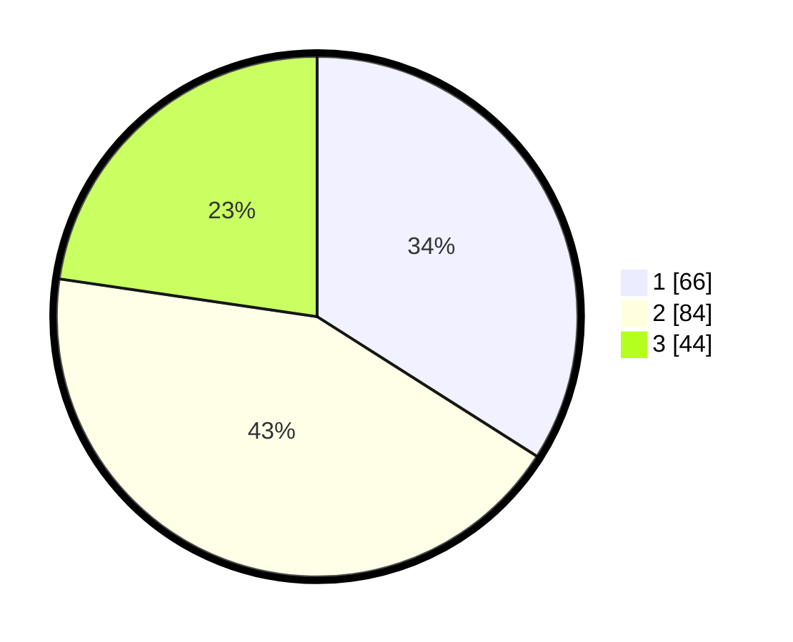

# Hasil

## Grafik

## Tabel

| No. | Nama Paslon    | Suara | Suara (raw) | Persentase |
|:--- |:-------------- | -----:| -----------:| ----------:|
| 1   | ANIES MUHAIMIN | 66    | [66][p-1]   | 34,02      |
| 2   | PRABOWO GIBRAN | 84    | [84][p-2]   | 43,30      |
| 3   | GANJAR MAHFUD  | 44    | [44][p-3]   | 22,68      |

[p-1]: https://github.com/gigit-pemilu/pemilu-2024-34-di-yogyakarta/blob/main/pilpres/hitung-suara/sub/34-di-yogyakarta/sub/04-sleman/sub/06-mlati/sub/2001-sinduadi/sub/027-tps/sub/paslon-1.txt
[p-2]: https://github.com/gigit-pemilu/pemilu-2024-34-di-yogyakarta/blob/main/pilpres/hitung-suara/sub/34-di-yogyakarta/sub/04-sleman/sub/06-mlati/sub/2001-sinduadi/sub/027-tps/sub/paslon-2.txt
[p-3]: https://github.com/gigit-pemilu/pemilu-2024-34-di-yogyakarta/blob/main/pilpres/hitung-suara/sub/34-di-yogyakarta/sub/04-sleman/sub/06-mlati/sub/2001-sinduadi/sub/027-tps/sub/paslon-3.txt

## Foto C Plano

https://sirekap-obj-formc.kpu.go.id/5daf/pemilu/ppwp/34/04/06/20/01/3404062001027-20240214-212258--e8053d21-cccd-4e09-96e9-8cfdad339943.jpg

https://sirekap-obj-formc.kpu.go.id/5daf/pemilu/ppwp/34/04/06/20/01/3404062001027-20240214-212315--adf1bda0-9ff8-43f4-8a44-18378af4a0a4.jpg

https://sirekap-obj-formc.kpu.go.id/5daf/pemilu/ppwp/34/04/06/20/01/3404062001027-20240214-212327--ddceb7cb-cf88-49b1-8dcd-640e2d9e4ee3.jpg

## Metadata

| Key        | Value               |
| ---------- | ------------------- |
| Time Stamp | 2024-02-15 12:00:28 |

