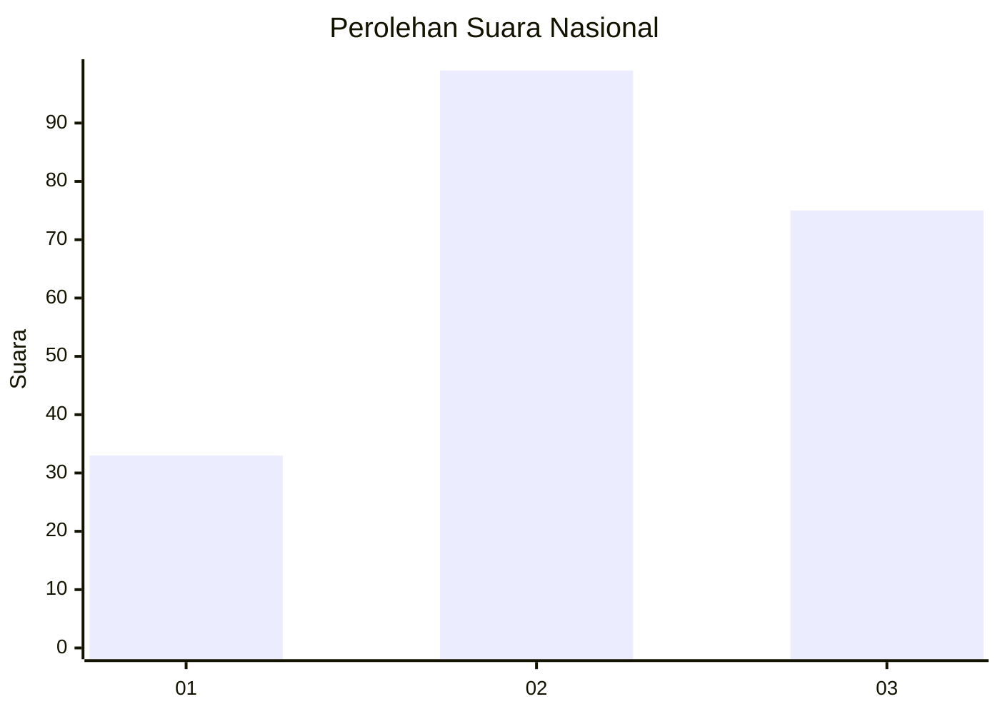
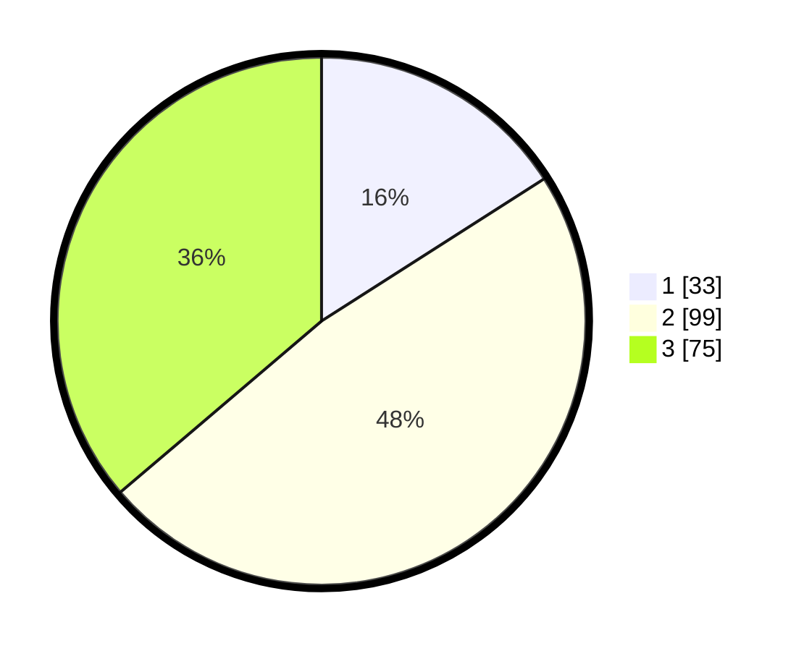

# Hasil

## Grafik

## Tabel

| No. | Nama Paslon    | Suara | Suara (raw) | Persentase |
|:--- |:-------------- | -----:| -----------:| ----------:|
| 1   | ANIES MUHAIMIN | 33    | [33][p-1]   | 15,94      |
| 2   | PRABOWO GIBRAN | 99    | [99][p-2]   | 47,83      |
| 3   | GANJAR MAHFUD  | 75    | [75][p-3]   | 36,23      |

[p-1]: https://github.com/gigit-pemilu/pemilu-2024/blob/main/pilpres/hitung-suara/sub/34-di-yogyakarta/sub/04-sleman/sub/06-mlati/sub/2001-sinduadi/sub/039-tps/sub/paslon-1.txt
[p-2]: https://github.com/gigit-pemilu/pemilu-2024/blob/main/pilpres/hitung-suara/sub/34-di-yogyakarta/sub/04-sleman/sub/06-mlati/sub/2001-sinduadi/sub/039-tps/sub/paslon-2.txt
[p-3]: https://github.com/gigit-pemilu/pemilu-2024/blob/main/pilpres/hitung-suara/sub/34-di-yogyakarta/sub/04-sleman/sub/06-mlati/sub/2001-sinduadi/sub/039-tps/sub/paslon-3.txt

## Foto C Plano

https://sirekap-obj-formc.kpu.go.id/a612/pemilu/ppwp/34/04/06/20/01/3404062001039-20240214-155242--a17d5006-1185-49f4-b256-d6931075a6d7.jpg

https://sirekap-obj-formc.kpu.go.id/a612/pemilu/ppwp/34/04/06/20/01/3404062001039-20240214-155721--04ebe7e9-8f4c-415b-851b-de8c910c718b.jpg

https://sirekap-obj-formc.kpu.go.id/a612/pemilu/ppwp/34/04/06/20/01/3404062001039-20240214-155753--42b7cca1-8287-4f24-9968-d09f9fa282a6.jpg

## Metadata

| Key        | Value               |
| ---------- | ------------------- |
| Time Stamp | 2024-02-15 12:00:28 |

