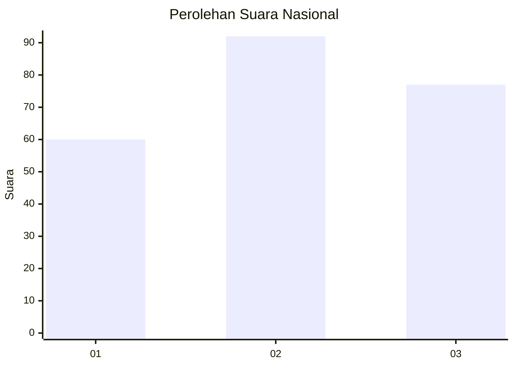
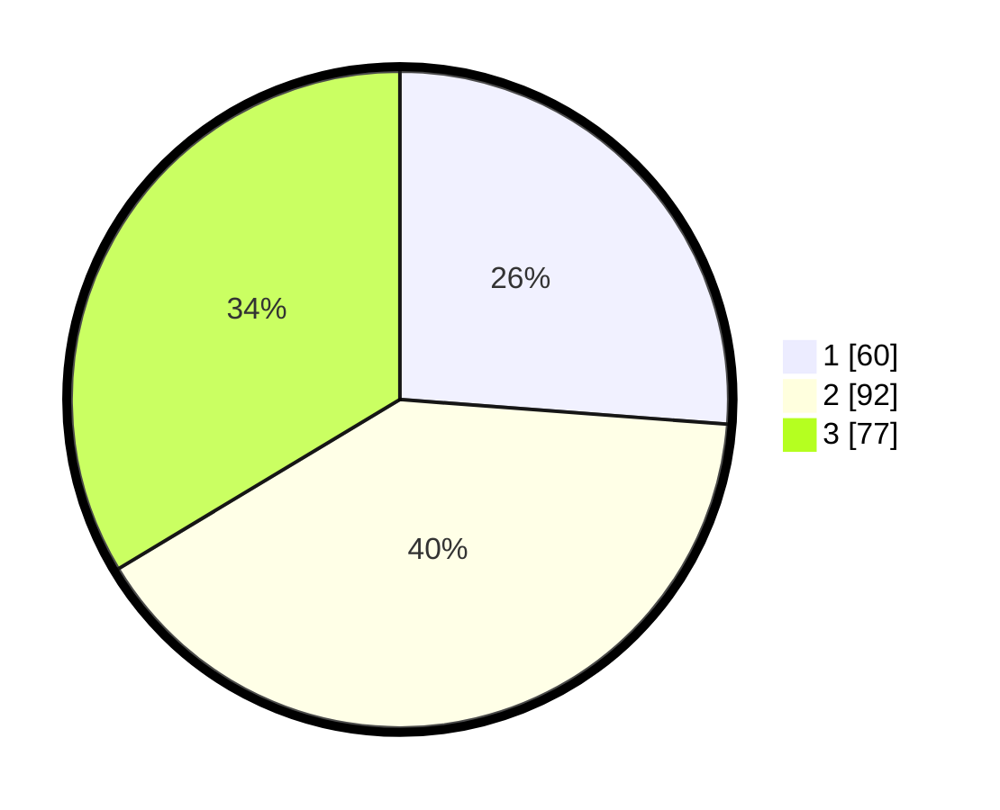

# Hasil

## Grafik

## Tabel

| No. | Nama Paslon    | Suara | Suara (raw) | Persentase |
|:--- |:-------------- | -----:| -----------:| ----------:|
| 1   | ANIES MUHAIMIN | 60    | [60][p-1]   | 26,20      |
| 2   | PRABOWO GIBRAN | 92    | [92][p-2]   | 40,17      |
| 3   | GANJAR MAHFUD  | 77    | [77][p-3]   | 33,62      |

[p-1]: https://github.com/gigit-pemilu/pemilu-2024/blob/main/pilpres/hitung-suara/sub/34-di-yogyakarta/sub/04-sleman/sub/06-mlati/sub/2001-sinduadi/sub/047-tps/sub/paslon-1.txt
[p-2]: https://github.com/gigit-pemilu/pemilu-2024/blob/main/pilpres/hitung-suara/sub/34-di-yogyakarta/sub/04-sleman/sub/06-mlati/sub/2001-sinduadi/sub/047-tps/sub/paslon-2.txt
[p-3]: https://github.com/gigit-pemilu/pemilu-2024/blob/main/pilpres/hitung-suara/sub/34-di-yogyakarta/sub/04-sleman/sub/06-mlati/sub/2001-sinduadi/sub/047-tps/sub/paslon-3.txt

## Foto C Plano

https://sirekap-obj-formc.kpu.go.id/3334/pemilu/ppwp/34/04/06/20/01/3404062001047-20240214-191824--f30d7c42-af25-49fa-9a7d-aa05fec5c31a.jpg

https://sirekap-obj-formc.kpu.go.id/3334/pemilu/ppwp/34/04/06/20/01/3404062001047-20240214-191947--83c88cf6-9c51-480d-9a44-75cf0567bbae.jpg

https://sirekap-obj-formc.kpu.go.id/3334/pemilu/ppwp/34/04/06/20/01/3404062001047-20240214-192155--855b3abf-74d8-4f05-9557-d457def7d8d1.jpg

## Metadata

| Key        | Value               |
| ---------- | ------------------- |
| Time Stamp | 2024-02-15 12:00:28 |

