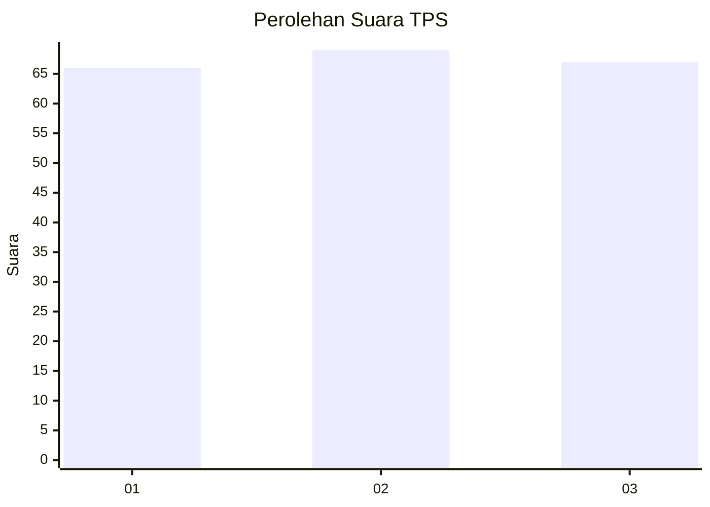
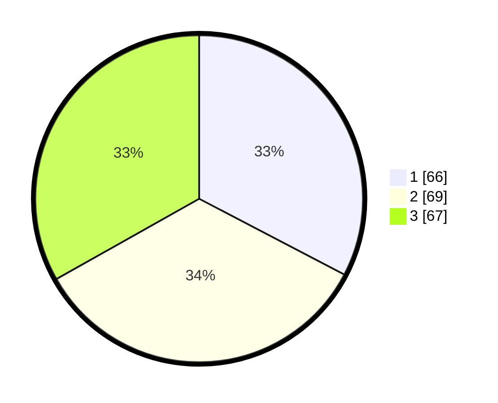

# Hasil

## Grafik

## Tabel

| No. | Nama Paslon    | Suara | Suara (raw) | Persentase |
|:--- |:-------------- | -----:| -----------:| ----------:|
| 1   | ANIES MUHAIMIN | 66    | [66][p-1]   | 32,67      |
| 2   | PRABOWO GIBRAN | 69    | [69][p-2]   | 34,16      |
| 3   | GANJAR MAHFUD  | 67    | [67][p-3]   | 33,17      |

[p-1]: https://github.com/gigit-pemilu/pemilu-2024-34-di-yogyakarta/blob/main/pilpres/hitung-suara/sub/34-di-yogyakarta/sub/04-sleman/sub/06-mlati/sub/2001-sinduadi/sub/050-tps/sub/paslon-1.txt
[p-2]: https://github.com/gigit-pemilu/pemilu-2024-34-di-yogyakarta/blob/main/pilpres/hitung-suara/sub/34-di-yogyakarta/sub/04-sleman/sub/06-mlati/sub/2001-sinduadi/sub/050-tps/sub/paslon-2.txt
[p-3]: https://github.com/gigit-pemilu/pemilu-2024-34-di-yogyakarta/blob/main/pilpres/hitung-suara/sub/34-di-yogyakarta/sub/04-sleman/sub/06-mlati/sub/2001-sinduadi/sub/050-tps/sub/paslon-3.txt

## Foto C Plano

https://sirekap-obj-formc.kpu.go.id/9955/pemilu/ppwp/34/04/06/20/01/3404062001050-20240216-013032--57547ea6-0722-4db1-9b29-d8e93571d676.jpg

https://sirekap-obj-formc.kpu.go.id/9955/pemilu/ppwp/34/04/06/20/01/3404062001050-20240216-013047--00d7d70e-4e05-469d-853e-4acecbf39b41.jpg

https://sirekap-obj-formc.kpu.go.id/9955/pemilu/ppwp/34/04/06/20/01/3404062001050-20240216-013039--906de5e8-8cf7-4ff6-9572-a2827d8f450f.jpg

## Metadata

| Key        | Value               |
| ---------- | ------------------- |
| Time Stamp | 2024-02-16 13:30:32 |

## DATA PEMILIH TETAP

Jumlah pemilih dalam DPT: **242**.
 * L: **117**.
 * P: **125**.

## DATA PENGGUNA HAK PILIH

Jumlah pengguna hak pilih dalam DPT: **188**.
 * L: **88**.
 * P: **100**.

Jumlah pengguna hak pilih dalam DPTb: **12**.
 * L: **5**.
 * P: **7**.

Jumlah pengguna hak pilih dalam DPK: **8**.
 * L: **2**.
 * P: **6**.

Jumlah pengguna hak pilih: **208**.
 * L: **95**.
 * P: **113**.

## JUMLAH SUARA SAH DAN TIDAK SAH

JUMLAH SELURUH SUARA SAH: **202**.

JUMLAH SUARA TIDAK SAH: **6**.

JUMLAH SELURUH SUARA SAH DAN SUARA TIDAK SAH: **208**.

