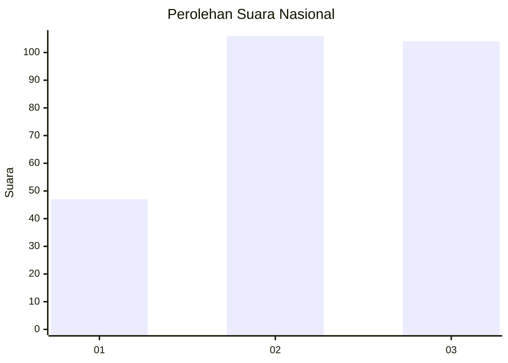
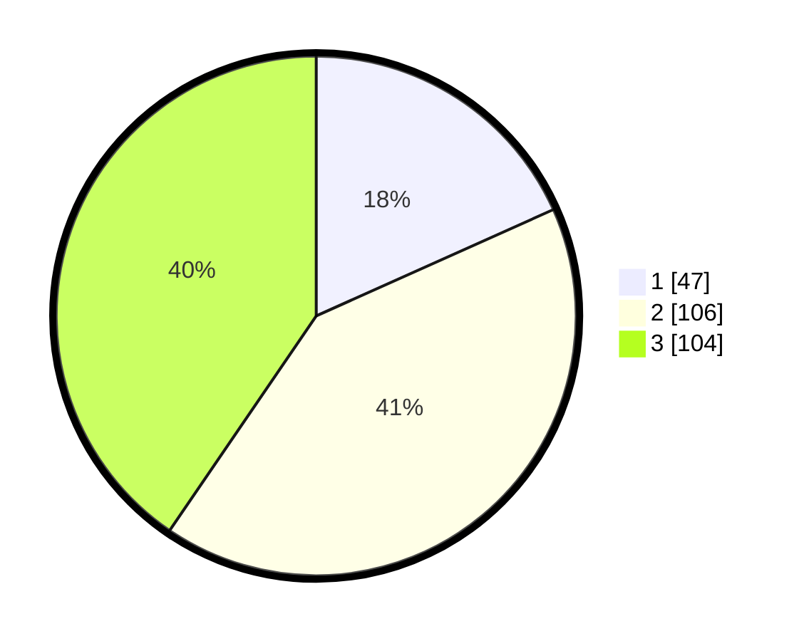

# Hasil

## Grafik

## Tabel

| No. | Nama Paslon    | Suara | Suara (raw) | Persentase |
|:--- |:-------------- | -----:| -----------:| ----------:|
| 1   | ANIES MUHAIMIN | 47    | [47][p-1]   | 18,29      |
| 2   | PRABOWO GIBRAN | 106   | [106][p-2]  | 41,25      |
| 3   | GANJAR MAHFUD  | 104   | [104][p-3]  | 40,47      |

[p-1]: https://github.com/gigit-pemilu/pemilu-2024/blob/main/pilpres/hitung-suara/sub/34-di-yogyakarta/sub/04-sleman/sub/06-mlati/sub/2001-sinduadi/sub/052-tps/sub/paslon-1.txt
[p-2]: https://github.com/gigit-pemilu/pemilu-2024/blob/main/pilpres/hitung-suara/sub/34-di-yogyakarta/sub/04-sleman/sub/06-mlati/sub/2001-sinduadi/sub/052-tps/sub/paslon-2.txt
[p-3]: https://github.com/gigit-pemilu/pemilu-2024/blob/main/pilpres/hitung-suara/sub/34-di-yogyakarta/sub/04-sleman/sub/06-mlati/sub/2001-sinduadi/sub/052-tps/sub/paslon-3.txt

## Foto C Plano

https://sirekap-obj-formc.kpu.go.id/d913/pemilu/ppwp/34/04/06/20/01/3404062001052-20240214-155043--9b460a45-2683-4ccf-b0d6-de8f5e8cf680.jpg

https://sirekap-obj-formc.kpu.go.id/d913/pemilu/ppwp/34/04/06/20/01/3404062001052-20240214-155542--db3c1b49-4b94-4bbb-88dc-b9214f8cedff.jpg

https://sirekap-obj-formc.kpu.go.id/d913/pemilu/ppwp/34/04/06/20/01/3404062001052-20240214-155310--791e5ee8-5e7a-4549-9933-a9804715cc52.jpg

## Metadata

| Key        | Value               |
| ---------- | ------------------- |
| Time Stamp | 2024-02-24 22:31:28 |

