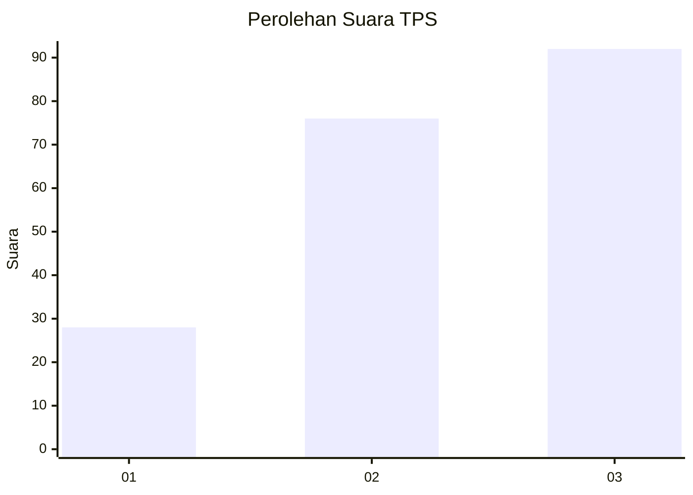
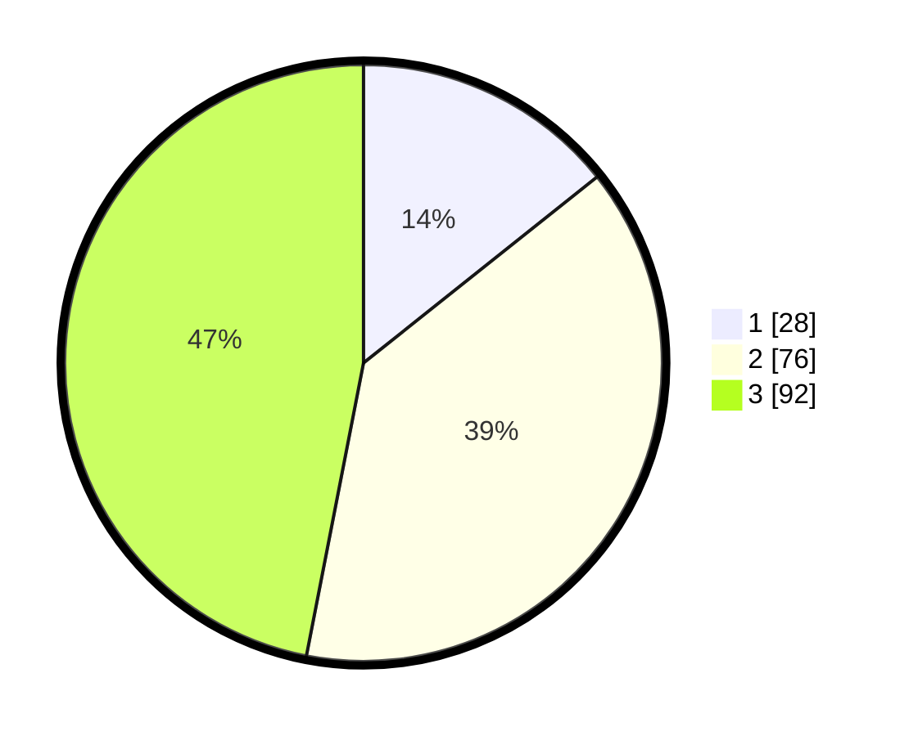

# Hasil

## Grafik

## Tabel

| No. | Nama Paslon    | Suara | Suara (raw) | Persentase |
|:--- |:-------------- | -----:| -----------:| ----------:|
| 1   | ANIES MUHAIMIN | 28    | [28][p-1]   | 14,29      |
| 2   | PRABOWO GIBRAN | 76    | [76][p-2]   | 38,78      |
| 3   | GANJAR MAHFUD  | 92    | [92][p-3]   | 46,94      |

[p-1]: https://github.com/gigit-pemilu/pemilu-2024-34-di-yogyakarta/blob/main/pilpres/hitung-suara/sub/34-di-yogyakarta/sub/04-sleman/sub/06-mlati/sub/2001-sinduadi/sub/060-tps/sub/paslon-1.txt
[p-2]: https://github.com/gigit-pemilu/pemilu-2024-34-di-yogyakarta/blob/main/pilpres/hitung-suara/sub/34-di-yogyakarta/sub/04-sleman/sub/06-mlati/sub/2001-sinduadi/sub/060-tps/sub/paslon-2.txt
[p-3]: https://github.com/gigit-pemilu/pemilu-2024-34-di-yogyakarta/blob/main/pilpres/hitung-suara/sub/34-di-yogyakarta/sub/04-sleman/sub/06-mlati/sub/2001-sinduadi/sub/060-tps/sub/paslon-3.txt

## Foto C Plano

https://sirekap-obj-formc.kpu.go.id/2321/pemilu/ppwp/34/04/06/20/01/3404062001060-20240214-155820--97a02f18-b330-4142-83bd-f9080ff98b0d.jpg

https://sirekap-obj-formc.kpu.go.id/2321/pemilu/ppwp/34/04/06/20/01/3404062001060-20240214-160147--d643c036-42ff-4352-b0cc-ca00728d5236.jpg

https://sirekap-obj-formc.kpu.go.id/2321/pemilu/ppwp/34/04/06/20/01/3404062001060-20240214-210122--6a88709a-ac94-42f3-bde4-61f8086c224e.jpg

## Metadata

| Key        | Value               |
| ---------- | ------------------- |
| Time Stamp | 2024-02-15 01:47:43 |

