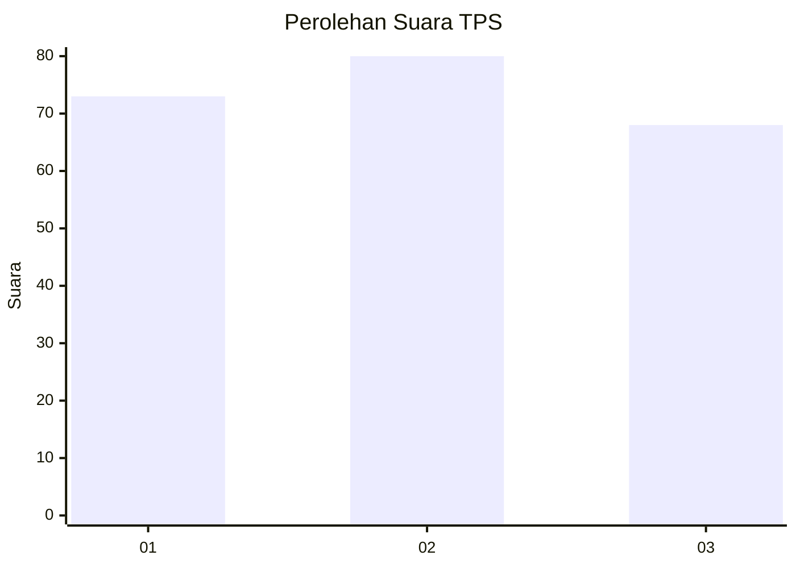
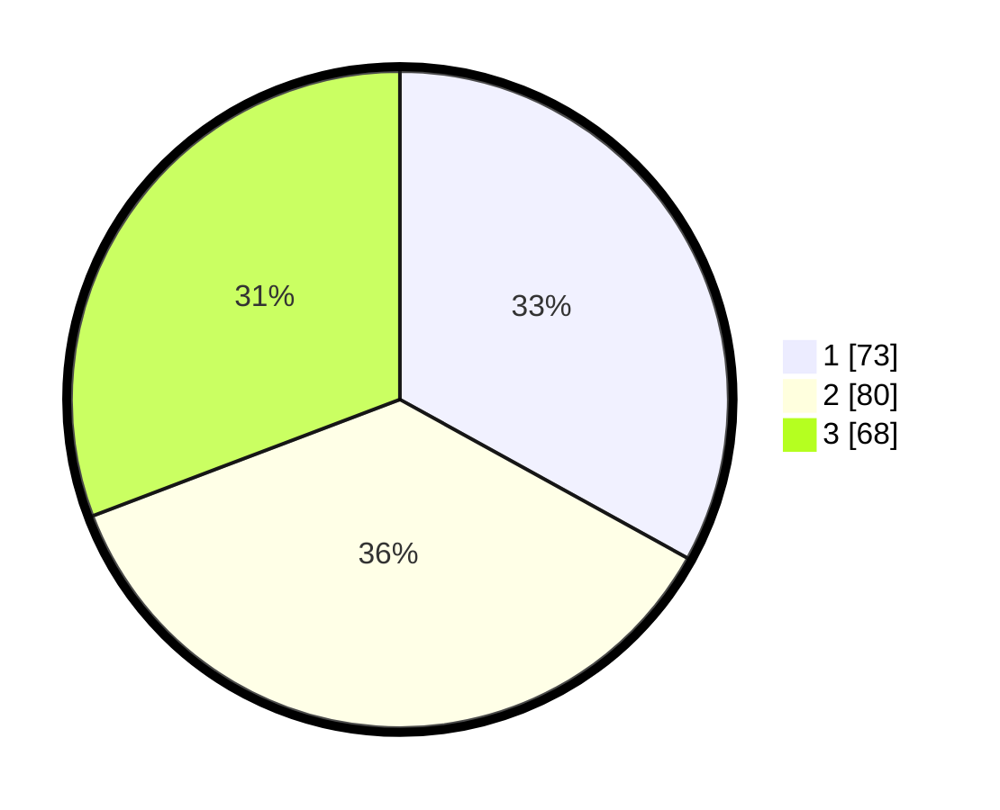

# Hasil

## Grafik

## Tabel

| No. | Nama Paslon    | Suara | Suara (raw) | Persentase |
|:--- |:-------------- | -----:| -----------:| ----------:|
| 1   | ANIES MUHAIMIN | 73    | [73][p-1]   | 33,03      |
| 2   | PRABOWO GIBRAN | 80    | [80][p-2]   | 36,20      |
| 3   | GANJAR MAHFUD  | 68    | [68][p-3]   | 30,77      |

[p-1]: https://github.com/gigit-pemilu/pemilu-2024-34-di-yogyakarta/blob/main/pilpres/hitung-suara/sub/34-di-yogyakarta/sub/04-sleman/sub/06-mlati/sub/2001-sinduadi/sub/063-tps/sub/paslon-1.txt
[p-2]: https://github.com/gigit-pemilu/pemilu-2024-34-di-yogyakarta/blob/main/pilpres/hitung-suara/sub/34-di-yogyakarta/sub/04-sleman/sub/06-mlati/sub/2001-sinduadi/sub/063-tps/sub/paslon-2.txt
[p-3]: https://github.com/gigit-pemilu/pemilu-2024-34-di-yogyakarta/blob/main/pilpres/hitung-suara/sub/34-di-yogyakarta/sub/04-sleman/sub/06-mlati/sub/2001-sinduadi/sub/063-tps/sub/paslon-3.txt

## Foto C Plano

https://sirekap-obj-formc.kpu.go.id/957c/pemilu/ppwp/34/04/06/20/01/3404062001063-20240214-212034--fbfd08a4-78b5-44c4-9ab2-a4e19fd78d8a.jpg

https://sirekap-obj-formc.kpu.go.id/957c/pemilu/ppwp/34/04/06/20/01/3404062001063-20240214-210334--c55c128e-d93c-46af-b212-b4945951df7b.jpg

https://sirekap-obj-formc.kpu.go.id/957c/pemilu/ppwp/34/04/06/20/01/3404062001063-20240214-210550--c73b7554-9a9f-491d-8540-bfeac04d9139.jpg

## Metadata

| Key        | Value               |
| ---------- | ------------------- |
| Time Stamp | 2024-02-15 12:00:28 |

