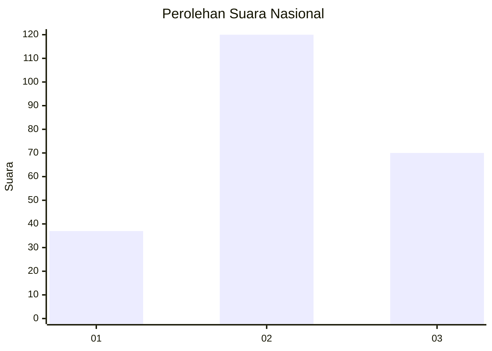
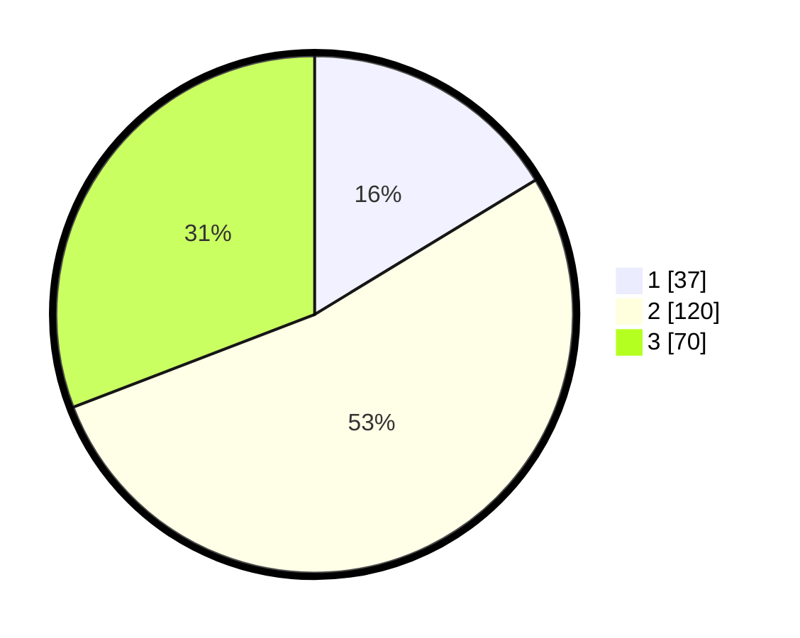

# Hasil

## Grafik

## Tabel

| No. | Nama Paslon    | Suara | Suara (raw) | Persentase |
|:--- |:-------------- | -----:| -----------:| ----------:|
| 1   | ANIES MUHAIMIN | 37    | [37][p-1]   | 16,30      |
| 2   | PRABOWO GIBRAN | 120   | [120][p-2]  | 52,86      |
| 3   | GANJAR MAHFUD  | 70    | [70][p-3]   | 30,84      |

[p-1]: https://github.com/gigit-pemilu/pemilu-2024/blob/main/pilpres/hitung-suara/sub/34-di-yogyakarta/sub/04-sleman/sub/06-mlati/sub/2001-sinduadi/sub/064-tps/sub/paslon-1.txt
[p-2]: https://github.com/gigit-pemilu/pemilu-2024/blob/main/pilpres/hitung-suara/sub/34-di-yogyakarta/sub/04-sleman/sub/06-mlati/sub/2001-sinduadi/sub/064-tps/sub/paslon-2.txt
[p-3]: https://github.com/gigit-pemilu/pemilu-2024/blob/main/pilpres/hitung-suara/sub/34-di-yogyakarta/sub/04-sleman/sub/06-mlati/sub/2001-sinduadi/sub/064-tps/sub/paslon-3.txt

## Foto C Plano

https://sirekap-obj-formc.kpu.go.id/1c7c/pemilu/ppwp/34/04/06/20/01/3404062001064-20240216-165715--0bd0572c-c57c-4840-823e-eafd8ea083e2.jpg

https://sirekap-obj-formc.kpu.go.id/1c7c/pemilu/ppwp/34/04/06/20/01/3404062001064-20240216-165717--812522d9-d193-4722-89f2-2a6adb6a5578.jpg

https://sirekap-obj-formc.kpu.go.id/1c7c/pemilu/ppwp/34/04/06/20/01/3404062001064-20240216-165720--f85864a0-88a3-4099-9bb3-83fb95edc8f0.jpg

## Metadata

| Key        | Value               |
| ---------- | ------------------- |
| Time Stamp | 2024-02-19 06:16:00 |

