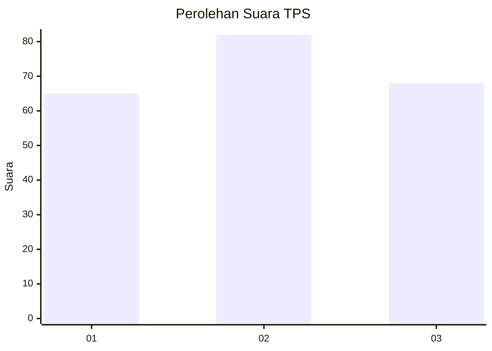
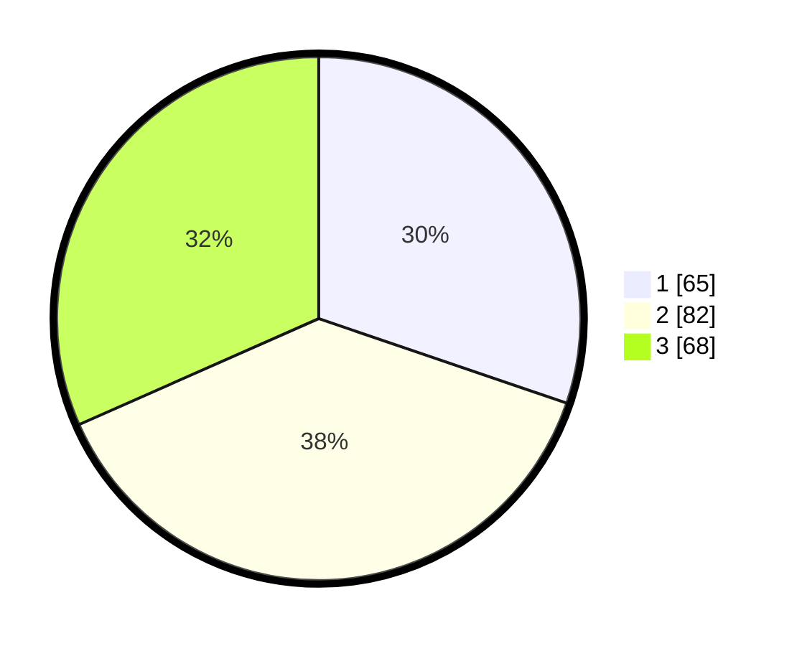

# Hasil

## Grafik

## Tabel

| No. | Nama Paslon    | Suara | Suara (raw) | Persentase |
|:--- |:-------------- | -----:| -----------:| ----------:|
| 1   | ANIES MUHAIMIN | 65    | [65][p-1]   | 30,23      |
| 2   | PRABOWO GIBRAN | 82    | [82][p-2]   | 38,14      |
| 3   | GANJAR MAHFUD  | 68    | [68][p-3]   | 31,63      |

[p-1]: https://github.com/gigit-pemilu/pemilu-2024-34-di-yogyakarta/blob/main/pilpres/hitung-suara/sub/34-di-yogyakarta/sub/04-sleman/sub/06-mlati/sub/2001-sinduadi/sub/065-tps/sub/paslon-1.txt
[p-2]: https://github.com/gigit-pemilu/pemilu-2024-34-di-yogyakarta/blob/main/pilpres/hitung-suara/sub/34-di-yogyakarta/sub/04-sleman/sub/06-mlati/sub/2001-sinduadi/sub/065-tps/sub/paslon-2.txt
[p-3]: https://github.com/gigit-pemilu/pemilu-2024-34-di-yogyakarta/blob/main/pilpres/hitung-suara/sub/34-di-yogyakarta/sub/04-sleman/sub/06-mlati/sub/2001-sinduadi/sub/065-tps/sub/paslon-3.txt

## Foto C Plano

https://sirekap-obj-formc.kpu.go.id/e214/pemilu/ppwp/34/04/06/20/01/3404062001065-20240214-155258--385ccf17-36b1-49b7-97af-837b09673105.jpg

https://sirekap-obj-formc.kpu.go.id/e214/pemilu/ppwp/34/04/06/20/01/3404062001065-20240214-155338--1495bee7-ab58-4acb-94f5-b48d2bcd5ce1.jpg

https://sirekap-obj-formc.kpu.go.id/e214/pemilu/ppwp/34/04/06/20/01/3404062001065-20240214-155153--c064c9a3-e4cc-4f32-ab79-13766d3a3a5f.jpg

## Metadata

| Key        | Value               |
| ---------- | ------------------- |
| Time Stamp | 2024-02-15 12:00:28 |

