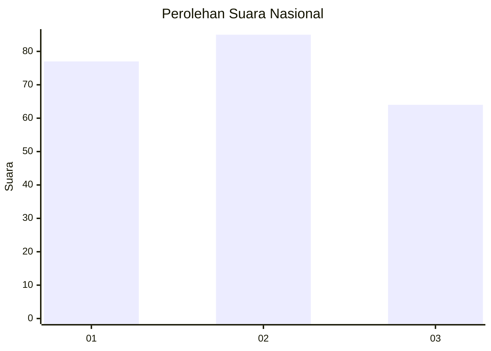
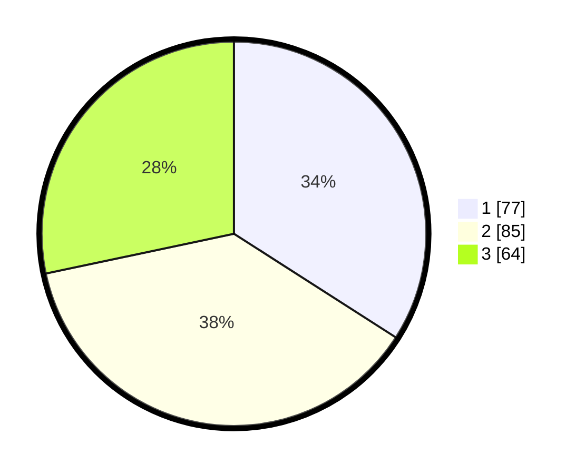

# Hasil

## Grafik

## Tabel

| No. | Nama Paslon    | Suara | Suara (raw) | Persentase |
|:--- |:-------------- | -----:| -----------:| ----------:|
| 1   | ANIES MUHAIMIN | 77    | [77][p-1]   | 34,07      |
| 2   | PRABOWO GIBRAN | 85    | [85][p-2]   | 37,61      |
| 3   | GANJAR MAHFUD  | 64    | [64][p-3]   | 28,32      |

[p-1]: https://github.com/gigit-pemilu/pemilu-2024/blob/main/pilpres/hitung-suara/sub/34-di-yogyakarta/sub/04-sleman/sub/06-mlati/sub/2001-sinduadi/sub/066-tps/sub/paslon-1.txt
[p-2]: https://github.com/gigit-pemilu/pemilu-2024/blob/main/pilpres/hitung-suara/sub/34-di-yogyakarta/sub/04-sleman/sub/06-mlati/sub/2001-sinduadi/sub/066-tps/sub/paslon-2.txt
[p-3]: https://github.com/gigit-pemilu/pemilu-2024/blob/main/pilpres/hitung-suara/sub/34-di-yogyakarta/sub/04-sleman/sub/06-mlati/sub/2001-sinduadi/sub/066-tps/sub/paslon-3.txt

## Foto C Plano

https://sirekap-obj-formc.kpu.go.id/51b2/pemilu/ppwp/34/04/06/20/01/3404062001066-20240214-192250--c16c82ae-eddb-4849-9f60-6597a2bff00e.jpg

https://sirekap-obj-formc.kpu.go.id/51b2/pemilu/ppwp/34/04/06/20/01/3404062001066-20240214-192354--a7c5ece2-6bdd-4a09-b086-2a332920ccf1.jpg

https://sirekap-obj-formc.kpu.go.id/51b2/pemilu/ppwp/34/04/06/20/01/3404062001066-20240214-192505--00fb87f9-2272-4907-86af-f2d59dcf2802.jpg

## Metadata

| Key        | Value               |
| ---------- | ------------------- |
| Time Stamp | 2024-02-15 12:00:28 |

