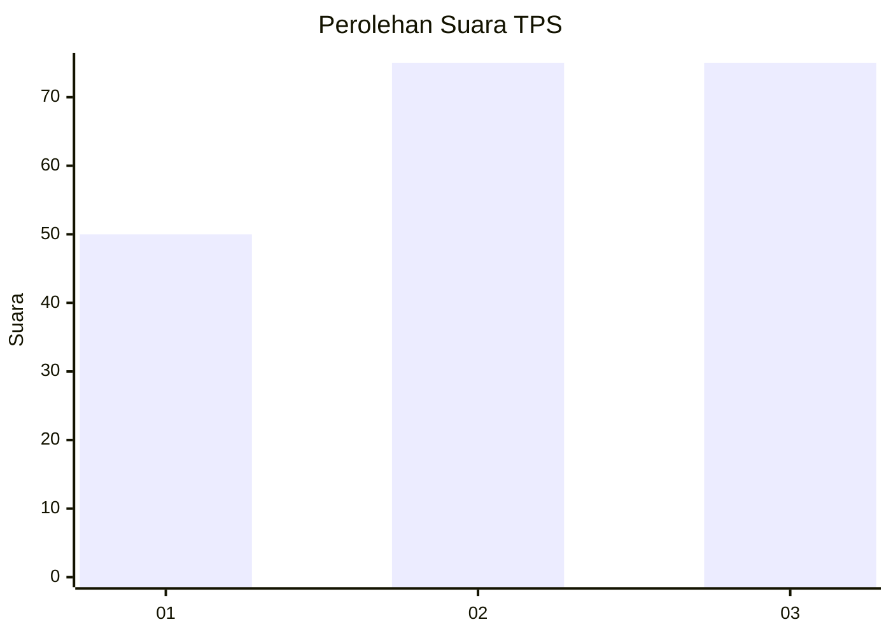
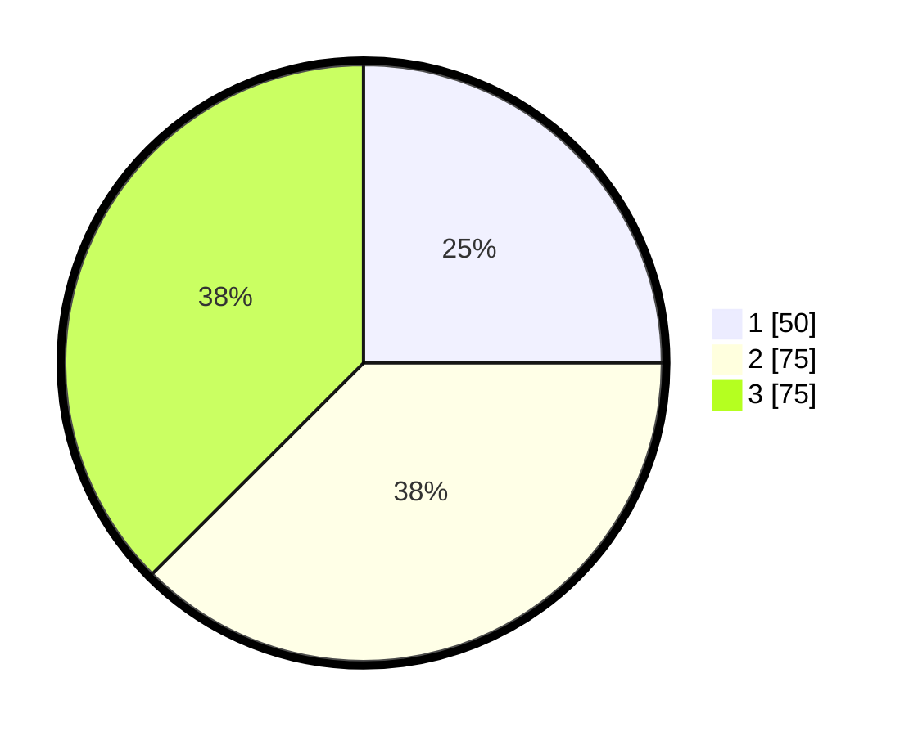

# Hasil

## Grafik

## Tabel

| No. | Nama Paslon    | Suara | Suara (raw) | Persentase |
|:--- |:-------------- | -----:| -----------:| ----------:|
| 1   | ANIES MUHAIMIN | 50    | [50][p-1]   | 25,00      |
| 2   | PRABOWO GIBRAN | 75    | [75][p-2]   | 37,50      |
| 3   | GANJAR MAHFUD  | 75    | [75][p-3]   | 37,50      |

[p-1]: https://github.com/gigit-pemilu/pemilu-2024-34-di-yogyakarta/blob/main/pilpres/hitung-suara/sub/34-di-yogyakarta/sub/04-sleman/sub/06-mlati/sub/2001-sinduadi/sub/070-tps/sub/paslon-1.txt
[p-2]: https://github.com/gigit-pemilu/pemilu-2024-34-di-yogyakarta/blob/main/pilpres/hitung-suara/sub/34-di-yogyakarta/sub/04-sleman/sub/06-mlati/sub/2001-sinduadi/sub/070-tps/sub/paslon-2.txt
[p-3]: https://github.com/gigit-pemilu/pemilu-2024-34-di-yogyakarta/blob/main/pilpres/hitung-suara/sub/34-di-yogyakarta/sub/04-sleman/sub/06-mlati/sub/2001-sinduadi/sub/070-tps/sub/paslon-3.txt

## Foto C Plano

https://sirekap-obj-formc.kpu.go.id/35cf/pemilu/ppwp/34/04/06/20/01/3404062001070-20240214-220929--cfffec06-9f31-4d25-973d-b86979994277.jpg

https://sirekap-obj-formc.kpu.go.id/35cf/pemilu/ppwp/34/04/06/20/01/3404062001070-20240214-220931--c8c6b853-16c5-4f90-8ec9-2d53ee65954f.jpg

https://sirekap-obj-formc.kpu.go.id/35cf/pemilu/ppwp/34/04/06/20/01/3404062001070-20240214-220934--7a9c7def-6826-439d-baca-e0914f4bc9c5.jpg

## Metadata

| Key        | Value               |
| ---------- | ------------------- |
| Time Stamp | 2024-02-15 15:00:29 |

