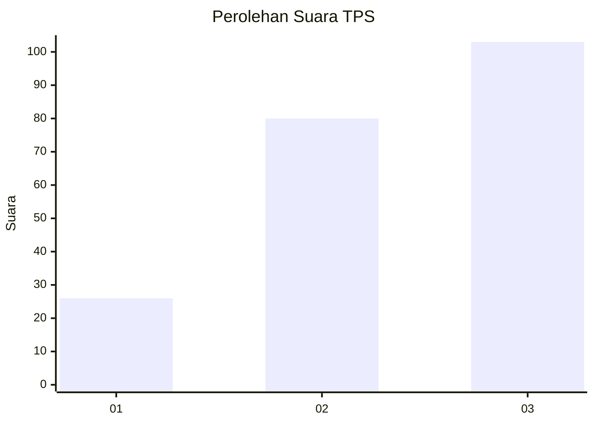
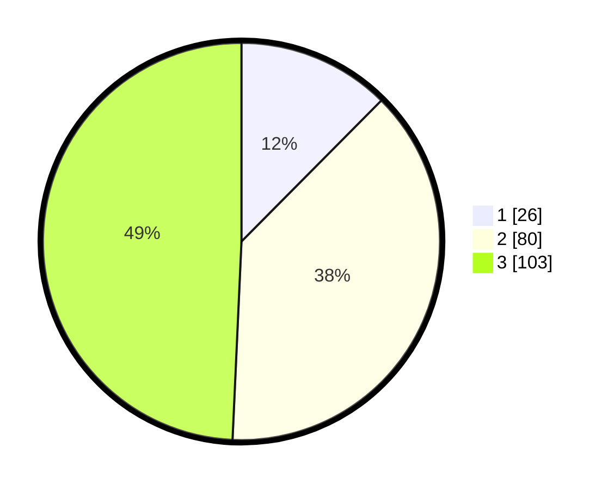

# Hasil

## Grafik

## Tabel

| No. | Nama Paslon    | Suara | Suara (raw) | Persentase |
|:--- |:-------------- | -----:| -----------:| ----------:|
| 1   | ANIES MUHAIMIN | 26    | [26][p-1]   | 12,44      |
| 2   | PRABOWO GIBRAN | 80    | [80][p-2]   | 38,28      |
| 3   | GANJAR MAHFUD  | 103   | [103][p-3]  | 49,28      |

[p-1]: https://github.com/gigit-pemilu/pemilu-2024-34-di-yogyakarta/blob/main/pilpres/hitung-suara/sub/34-di-yogyakarta/sub/04-sleman/sub/06-mlati/sub/2001-sinduadi/sub/073-tps/sub/paslon-1.txt
[p-2]: https://github.com/gigit-pemilu/pemilu-2024-34-di-yogyakarta/blob/main/pilpres/hitung-suara/sub/34-di-yogyakarta/sub/04-sleman/sub/06-mlati/sub/2001-sinduadi/sub/073-tps/sub/paslon-2.txt
[p-3]: https://github.com/gigit-pemilu/pemilu-2024-34-di-yogyakarta/blob/main/pilpres/hitung-suara/sub/34-di-yogyakarta/sub/04-sleman/sub/06-mlati/sub/2001-sinduadi/sub/073-tps/sub/paslon-3.txt

## Foto C Plano

https://sirekap-obj-formc.kpu.go.id/a1c0/pemilu/ppwp/34/04/06/20/01/3404062001073-20240214-194124--3f2f6408-dc43-49cf-a430-cd39626b2572.jpg

https://sirekap-obj-formc.kpu.go.id/a1c0/pemilu/ppwp/34/04/06/20/01/3404062001073-20240214-192947--fda44502-7ecc-4928-a1bf-0a2827547f7f.jpg

https://sirekap-obj-formc.kpu.go.id/a1c0/pemilu/ppwp/34/04/06/20/01/3404062001073-20240214-194307--c52eb336-82a0-4d8e-86d0-b7a34f6a0726.jpg

## Metadata

| Key        | Value               |
| ---------- | ------------------- |
| Time Stamp | 2024-02-14 21:46:01 |

