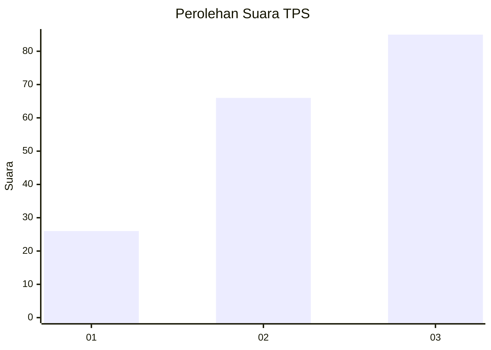
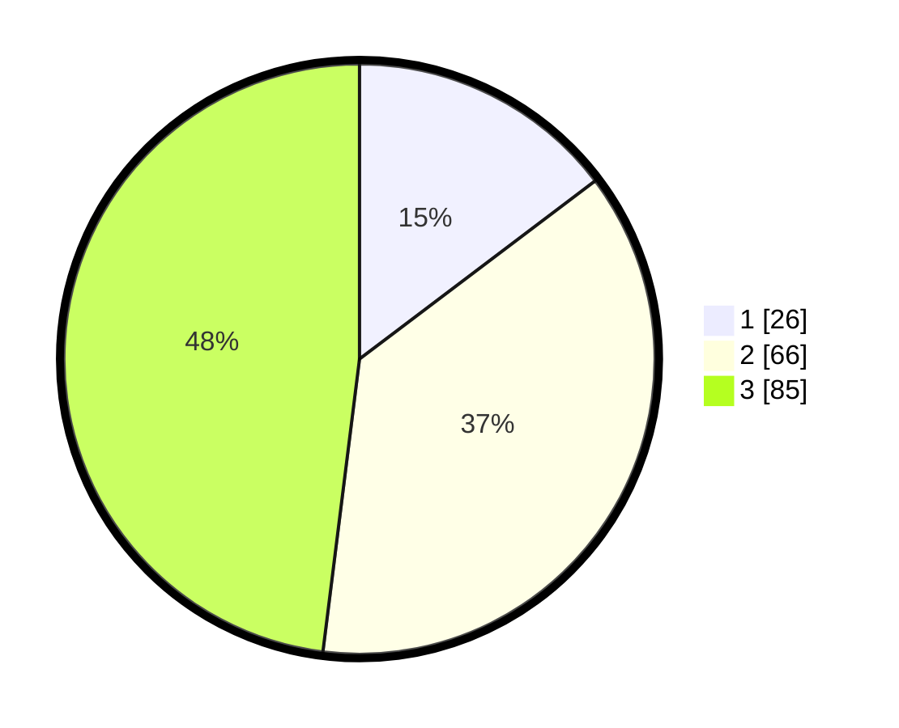

# Hasil

## Grafik

## Tabel

| No. | Nama Paslon    | Suara | Suara (raw) | Persentase |
|:--- |:-------------- | -----:| -----------:| ----------:|
| 1   | ANIES MUHAIMIN | 26    | [26][p-1]   | 14,69      |
| 2   | PRABOWO GIBRAN | 66    | [66][p-2]   | 37,29      |
| 3   | GANJAR MAHFUD  | 85    | [85][p-3]   | 48,02      |

[p-1]: https://github.com/gigit-pemilu/pemilu-2024-34-di-yogyakarta/blob/main/pilpres/hitung-suara/sub/34-di-yogyakarta/sub/04-sleman/sub/06-mlati/sub/2001-sinduadi/sub/075-tps/sub/paslon-1.txt
[p-2]: https://github.com/gigit-pemilu/pemilu-2024-34-di-yogyakarta/blob/main/pilpres/hitung-suara/sub/34-di-yogyakarta/sub/04-sleman/sub/06-mlati/sub/2001-sinduadi/sub/075-tps/sub/paslon-2.txt
[p-3]: https://github.com/gigit-pemilu/pemilu-2024-34-di-yogyakarta/blob/main/pilpres/hitung-suara/sub/34-di-yogyakarta/sub/04-sleman/sub/06-mlati/sub/2001-sinduadi/sub/075-tps/sub/paslon-3.txt

## Foto C Plano

https://sirekap-obj-formc.kpu.go.id/0d94/pemilu/ppwp/34/04/06/20/01/3404062001075-20240215-135251--4a60a898-0bb5-4619-970c-59fb90609f5f.jpg

https://sirekap-obj-formc.kpu.go.id/0d94/pemilu/ppwp/34/04/06/20/01/3404062001075-20240216-124639--1e137e7d-376f-4224-8399-b3e9880a6765.jpg

https://sirekap-obj-formc.kpu.go.id/0d94/pemilu/ppwp/34/04/06/20/01/3404062001075-20240216-124424--eca4ebdb-8fd8-49f3-817e-6edac6e97d1c.jpg

## Metadata

| Key        | Value               |
| ---------- | ------------------- |
| Time Stamp | 2024-02-16 13:30:32 |

## DATA PEMILIH TETAP

Jumlah pemilih dalam DPT: **215**.
 * L: **101**.
 * P: **114**.

## DATA PENGGUNA HAK PILIH

Jumlah pengguna hak pilih dalam DPT: **169**.
 * L: **77**.
 * P: **92**.

Jumlah pengguna hak pilih dalam DPTb: **8**.
 * L: **0**.
 * P: **8**.

Jumlah pengguna hak pilih dalam DPK: **3**.
 * L: **1**.
 * P: **2**.

Jumlah pengguna hak pilih: **180**.
 * L: **78**.
 * P: **102**.

## JUMLAH SUARA SAH DAN TIDAK SAH

JUMLAH SELURUH SUARA SAH: **177**.

JUMLAH SUARA TIDAK SAH: **3**.

JUMLAH SELURUH SUARA SAH DAN SUARA TIDAK SAH: **180**.

