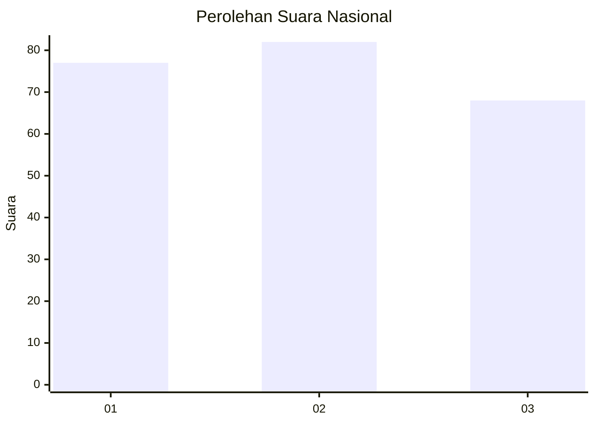
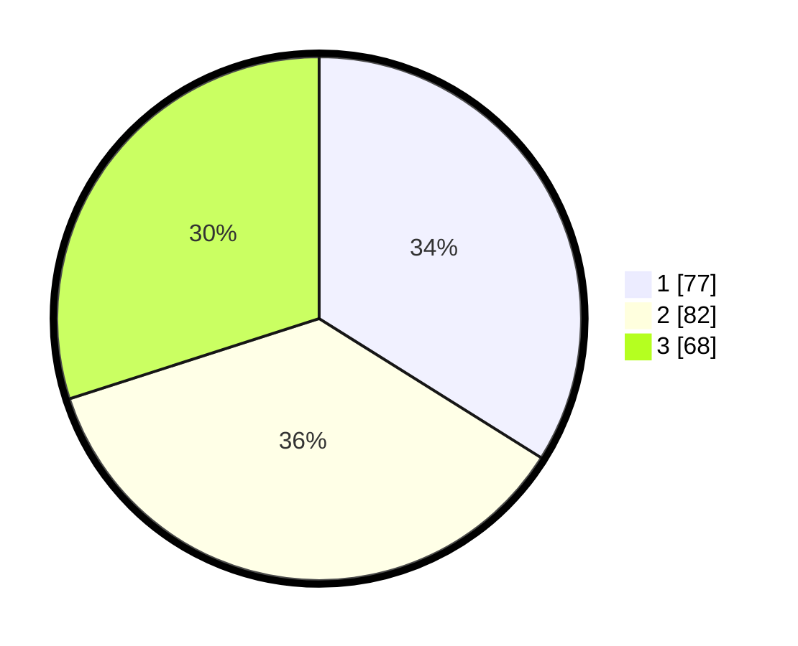

# Hasil

## Grafik

## Tabel

| No. | Nama Paslon    | Suara | Suara (raw) | Persentase |
|:--- |:-------------- | -----:| -----------:| ----------:|
| 1   | ANIES MUHAIMIN | 77    | [77][p-1]   | 33,92      |
| 2   | PRABOWO GIBRAN | 82    | [82][p-2]   | 36,12      |
| 3   | GANJAR MAHFUD  | 68    | [68][p-3]   | 29,96      |

[p-1]: https://github.com/gigit-pemilu/pemilu-2024/blob/main/pilpres/hitung-suara/sub/34-di-yogyakarta/sub/04-sleman/sub/06-mlati/sub/2001-sinduadi/sub/079-tps/sub/paslon-1.txt
[p-2]: https://github.com/gigit-pemilu/pemilu-2024/blob/main/pilpres/hitung-suara/sub/34-di-yogyakarta/sub/04-sleman/sub/06-mlati/sub/2001-sinduadi/sub/079-tps/sub/paslon-2.txt
[p-3]: https://github.com/gigit-pemilu/pemilu-2024/blob/main/pilpres/hitung-suara/sub/34-di-yogyakarta/sub/04-sleman/sub/06-mlati/sub/2001-sinduadi/sub/079-tps/sub/paslon-3.txt

## Foto C Plano

https://sirekap-obj-formc.kpu.go.id/4ce0/pemilu/ppwp/34/04/06/20/01/3404062001079-20240214-193009--bef7c7ea-0734-4d9c-b978-e47344915ae2.jpg

https://sirekap-obj-formc.kpu.go.id/4ce0/pemilu/ppwp/34/04/06/20/01/3404062001079-20240214-193046--ecd5a7cb-fcd1-4673-9ce3-afaa4f49c261.jpg

https://sirekap-obj-formc.kpu.go.id/4ce0/pemilu/ppwp/34/04/06/20/01/3404062001079-20240214-193129--88c509e8-036b-44bc-968d-b97b9b0c69ea.jpg

## Metadata

| Key        | Value               |
| ---------- | ------------------- |
| Time Stamp | 2024-02-15 12:00:28 |

